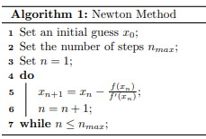
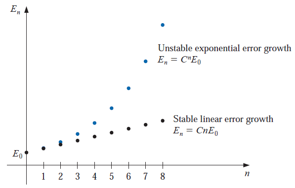

```{=html}

<style type="text/css">

/* Cascading Style Sheets (CSS) is a stylesheet language used to describe the presentation of a document written in HTML or XML. it is a simple mechanism for adding style (e.g., fonts, colors, spacing) to Web documents. */

h1.title {  /* Title - font specifications of the report title */
  font-size: 24px;
  color: DarkRed;
  text-align: center;
  font-family: "Gill Sans", sans-serif;
}
h4.author { /* Header 4 - font specifications for authors  */
  font-size: 20px;
  font-family: system-ui;
  color: DarkRed;
  text-align: center;
}
h4.date { /* Header 4 - font specifications for the date  */
  font-size: 18px;
  font-family: system-ui;
  color: DarkBlue;
  text-align: center;
}
h1 { /* Header 1 - font specifications for level 1 section title  */
    font-size: 22px;
    font-family: system-ui;
    color: navy;
    text-align: left;
}
h2 { /* Header 2 - font specifications for level 2 section title */
    font-size: 20px;
    font-family: "Times New Roman", Times, serif;
    color: navy;
    text-align: left;
}

h3 { /* Header 3 - font specifications of level 3 section title  */
    font-size: 18px;
    font-family: "Times New Roman", Times, serif;
    color: navy;
    text-align: left;
}

h4 { /* Header 4 - font specifications of level 4 section title  */
    font-size: 18px;
    font-family: "Times New Roman", Times, serif;
    color: darkred;
    text-align: left;
}

body { background-color:white; }

.highlightme { background-color:yellow; }

p { background-color:white; }

</style>
```
```{r setup, include=FALSE}
# Detect, install and load packages if needed.
if (!require("knitr")) {
   install.packages("knitr")
   library(knitr)
}
if (!require("MASS")) {
   install.packages("MASS")
   library(MASS)
}
if (!require("nleqslv")) {
   install.packages("nleqslv")
   library(nleqslv)
}
#
# specifications of outputs of code in code chunks
knitr::opts_chunk$set(echo = TRUE,      # include code chunk in the output file
                      warnings = FALSE,  # sometimes, you code may produce warning messages,
                                         # you can choose to include the warning messages in
                                         # the output file. 
                      messages = FALSE,  #
                      results = TRUE     # you can also decide whether to include the output
                                         # in the output file.
                      )   
```

\


# Introduction

We briefly introduce sources of errors in numerical analysis and concepts of convergence of algorithms. 


#  Error Analysis

We briefly outline the sources and types of errors.


## Understanding Numerical Error

We have seen that every computerized representation of real numbers with fractional parts is forced to employ rounding and other approximations. Rounding, however, represents one of many sources of error in numerical systems.

**Rounding or truncation** error comes from rounding and other approximations used to deal with the fact that we can only represent a finite set of values using most computational number systems. ** For example,**, it is impossible to write $\pi$ exactly as an IEEE 754 floating-point value, so in practice, its value is truncated after a finite number of digits.

**Discretization** error comes from our computerized adaptations of calculus, physics,
and other aspects of continuous mathematics. **For example**, a numerical system might
attempt to approximate the derivative of a function $f(t)$ using divided differences:
$$
f^\prime(t) \approx \frac{f(t+\epsilon) - f(t)}{\epsilon}
$$
for some fixed choice of $\epsilon$. We must use a finite $\epsilon > 0$ rather than taking a
limit as $\epsilon → 0$, the resulting value for $f^\prime(t)$ is only accurate to some number of digits. This results in a discretization error.

**Modeling** These errors arise during the modeling process when scientists ignore effecting factors in the model to simplify the problem. Also, these errors are known as formulation errors.


## Error Classification

Let $P = 1.354595$ is the true value and $P^* = 1.354675$ an approximated value. Three types of errors will be used from time to time throughout the semester.

* The **actual error** is defined to be $P-P^* = 1.354595-1.354675 = -0.00008 = -8 \cdot 10^{-5}$.

* The **absolute error** is defined to be $|P-P^*| = |1.354595 - 1.354675| = 0.00008 = 8 \cdot 10^{-5}$

* The **relative error** is generally defined to be $|P-P^*|/P$, $p \ne 0$. With the given values of $P$ and $P^*$, we have

$$
\frac{|P-P^*|}{|P|} = \frac{|1.354595 - 1.354675|}{|1.354595|} = 5.905475\times 10^{-05}
$$

   The relative errors are frequently used in error analysis throughout this semester.


## Approximation Significant Digits (Figures)

The number $P^*$ is said to approximate $P$ to $t$ **significant digits** if $t$ is the <font color = "red"><b>**\color{red}largest non-negative number**</b></font> such that 

$$
\frac{|P-P^*|}{|P|} < 5\times 10^{-t}
$$

**Example 1**: We still use $P = 1.354595$ as the true value and $P^* = 1.354675$ an approximated value. We have calculated 

$$
\frac{|P-P^*|}{|P|} = \frac{|1.354595-1.354675|}{|1.354595|} = 5.905475\times 10^{-05}
$$

Since $5\times 10^{-05} < 5.905475\times 10^{-05} < 5\times 10^{-04}$. Therefore, by the definition, the approximation significant digit is 4. 


**Example 2** (refer to *Example 5* of the textbook, page 25.) Let $p=0.54617$ and $q=0.54601$. Use four-digit arithmetic to approximate $p - q$ and determine the absolute and relative errors using (a) rounding and (b) chopping.

**Solution**: The exact value of $r = p - q$ is $r = 0.00016$.

(a): Suppose the subtraction is performed using four-digit rounding arithmetic. Rounding p and q to four digits gives $p^* = 0.5462$ and $q^* = 0.5460$, respectively, and $r^* p^* - q^* = 0.0002$ is the four-digit approximation to r. Since
$$
\frac{|r - r^*|}{|r|} = \frac{|0.00016 - 0.0002|}{|0.00016|} = 0.25 = 2.5\times 10^{-1} < 5\times 10^{-1}.
$$

By the definition, the result has only <font color = "red"><b>**\color{red}one significant digit**</b></font>, whereas $p^*$ and $q^*$ were accurate to four and five significant digits, respectively.

(b). If chopping is used to obtain the four digits, the four-digit approximations to $p$, $q$, and $r$ are $p^* = 0.5461$, $q^* = 0.5460$, and $r^* = p^* - q^* = 0.0001$. This gives

$$
\frac{|r - r^*|}{|r|} = \frac{|0.00016 - 0.0001|}{|0.00016|} = 0.375 = 3.75\times 10^{-1} < 5\times 10^{-1}.
$$
which also results in only one significant digit of accuracy.


## Nested Arithmetic

Accuracy loss **due to round-off error** can also be reduced by rearranging calculations, as shown in the next example.

**Example 3**: [examples 6 and 7 of the textbook, pages 25-27 ]. Consider polynomial $f(x) = x^3 - 6.1x^2 + 3.2x + 1.5$. Evaluate $f(x)$ at = $x = 4.71$ using three-digit arithmetic.

**Solution**: We calculate approximations

* Exact value: $f(x) = 4.71^3 - 6.1\times 4.71^2 + 3.2\times 4.71 + 1.5 = -14.263899$

* Rounding term-wise: $f(x) = 104 - 135 + 15.1 + 1.5 = -14.4$

* Nest rounding: $f(x) = ((4.71 - 6.1)\times 4.71 + 3.2)\times 4.71 + 1.5=(-6.54+3.2)\times4.71+1.5 = -15.7+1.5 = 14.2$.

The above evaluation can be done using the following R code.

```{r}
x = 4.71
f.exact = x^3 - 6.1* x^2 + 3.2*x + 1.5
f.3digit = signif(x^3,3) - signif(6.1* x^2,3) + signif(3.2*x,3) + 1.5
f.3digit.nest = signif((signif((x-6.1)*x,3) + 3.2)*x,3) + 1.5
cbind(f.exact=f.exact, f.3digit=f.3digit, f.3digit.nest=f.3digit.nest)
```
The relative errors of the two different approximations are
$$
\text{Non-nest approximation} = \frac{|-14.2639 - (-14.4)|}{|-14.2639|} \approx 0.00954157
$$

$$
\text{Nest approximation} = \frac{|-14.2639 - (-14.3)|}{|-14.2639|} \approx 0.002530865
$$
Therefore, the nested arithmetic yields less approximation error.

Polynomials should always be expressed in the nested form before performing an evaluation because this form minimizes the number of arithmetic calculations. The error in the Illustration is due to the reduction in computations from four multiplications and three additions to two multiplications and three additions. One way to reduce round-off error is to reduce the number of computations.

\

## Chapter #1 Homework - Part II

1. Textbook Section 1.2, Problem 1(a)

2. Textbook Section 1.2, Problem 19(a)

3. Textbook Section 1.2, Problem 21


\


# Algorithms and Convergence

The objective of numerical analysis is to solve continuous problems using numeric approximation but accurate numeric solutions. Numerical methods (or algorithms) are used in cases where the exact solution is impossible or prohibitively expensive to calculate. 


## Algorithm and Psuedo-code

**An algorithm** is a procedure that describes, in an **unambiguous** manner, a **finite** sequence of steps to be performed in a specified order. The object of the algorithm is to implement a procedure to solve a problem or approximate a solution to the problem.

Pseudo-code is a programmatic description of an algorithm that does not require any strict programming language syntax or underlying technology considerations. It is a rough draft of a program. Pseudo-code summarizes a program’s flow, which is something like

```{r echo=FALSE, fig.align ="center",  out.width = '30%'}

```


## Rules of Pseudo-code

The purpose of using pseudo-code is an efficient key principle of an algorithm. It is used in planning an algorithm by sketching out the structure of the program before the actual coding takes place. The basic rules of writing pseudo-code are 

\

**Rule 1**: *Write only one statement per line*

Each statement in the pseudo-code should express just one action for the computer. If the task list is properly drawn, then in most cases each task will correspond to one line of pseudo-code


**Rule 2**: *Capitalize initial keyword*

There are just a few keywords we will use: **WRITE, OUTPUT,  IF, ELSE, ENDIF, WHILE, ENDWHILE, REPEAT, UNTIL**


**Rule 3**: *Indent to show hierarchy*

We will use a particular indentation pattern in each of the design structures:

  **SEQUENCE**: keep statements that are “stacked” in sequence all starting in the same column.
  
  **SELECTION**: indent the statements that fall inside the selection structure, but not the keywords that form the selection.
  
  **LOOPING**: indent the statements that fall inside the loop, but not the keywords that form the loop.


**Rule 4**: *End multi-line structures*

See how the **IF/ELSE/ENDIF** is constructed in the next example. The **ENDIF** (or END whatever) always is in line with the IF (or whatever starts the structure).


**Rule 5**: *Keep statements language independent*

Pseudo-code should not be tied to any programming language. It can be implemented in any language, whether it's C++, Java, Python, MATLAB, R, or any other programming language.


\

**Example 4**: The nth Taylor polynomial for $f (x) = e^x$ expanded about $x_0 = 0$ is
$$
P_n(x) =\sum_{i=0}^n \frac{x^i}{i!}
$$
and the value of $e$ to six decimal places is 2.718282. **Construct an algorithm** to determine the **minimal value of $n$** required for
$$
|e - P_n(1)| < 10^{-5},
$$
without using the Taylor polynomial remainder term.


**Solution**: The objective is to determine the degrees of the Taylor polynomial evaluated at $x = 1$ to approximate $e$. The input values are (1) tolerance TOL and the initial degree of the Taylor polynomial. The output is the smallest degree of the Taylor polynomial that meets $|e - P_n(1)| < TOL$.

```
INPUT  initial degree: n, 
            tolerance: TOL, 
OUTPUT the desired degree N of the polynomial

Step 1. SET   n = 0;
            SUM = 0;
Step 2. WHILE n < M + 1 DO:
        
        1. SUM = SUM + 1/n!    # n! = n factorial
           ERR = e - SUM       # e = 2.718282
        2. IF |ERR| < TOL DO
               OUTPUT (N)
               WRITE (tolerance achieved!)
               STOP
           ELSE DO
               n = n + 1
               IF n == M + 1 
                  WRITE (maximum iteration achieved!)
               ENDIF
           ENDIF
        ENDWHILE
```
\

## Stability of Algorithms

Roughly speaking, the stability of an algorithm measures how good the algorithm is at solving problems to achievable accuracy. In practice, there could have several algorithms for solving one problem and some algorithms are better than others. Those algorithms that get unnecessarily inaccurate answers are called unstable.


To further consider the subject of round-off error growth and its connection to algorithm stability, suppose an error with magnitude $E_0 > 0$ is introduced at some stage in the calculations and that the magnitude of the error after $n$ subsequent operations is denoted by $E_n$. The two cases that arise most often in practice are defined as follows.


**Growth of Error**: Suppose that $E_0 > 0$ denotes an error introduced at some stage in the calculations and $E_n$ represents the magnitude of the error after $n$ subsequent operations.

* If $E_n \approx CnE_0$, where $C$ is a constant independent of $n$, then the growth of error is said to be **linear**.

* If $En \approx C^nE_0$, for some $C > 1$, then the growth of error is called **exponential**.

\


```{r echo=FALSE, fig.align ="center",  out.width = '60%'}

```


## Rates of Convergence

Since iterative techniques involving sequences are often used, this section concludes with a brief discussion of some terminology used to describe the rate at which **convergence** occurs. In general, we would like the technique to converge as rapidly as possible. The following definition is used to compare the convergence rates of sequences.


**Convergence Sequence**:  Suppose $\{\beta_n \}_{n=1}^\infty$ is a sequence known to converge to zero, and $\{\alpha_n \}_{n=1}^\infty$ converges to a number $\alpha$. If a positive constant K exists with
$$
|\alpha_n - \alpha| \le K|\beta_n|, \text{ for large } n,
$$
then we say that $\{\alpha_n \}_{n=1}^\infty$ converges to $\alpha$ with rate, or order, of convergence $O(\beta_n)$. (This expression is read “big oh of $\beta_n$”.) It is indicated by writing $\alpha_n = \alpha + O(\beta_n)$.


**Remark**: Since sequence, $\{1/n^p \}_{n=1}^\infty$ (for some $p$) is a simple sequence, it is usually used as the base sequence to define the rate of convergence. In other words, we are interested in the largest value of $p$ such that $\alpha_n = \alpha + O(1/p^n)$.

\

**Example 5**: Consider two sequences $\{\alpha_n \}_{n=1}^\infty$ and $\{\beta_n \}_{n=1}^\infty$ where
$$
\alpha_n = \frac{n+1}{n^2} \text{ and  } \beta_n = \frac{n + 3}{n^3}.
$$
What is the rate of convergence of the two sequences?

**Solution**: Note that
$$
\lim_{n \to \infty}\alpha_n = \lim_{n \to \infty}\frac{n+1}{n^2} = 0 \text{ and  } \lim_{n \to \infty}\beta_n = \lim_{n \to \infty}\frac{n + 3}{n^3} = 0.
$$
Therefore, $\alpha_n = 0 + O(\frac{1}{n})$ and $\beta_n = 0 + O(\frac{1}{n^2})$. In other words, the convergence rate of $\{\alpha_n \}$ and $\{ 1/n\}$ are the same, and $\{\beta_n\}$ and $\{1/n^2 \}$ are the same.


## Chapter #1 Homework - Part III.

1. Textbook Section 1.3. Problem 6(a).

2. Textbook Section 1.3. Problem 7(b).

3. Textbook Section 1.3. Problem 11.

4. Textbook Section 1.3. Problem 13(a).
