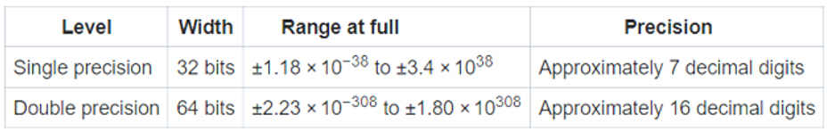

```{=html}

<style type="text/css">

/* Cascading Style Sheets (CSS) is a stylesheet language used to describe the presentation of a document written in HTML or XML. it is a simple mechanism for adding style (e.g., fonts, colors, spacing) to Web documents. */

h1.title {  /* Title - font specifications of the report title */
  font-size: 24px;
  color: DarkRed;
  text-align: center;
  font-family: "Gill Sans", sans-serif;
}
h4.author { /* Header 4 - font specifications for authors  */
  font-size: 20px;
  font-family: system-ui;
  color: DarkRed;
  text-align: center;
}
h4.date { /* Header 4 - font specifications for the date  */
  font-size: 18px;
  font-family: system-ui;
  color: DarkBlue;
  text-align: center;
}
h1 { /* Header 1 - font specifications for level 1 section title  */
    font-size: 22px;
    font-family: system-ui;
    color: navy;
    text-align: left;
}
h2 { /* Header 2 - font specifications for level 2 section title */
    font-size: 20px;
    font-family: "Times New Roman", Times, serif;
    color: navy;
    text-align: left;
}

h3 { /* Header 3 - font specifications of level 3 section title  */
    font-size: 18px;
    font-family: "Times New Roman", Times, serif;
    color: navy;
    text-align: left;
}

h4 { /* Header 4 - font specifications of level 4 section title  */
    font-size: 18px;
    font-family: "Times New Roman", Times, serif;
    color: darkred;
    text-align: left;
}

body { background-color:white; }

.highlightme { background-color:yellow; }

p { background-color:white; }

</style>
```
```{r setup, include=FALSE}
# Detect, install and load packages if needed.
if (!require("knitr")) {
   install.packages("knitr")
   library(knitr)
}
if (!require("MASS")) {
   install.packages("MASS")
   library(MASS)
}
if (!require("nleqslv")) {
   install.packages("nleqslv")
   library(nleqslv)
}
#
# specifications of outputs of code in code chunks
knitr::opts_chunk$set(echo = TRUE,      # include code chunk in the output file
                      warnings = FALSE,  # sometimes, you code may produce warning messages,
                                         # you can choose to include the warning messages in
                                         # the output file. 
                      messages = FALSE,  #
                      results = TRUE     # you can also decide whether to include the output
                                         # in the output file.
                      )   
```

\

# Introduction

This note introduces briefly the concepts of floating point and the basics of error analysis. Before presenting these concepts, we introduce some computer architecture concepts from computer science.

**Bit** is the fundamental unit of memory inside a computer, which is short for <font color = "red">**\color{red} binary digit**</font>. **Each bit** of data corresponds to a '0' or '1'.

The bit is the smallest unit of data that a computer processes, but a single bit are too small to represent much data.

<font color = "red">**\color{red}The smallest practical unit for expressing information is the byte, which is made up of eight bits**</font>.

**A single byte** consists of **eight bits**. That is, a single byte can represent 256 ($=2^8$) combinations of data.

# Data Representation

Data is a broad concept. All recorded information is called data. We briefly describe how data is represented and stored in computer systems. In this numerical analysis class, we focus on how numbers are represented and stored in computers.

## Number Systems

We use a decimal system (base 10) for counting and computations. Computers use binary (base 2) number systems, as they are made from binary digital components (known as transistors) operating in two states - on (encoded as $1$) and off (encoded as $0$). In computing, the hexadecimal (base 16) or octal (base 8) number systems are also used as a compact form for representing binary numbers. Next, we briefly outline decimal, binary, and hexadecimal number systems. Every representation has three components: <font color = "red"> **\color{red}digits**, **\color{red}base**, and **\color{red}exponent**</font>.

### Decimal (Base 10) System

The decimal number system has ten symbols: $0, 1, 2, 3, 4, 5, 6, 7, 8$, and $9$, called **digits**. It uses positional notation. That is, the least-significant digit (right-most digit) is of the order of $10^0$ (units or ones), the second right-most digit is of the order of $10^1$ (tens), the third right-most digit is of the order of $10^2$ (hundreds), and so on. The exponents of the base are called **positional numbers**.

\

**Example 1**: The base 10 representation of integer 182736 is given the following form $$
182736 = 1\times 10^5 + 8\times 10^4 + 2\times 10^3 + 7\times 10^2 + 3\times 10^1 + 6\times 10^0.
$$ The following figure explains the above representation.

```{r echo=FALSE, fig.align ="center",  out.width = '85%'}

```

To avoid confusion, we use $182736D$ or $182736_{10}$ to denote $182736$ to be a decimal number in case multiple number systems are used at the same time.

\

### Binary (base 2) System

The binary number system is used by all computers. The binary number system is a base-2 number system, therefore there are two valid digits: 0 and 1. The binary number system has two symbols: 0 and 1, called bits. It is also a positional notation.

**Example 2**: Write the base 2 representation of binary integer 101010B.

**Solution** The base 2 representation is given in the following. $$
101010B = 1\times 2^5 + 0\times 2^4 + 1\times 2^3 + 0\times 2^2 + 1\times 2^1 + 0\times 2^0
$$

where suffix $B$ denotes the binary number. The following figure explains the above representation.

```{r echo=FALSE, fig.align ="center",  out.width = '35%'}
include_graphics("img/w02-base2Rep.png")
```

\

### Conversion Between Number Systems

Computers use the binary system to store numbers. How to convert a number from one system to the other? The following examples illustrate the idea of conversion.

**Example 3** Convert 12045D to a binary number.

**Solution**: All we need to so is to represent 205D in a power series with base 2 in the following $$
205D = 2^7D + 2^6D + 2^3D + 2^2D + 1D  
$$ $$
= 1 \times 2^7D + 1\times 2^6D +0\times 2^5D + 0\times 2^4D + 1\times 2^3D + 1\times 2^2D + 0\times 2^1D + 1\times 2^0D = 11001101B
$$\

**Example 4**: Convert 101011B into a decimal system.

**Solution**: Use the same idea in the previous example to complete the conversion. $$
101011B = 1\times 2^5D + 0\times 2^4D + 1\times 2^3D + 0\times 2^2D + 1\times 2^1D + 1\times 2^0 
$$ $$
=32D + 0D + 8D + 0D + 2D + 1D = 43D.
$$

\

**Example 5**: Express 3.25D (floating value) into a binary (floating) value.

**Solution**: We represent the integral and decimal parts into binary numbers respectively.

-   **Integral part**: $3_{10} = (1\times 2^1 + 1\times 2^0)_{10} = (11)_2$.

-   **Decimal part**: $.25_{10} = (0\times 2^{-1} + 1\times 2^{-2} = (.01)_2$.

Therefore, $3.25_{10} = 11.01_2$.

\

**Comment**: converting the fractional part to binary (base 2 representation) is a little cumbersome. The following is a programmatically convenient tabular algorithm:

```{r echo=FALSE, fig.align ="center",  out.width = '75%'}
include_graphics("img/w02-TabularConversionBase2Fraction.png")
```

\

**Example 6** Express 21.36D (decimal representation) into a binary (representation) value.

**Solution**: We still convert the integral and fraction parts separately.

-   **Integral Part**: $21 = 1\times 2^4 + 0\times 2^3 + 1\times 2^2 + 0\times 2^1 + 1 \times 2^0 = (10101)_2$.

-   **Fractional Part**: The binary conversion of $0.36$ is based on the following table.

```{r echo=FALSE, fig.align ="center",  out.width = '95%'}

```

From the table we have $$
0.36_{10} = (\overbrace{01011100001010001111}^\text{20 digits} \cdots\overbrace{ 01011100001010001111}^\text{20 digits} \cdots)_2
$$ That is, the resultant binary number has infinite digits because the sequence of digits ($01011100001010001111$) will repeat infinitely many times.

Therefore, $21.36_{10} = 10101.\overline{01011100001010001111}_2$.

**Remark**: This examples shows that $0.36$ has infinite representations in binary. The bits go on forever; no matter how many of those bits you store in a computer, you will never end up with the binary equivalent of decimal $0.36$.

### Scientific Notation

We have outlined the base-10 and base-2 representation of given numbers. We also use **scientific notation** in base-10 representation.

**Example 7**: Write the scientific notation of $21.36_{10}$ and its binary representation (see the second part of example 6).

**Solution**: The scientific notation of $21.36_{10}$ denoted by $21.36 = 2.136\times 10^{1}$ or written as $2.136E1$. In binary representation, $21.36_{10} = 10101.\overline{01011100001010001111}_2 = 1.0101\overline{01011100001010001111}_2\times 2^4$

# How data is stored in computer memory

Human beings use decimal (base 10) and duodecimal (base 12) number systems for counting and measurements (probably because we have 10 fingers and two big toes). Computers use binary (base 2) number systems, as they are made from binary digital components (known as transistors) operating in two states - **on** and **off**.

```{r echo=FALSE, fig.align ="center",  out.width = '65%'}
include_graphics("img/w02-Realworld-Computer-Data.png")
```

We will not go into details about how all kinds of data are stored in a computer. But it is necessary to have some conceptual understanding of how numbers are stored in a computer so that we will better understand various sources of errors.

Computer memory is the collection of many groups that contain a certain number of bits. As mentioned earlier,

-   a collection of 8 bits is called a byte, and

-   a collection of 4 bytes, or 32 bits, is called a word.

Each individual data value in a data set is usually stored using one or more bytes of memory, but at the lowest level, any data stored on a computer is just a large collection of bits. The following is an illustrative example that explains how a number is stored using a 32-bit layout (also called **bit string**) memory.

```{r echo=FALSE, fig.align ="center",  out.width = '85%'}

```

## How integers are stored in memory?

The most computer system uses 32-bit (or 64-bit) layout to store integers. The previous figure is a 32-bit string layout. The binary integer stored is $$
(\overbrace{010101010101010101010101010101010101}^\text{32 digits})_2 = (2^{30}+2^{28}+2^{26} + \cdots + 2^2 + 2^0)_{10} = 1431655765_{10}
$$ If we store only unsigned integers, the biggest integer we store in the 32-bit layout is $2^{32} - 1 = 4294967295$. The smallest integer is 0. If we consider both positive and positive integers, the use one bit (utmost left-hand side of the bit string) to denote the sign of the integer (0 indicates positive and 1 indicates negative). Then the smallest and the biggest integers that can be stored are $-2^{31} -1 = - 2147483647$ and $2^{31} -1 = + 2147483647$.

\

## Floating-point Numbers

We first describe the concepts of real numbers and floating-point numbers.

-   **Floating-point numbers** are any numbers with a decimal point in them. For example, 3.14159 is a floating-point number.

-   **A real number** is the "analog" version of a floating-point number -- It **has infinite precision** and **is continuous**.

-   The **difference** between *reals* and *floating-point numbers* is that the latter has limited precision -- it really depends on the abilities of the computer. **Floating-point numbers are essentially approximations of real numbers**.

**Example 8**: Let's binary representation and floating-point representation of real number $0.1_{10}$.

**Answer**: Using the same method used in **example 7** to represent $0.1_{10}$, we have $$
0.1_{10} = 0.0\underbrace{\overline{0011}_2}_\text{4 digits}
$$ It has infinite representation in binary representation. When it is stored in a computer system, only finite binary digits are used due to the precision of the computer.

**Example 9**: Find the difference $3_{10}\times0.1_{10} - 0.3_{10}$.

**Answer**: The difference is 0 if calculated manually. We have shown that $0.1_{10}$ has an infinite binary representation. However, $0.3_{10} = (0.01001100110)_2$. When calculating the above difference in a computer, it will give a non-zero number. The result from **R** in the following

```{r}
3*0.1 - 0.3
```

## How Floating-point Numbers Are Stored in Memory?

IEEE 754-1985 represents numbers in binary, providing definitions for four levels of precision, of which the two most commonly used are single (32-bit) and double precision (64-bit) layouts.

```{r echo=FALSE, fig.align ="center",  out.width = '85%'}

```

The equation for converting a 32-bit pattern into a floating point number is given by

$$
(-1)^S\times M \times 2^{E-127}
$$ where $S$ is the value of the *sign bit*, $M$ is the value of the *mantissa* (fractional part), and $E$ is the value of component. In 32-bit layout, 23 bits are allocated to *mantissa*. The general form of $M$ is explicitly by $$
M_{10} = 1 + m_{22}2^{-1} + m_{21}2^{-2} + m_{20}2^{-3}+\cdots +m_{1}2^{-22}
$$ where $m_i$ ($i =0, 1, 2, \cdots, 22$ is either 1 or 0. Note that $-127$ in the conversion formula reflects the total number of alternatives based on the allocated 8 bits ($2^8 -1 = 127$).

The examples given below show how $\pm 10.75_{10}$ are stored in a 32-bit layout system.

```{r echo=FALSE, fig.align ="center",  out.width = '95%'}
include_graphics("img/w02-32bitPattern.png")
```

Of the 64 bits used to store a double precision number, bits 0 through 51 are the *mantissa*, bits 52 through 62 are the *exponent*, and bit 63 is the *sign* bit.

**The main take-away is that storing real number to a computer system involves potential rounding error (due to approximation)!**

## Basic Types Errors in Error Analysis

Let $P$ is the true value and $P^*$ an approximated value. Three types of errors will be used from time to time throughout the semester.

-   The **actual error** is defined to be $P-P^*$.

-   The **absolute error** is defined to be $|P-P^*|$

-   The **relative error** is defined to be $|P-P^*|/P$, $p \ne 0$. The relative errors are frequently used in error analysis throughout this semester.

-   **Significant digit**:

The number $P^*$ is said to approximate $P$ to $t$ **significant digits** if $t$ is the largest non-negative number such that $$
\frac{|P-P^*|}{P} < 1.23\times 10^{-t}
$$
