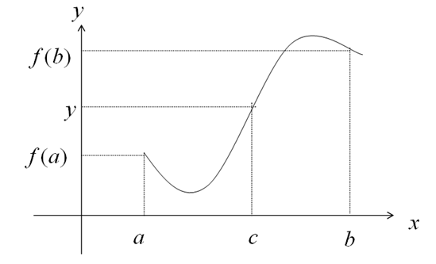
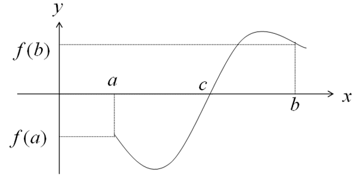
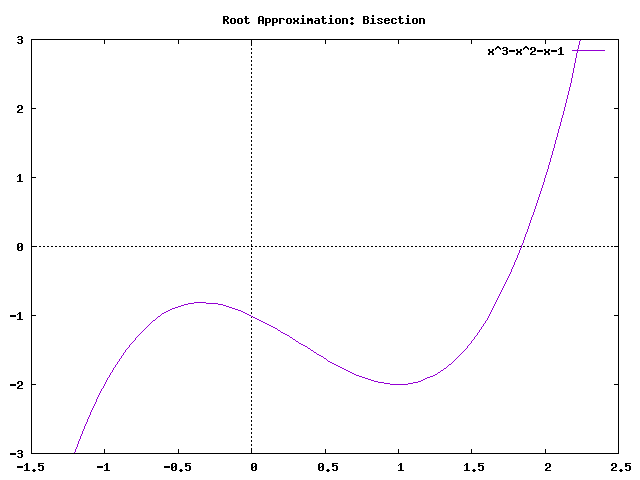
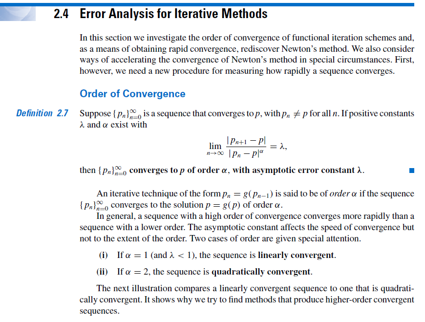

```{=html}

<style type="text/css">

/* Cascading Style Sheets (CSS) is a stylesheet language used to describe the presentation of a document written in HTML or XML. it is a simple mechanism for adding style (e.g., fonts, colors, spacing) to Web documents. */

h1.title {  /* Title - font specifications of the report title */
  font-size: 24px;
  color: DarkRed;
  text-align: center;
  font-family: "Gill Sans", sans-serif;
}
h4.author { /* Header 4 - font specifications for authors  */
  font-size: 20px;
  font-family: system-ui;
  color: DarkRed;
  text-align: center;
}
h4.date { /* Header 4 - font specifications for the date  */
  font-size: 18px;
  font-family: system-ui;
  color: DarkBlue;
  text-align: center;
}
h1 { /* Header 1 - font specifications for level 1 section title  */
    font-size: 22px;
    font-family: system-ui;
    color: navy;
    text-align: left;
}
h2 { /* Header 2 - font specifications for level 2 section title */
    font-size: 20px;
    font-family: "Times New Roman", Times, serif;
    color: navy;
    text-align: left;
}

h3 { /* Header 3 - font specifications of level 3 section title  */
    font-size: 18px;
    font-family: "Times New Roman", Times, serif;
    color: navy;
    text-align: left;
}

h4 { /* Header 4 - font specifications of level 4 section title  */
    font-size: 18px;
    font-family: "Times New Roman", Times, serif;
    color: darkred;
    text-align: left;
}

body { background-color:white; }

.highlightme { background-color:yellow; }

p { background-color:white; }

</style>
```
```{r setup, include=FALSE}
# Detect, install and load packages if needed.
if (!require("knitr")) {
   install.packages("knitr")
   library(knitr)
}
if (!require("MASS")) {
   install.packages("MASS")
   library(MASS)
}
if (!require("nleqslv")) {
   install.packages("nleqslv")
   library(nleqslv)
}
#
# specifications of outputs of code in code chunks
knitr::opts_chunk$set(echo = TRUE,      # include code chunk in the output file
                      warnings = FALSE,  # sometimes, you code may produce warning messages,
                                         # you can choose to include the warning messages in
                                         # the output file. 
                      messages = FALSE,  #
                      results = TRUE     # you can also decide whether to include the output
                                         # in the output file.
                      )   
```

\


# Introduction

There are different methods for root finding. The bisection method discussed in this note is useful for finding a root of single variable functions that satisfy certain assumptions. 

# The Question

**The general question to answer**: let $f(x)$ be a single variable continuous function defined on $D$, a sub set of $R$. Assume there is at least one root for equation $f(x) = 0$ on the closed interval [a, b].

**Goal**: using a numerical method to locate the root.

Several methods can be used to find the root of a given single variable equation satisfying certain regular conditions in the next few lectures. Most of these methods are direct applications of some concepts we have already covered in elementary calculus courses.

We follow the same process throughout the semester to do numerical analysis:  

* doing some mathematics 
* developing an algorithm 
* performing error analysis
* implementing the algorithm using a programming language

# Bisection Method

The bisection method is developed based on the **intermediate value theorem (IVT)**. If a function  $y = f(x)$ is continuous for all $x$ in the closed interval $[a,b]$, and $y_0$ is a number between $f(a)$ and  $f(b)$, then there is a number $x=c$ in $(a,b)$ that satisfies $f(c) = y_0$.

This definition can be graphically explained in the following figure
```{r echo=FALSE, fig.align ="center",  out.width = '45%'}

```

As a special case, if we have two distinct values $x = a$ and $x = b$ that satisfy $f(a)f(b) < 0$. Then by the intermediate value theorem, there exists a $c \in [a,b]$ such that $f(c) = 0$. This means, $f(x) = 0$ has root $c$ in $[a, b]$.
```{r echo=FALSE, fig.align ="center",  out.width = '45%'}

```

## The Logic of Bisection Method

The method calls for a repeated halving of sub-intervals of $[a, b]$ and, at each step, locating the half interval that contains the root $r$ (i.e., $f(r) = 0$).
 
```{r echo=FALSE, fig.align ="center",  out.width = '65%'}
if (knitr:::is_latex_output()) {
  knitr::asis_output('\\url{https://github.com/pengdsci/MAT325/raw/main/w03/img/w03-bisectionMethod.gif}')
} else {
  
}
```

## Bisection Algorithm

Based on the logic of the bisection method, we develop the following pseudo-code to find the root of a given equation $f(x) = 0$ on the interval $[a, b]$ assuming that $f(a)f(b) < 0$.

```
INPUT: ending values: a, b;
           tolerance: TOL
      max. iteration: N
OUTPUT:  approximate root and errors
         error/warning messages
         intermediate outputs

STEP 1.  SET n = 0
         ERR = |b - a|
STEP 2.  WHILE ERR > TOL DO:
         STEP 3  n = n + 1               (updating iteration index)
                 SET m = a + (b - a)/2   (mid-point)
         STEP 4. IF f(m)f(b) < 0 DO:
                     a = m               (updating ending value)
                     b = b               (not necessary...)
                 ENDIF
         STEP 5. IF f(m)f(b) > 0 DO:
                    a = a
                    b = m
                 ENDIF
         STEP 6. ERR = |b - a|
                 IF ERR < TOL DO:
                     OUTPUT (p = m, other information)
                     STOP
                 ENDIF
                 IF ERR > TOL DO:
                    OUTPUT (intermediate info)
                 ENDIF
         STEP 7. IF n = N DO:
                    OUTPUT (message on iteration limit)
                    STOP
                 ENDIF
         ENDWHILE
``` 

## Error Analysis

Given that we have an initial bound on the problem $[a, b]$, then the maximum error of using either $a$ or $b$ as our approximation is $h = b - a$. Because we halve the width of the interval with each iteration, the error is reduced by a factor of $2$, and thus, the error after $n$ iterations will be $h/2^n$. Let $r$ be the true root of $f(x) = 0$ and $p_n$ is the approximate root at $n$-th iteration. The absolute error of the bisection method is given by
$$
|r - p_n| = \frac{b - a}{2^n}.
$$
Next, we introduce the order of convergence that is defined in Section 2.4 of the textbook.

\

```{r echo=FALSE, fig.align ="center",  out.width = '100%'}

```

\

Based on the above definition of the order of convergence, we have

$$
\frac{|p_{n+1} - r|}{|p_n - r|^1} = \frac{(b-a)/2^{n+1}}{(b - a)/2^n} = \frac{1}{2}. 
$$
That is $\alpha = 1$. Therefore, the order of convergence order of the error is **linear**.

\

## Numerical Examples.

We will present two examples to demonstrate the application of the bisection method.

**Example 1**: Find a root of equation $x^3+4x^2-10 = 0$.

**Solution**: Since we are not given the interval to apply the bisection method. We first sketch $f(x) = x^3+4x^2-10$ and $y = 0$. The x-coordinate of the intersection of the two curves is the solution to the original equation.

```{r fig.align='center', fig.height= 4, fig.width=4}
x= seq(-1, 2, length = 200)
y = x^3+4*x^2-10
#
plot(x, y, 
     type = "l",
     lty = 1,
     lwd = 2,
     col = "blue",
     xlab = "X",
     ylab = "Y",
     main = "The curve of y = x^3+4x^2-10")
abline(h = 0, lty = 2, lwd = 1, col = "darkred")
```

Based on the above curve, we choose $[a, b] = [1,2]$ to implement the bisection algorithm with the following code.

```{r}
## we first define the R function based on the given equation
fn = function(x){
   f.val =   x^3 + 4*x^2 - 10
   f.val
}

## INPUT INFO
  a = 0
  b = 2
  TOL = 10^(-6)            # tolerance limit
  N = 200                   # max iterations
## Initialization
  n  = 0
  ERR = abs(b - a)
## Loop begins
while(ERR > TOL){
  n = n + 1
  m = a + (b - a) / 2     # midpoint of interval [a, b]
  if (fn(m)*fn(b) < 0){   # new interval should be [m, b]
      a = m               # m will be the new a
      b = b
  } else {                # new interval should be [a,m]
      a = a
      b = m               # m will be the new 'b'
   }
  ERR = abs(b - a)        # updated absolute error
  ## Output information
  if(ERR < TOL){  # if the absolute error is less than TOL, print out results
    cat("\nThe algorithm converges!")
    cat("\nThe number of iteration n =", n, ".")
    cat("\nThe approximate root r =", (a + b)/2,".")
    cat("\nThe absolute error ERR =", ERR,".")
    break
  } else {            ## output of intermediate iteration
    cat("\nIteration:",n,". The absolute error ERR =", ERR, ".")  
    }
  ### Test attainment to the max iteration
  if(n == N){ 
    cat("\n\n Iteration limit reached. The algorithm diverges!")
    break
  }
}
```

# Chapter 2 Homework - Part I.

Section 2.1: 5(a), 7, 13 (see the hint in problem 12 to set up the equation)

**Requirements**:

1. Use the RMarkdown document to complete these problems.

2. For each problem, sketch the equation to find an appropriate interval to search the root.

3. Convert the RMarkdown to a PDF file and submit it to the D2L dropbox


