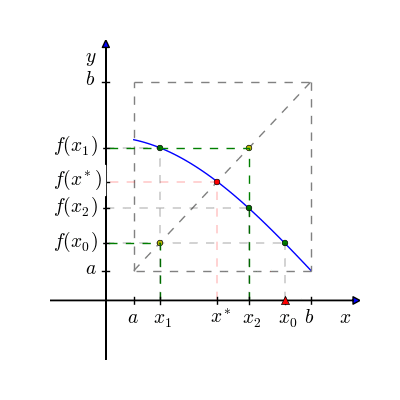

```{=html}

<style type="text/css">

/* Cascading Style Sheets (CSS) is a stylesheet language used to describe the presentation of a document written in HTML or XML. it is a simple mechanism for adding style (e.g., fonts, colors, spacing) to Web documents. */

h1.title {  /* Title - font specifications of the report title */
  font-size: 24px;
  color: DarkRed;
  text-align: center;
  font-family: "Gill Sans", sans-serif;
}
h4.author { /* Header 4 - font specifications for authors  */
  font-size: 20px;
  font-family: system-ui;
  color: DarkRed;
  text-align: center;
}
h4.date { /* Header 4 - font specifications for the date  */
  font-size: 18px;
  font-family: system-ui;
  color: DarkBlue;
  text-align: center;
}
h1 { /* Header 1 - font specifications for level 1 section title  */
    font-size: 22px;
    font-family: system-ui;
    color: navy;
    text-align: left;
}
h2 { /* Header 2 - font specifications for level 2 section title */
    font-size: 20px;
    font-family: "Times New Roman", Times, serif;
    color: navy;
    text-align: left;
}

h3 { /* Header 3 - font specifications of level 3 section title  */
    font-size: 18px;
    font-family: "Times New Roman", Times, serif;
    color: navy;
    text-align: left;
}

h4 { /* Header 4 - font specifications of level 4 section title  */
    font-size: 18px;
    font-family: "Times New Roman", Times, serif;
    color: darkred;
    text-align: left;
}

body { background-color:white; }

.highlightme { background-color:yellow; }

p { background-color:white; }

</style>
```
```{r setup, include=FALSE}
# Detect, install and load packages if needed.
if (!require("knitr")) {
   install.packages("knitr")
   library(knitr)
}
if (!require("MASS")) {
   install.packages("MASS")
   library(MASS)
}
if (!require("nleqslv")) {
   install.packages("nleqslv")
   library(nleqslv)
}
#
# specifications of outputs of code in code chunks
knitr::opts_chunk$set(echo = TRUE,      # include code chunk in the output file
                      warnings = FALSE,  # sometimes, you code may produce warning messages,
                                         # you can choose to include the warning messages in
                                         # the output file. 
                      messages = FALSE,  #
                      results = TRUE     # you can also decide whether to include the output
                                         # in the output file.
                      )   
```

\

# Introduction

The number $p$ is a fixed point for a given function $g$ if $g( p) = p$. In other words, if function $g(x)$ has a fixed point $p$, then $p$ is a root of equation $g(x) - x = 0$. Conversely, we could convert root finding problem $f(x) = 0$ to fixed-point problem $g(x) = af(x) - x = x$ for any real number $a \ne 0$. This section discusses how to approximate the root $p$ using the **Fixed-point Method**.

# Some Theories of the Fixed Point Method

**Theorem 1** (Existence of fixed point)

Suppose that $f(x)$ is a continuous function that maps its domain, $D$, onto a subset of itself, $S = f(D)$, i.e., $f(x) \in C[a, b]$, such that $$
f(x): [a,b]\in S \subset [a, b]
$$

Then $f(x)$ has a fixed point in $[a, b]$.

**Proof**: If $f(a) = a$ or $f(b) = b$, we are done.

Assume $f(a) \ne a$ and $f(b) \ne b$. Since $f([a,b]) \subset [a, b]$, we have $f(a) > a$ and $f(b) < b$. Let $h(x) = f(x) - x$. Since $f(x) \in C[a, b]$, so is $h(x) \in C[a, b]$. Observe that $h(a) = f(a) - a > 0$, $h(b) = f(b) - b < 0$. By intermediate value theorem, there exists at least one value $r$ in $[a, b]$ such that $h(r) = 0$. That implies that $f(r) = r$. This completes the proof.

**Corollary**: Every continuous bounded function on the real numbers has a fixed point.

**Theorem 2** (Uniqueness of fixed point, also called Contraction Mapping Theorem)

Suppose that $f(x)$ is a continuous function that maps its domain, $D$, onto a subset of itself, $S = f(D)$, i.e., $f(x) \in C[a, b]$, such that $$
f(x): [a,b]\in S \subset [a, b]
$$ Suppose further that there exists some positive constant $0 < K < 1$ such that $|f^\prime(x)| < K$ for all $x$ in $[a, b]$. Then $f(x)$ has a unique fixed point $p$ in $[a, b]$.

**Proof**: Assume there at least two fixed points, say $p_1$ and $p_2$ in $[a,b]$, such that $f(p_1) = p_1$ and $f(p_2) = p_2$ with $p_1 < p_2$. That is, $f(p_2) - f(p_1) = p_2 - p_1$.

On the other hand, the mean value theorem indicated that $f(p_2) - f(p_1) = f^\prime (c)(p_2 - p_1)$ for some $c$ in $[p_1, p_2]$. Since , we have $f(p_2) - f(p_1) < p_2 – p_1$. This **contradicts** with $f(p_2) - f(p_1) = p_2 - p_1$. Therefore, we have proved the uniqueness of the fixed point. The proof is completed.

\

# Fixed Point Iteration

With the theory developed previously, we focus on the following recursive equation for finding the fixed point numerically.

Choose an initial approximation $p_0$, generate sequence $\{p_n\}_{n=0}^\infty$ by $p_n = g(p_{n-1})$. If the sequence converges to $p$ and $g(x)$ is continuous at p, then $$
p = \lim_{n \to \infty}p_n = \lim_{n \to \infty}g(p_{n-1}) = g(p)
$$

```{r echo=FALSE, fig.align ="center",  out.width = '80%'}

```

The following animated graph demonstrates the process of searching the fixed point.

```{r echo=FALSE, fig.align ="center",  out.width = '45%'}
if (knitr:::is_latex_output()) {
  knitr::asis_output('\\url{https://github.com/pengdsci/MAT325/raw/main/w03/img/Fixed_point_anime.gif}')
} else {
  
}
```

**Fixed-point Iteration Algorithm**

    INPUT    f(x), 
             initial p0, 
             TOL
             N                       (max iterations)
    STEP 1.  ERR = infinity          (initial error - must be a big number)
             x                       (initial value)
             n = 0                   (initial iterator)
    STEP 2.  WHILE ERR > TOL DO:
             STEP 3. n = n + 1
             STEP 4. new.x = f(x)
                     ERR = new.x - x
                     IF ERR < TOL DO:
                        OUTPUT (results)
                        STOP
                      ENDIF
                     IF ERR > TOL DO:
                       OUTPUT (intermediate results)
                       x = new.x      (update x value)
                     ENDIF
                     IF n == N DO:
                       OUTPUT ()
                       STOP
                     ENDIF

\

# Error Analysis

\

By the Lipschitz condition in the definition of **Contraction Mapping Theorem**, the approximated error is easily obtained as $|p_{n+1} - p_n| \le K^n|p_1 – p_0|$. Next, we present a result that gives the bound the true error.

**Theorem 3** (Error Estimation)

If fixed point iteration is terminated after $n > 1$ steps then the error is limited by $$
|p_n-p| \le \frac{K^n|p_1-p_0|}{1-K}
$$

where $0< K < 1$ is the Lipschitz constant.

**Proof** We use mathematical induction to prove this theorem. For $n = 1$, we need to show that $$
|p_1 - p| \le \frac{K}{K-1}|p_1-p_0|.
$$ To this end, we use the Mean Value Theorem, there exists a constant $c \in [\min\{p, p_0\}, \max\{p, p_0\}]$ such that $$
|g^\prime(c)| = \left|\frac{f(p_0)-f(p)}{p_0-p} \right| = \left|\frac{p_1-p}{p_0-p} \right|\le K.
$$

That is, $|p_1-p| \le K|p_0-p|$. Using the triangular inequality, we have $$
|p_1 - p| \le K|p_0-p| = K|p_0 - p_1 + p_1 -p| \le K|p_1-p_0| + K|p_1-p|
$$ Therefore $$
|p_1-p|\le\frac{K}{K-1}|p_1-p_0|.
$$

We assume that original inequality is true when $n = m$, i.e., $$
|p_m-p| \le \frac{K^m|p_1-p_0|}{1-K}.
$$ We want to show that $$
|p_{m+1}-p| \le \frac{K^{m+1}|p_1-p_0|}{1-K}.
$$

We still use the MVT on interval $[\min\{p, p_m\}, \max\{p, p_m\}]$ to get $$
|g^\prime(c)| = \left|\frac{f(p_m)-f(p)}{p_m-p} \right| = \left|\frac{p_{m+1}-p}{p_m-p} \right|\le K.
$$ where $c\in [\min\{p, p_m\}, \max\{p, p_m\}]$. Therefore, $$
|p_{n+1}-p| \le K|p_n - p|
$$ and $$
|p_{m+1} - p| \le K|p_m-p_0| = \frac{K^{m+1}}{1-L}|p_1-p_0|.
$$ This completes the proof.

**Corollary** (Order of Convergence)

If the fixed-point method converges, it has a linear convergence order.

The proof has already been given in the proof of the above theorem.

\

# Numerical Example

We know that there is a solution for the equation $x^3-7x+2 = 0$ in $[0, 1]$. We rewrite the equation in the form $x = (x^3 + 2)/7$ and denote the process $x_{n+1} = (x^3_n + 2)/7$. We see from the following figures that if $0 \le x_0 \le 1$ then ($x_n$) converges to a root of the above equation. We also note that if we start with (for example) $x_0 = 2.5$ then the recursive process does not converge.

```{r}
## input values
TOL = 10^(-6)
  M = 200
####
gfun = function(x) (x^3 + 2)/7
####
 a = 0
 b = 2
 x = 2       # initial value of x
 n = 0      # initializing iterator
 ERR = Inf  # initial error
## 
 while (ERR > TOL){
  n = n + 1
  new.x = gfun(x)
  ERR = abs(new.x - x)
  if(ERR < TOL){
    cat("\n\nThe algorithm converges!")
    cat("\nThe approximate root is:", new.x,".")
    cat("\nThe absolute error is:", ERR, ".")
    cat("\nThe number of iterations is:", n, ".")
    break
  } else{
    if(ERR > 10^7){
        cat("\n\nThe algorithm diverges!")
        break
    } else{
         cat("\nIteration:",n,". Estimated root:", new.x, ". Absolute error:", ERR,".")
         x = new.x         # update x value!!!
    }
  }
  if(n == M){
    cat("\n\nThe maximum number of iterations is achieved!")
    break
  } 
 }
 
```


# Chapter 2 Homework Part II

Section 2.2:

Problem 1. Page 18.

Problem 7. Page 18 (first part): Use Theorem 2.3 to show that $g(x) = \pi + 0.5 \sin(x/2)$ has a unique fixed point on $[0, 2\pi]$.

Problem 12(a). Page 19.
