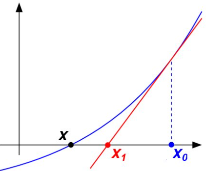

```{=html}

<style type="text/css">

/* Cascading Style Sheets (CSS) is a stylesheet language used to describe the presentation of a document written in HTML or XML. it is a simple mechanism for adding style (e.g., fonts, colors, spacing) to Web documents. */

h1.title {  /* Title - font specifications of the report title */
  font-size: 24px;
  color: DarkRed;
  text-align: center;
  font-family: "Gill Sans", sans-serif;
}
h4.author { /* Header 4 - font specifications for authors  */
  font-size: 20px;
  font-family: system-ui;
  color: DarkRed;
  text-align: center;
}
h4.date { /* Header 4 - font specifications for the date  */
  font-size: 18px;
  font-family: system-ui;
  color: DarkBlue;
  text-align: center;
}
h1 { /* Header 1 - font specifications for level 1 section title  */
    font-size: 22px;
    font-family: system-ui;
    color: navy;
    text-align: left;
}
h2 { /* Header 2 - font specifications for level 2 section title */
    font-size: 20px;
    font-family: "Times New Roman", Times, serif;
    color: navy;
    text-align: left;
}

h3 { /* Header 3 - font specifications of level 3 section title  */
    font-size: 18px;
    font-family: "Times New Roman", Times, serif;
    color: navy;
    text-align: left;
}

h4 { /* Header 4 - font specifications of level 4 section title  */
    font-size: 18px;
    font-family: "Times New Roman", Times, serif;
    color: darkred;
    text-align: left;
}

body { background-color:white; }

.highlightme { background-color:yellow; }

p { background-color:white; }

</style>
```
```{r setup, include=FALSE}
# Detect, install and load packages if needed.
if (!require("knitr")) {
   install.packages("knitr")
   library(knitr)
}
if (!require("nleqslv")) {
   install.packages("nleqslv")
   library(nleqslv)
}
#
# specifications of outputs of code in code chunks
knitr::opts_chunk$set(echo = TRUE,      
                      warnings = FALSE,   
                      messages = FALSE,  
                      results = TRUE     
                      )   
```


\

# Introduction

We have introduced bisection and fixed-point methods for finding the root of single-variable equations over a pre-selected interval. Both methods have a linear convergence rate (if the error sequence converges). This note introduces the well-known Newton method for finding the root of non-linear equations. We will see that the Newton method has a quadratic convergence rate (if converges).  Unlike the bisection method, this method can be extended to multi-variable nonlinear systems (same as the fixed-point method).

\
# Notation: Big O and Little o

We have introduced the concept of convergence rate at which some function changes as its argument grows (or shrinks), without worrying too much about the detailed form. This is what the O(·) and o(·) notation are. We now give a little more detail about these notations.

A function $f (n)$ is “of constant order”, or “of order 1” when there exists some non-zero constant c such that 
$$
\frac{f (n)}{c} \to 1
$$
as $n \to 1$; equivalently, since $c$ is a constant, $f (n)\to  c$ as $n \to 1$. It doesn’t matter how big or how small $c$ is, just so long as there is some such constant. We then write

$$
f(n) = O(1)
$$
and say that “the proportionality constant c gets absorbed into the big O”. For
example, if $f (n) = 37$, then $f (n) = O(1)$. But if $g (n) = 37(1 -2/n)$, then $g(n) = O(1)$


The other orders are defined recursively. Saying
$$
g(n) = O(f(n))
$$
means
$$
\frac{g(n)}{f(n)} = O(1), \text{ or }  \frac{g(n)}{f(n)} \to c,
$$
as $n \to \infty$. This is equivalently to say that $g(n)$ is **of the same order** as $f(n)$, and they **grow at the same rate**!

\
**Example 1**: a quadratic function $a_1n^2 + a_2n + a_3 = O(n^2)$, no matter what the coefficients are. On the other hand, $b_1n^{-2} + b_1n^{-1} is O(n^-1)$.

Big-O means “is of the same order as”. The corresponding little-o means “is ultimately smaller than”: $f (n) = o(1)$ means that $f (n)/c \in 0$ for any constant $c$. Reccursively, $g (n) = o(f (n))$ means $g (n)/ f (n) = o(1)$, or $g (n)/ f (n) \to 0$. We also read $g (n) = o(f (n))$ as “$g (n)$ is ultimately negligible compared to $f (n)$”.

\

# Foundations of Newton Method

**The Newton method is formulated based on the Taylor series.** 

## The Algorithmic Logic

Let's consider a general function $f(x)$. For the starting point $x_0$, the slope of the tangent line at the point $(x_0,f(x_0))$ is $f\prime(x_0)$ so the equation of the tangent line is $y-f(x_0)=f\prime(x_0)(x-x_0)$. We look at the intersection between the tangent line and $x$-axis: $(x_1, 0)$

```{r echo=FALSE, fig.align ="center",  out.width = '40%'}

```

where $x_1$ is the root of $0-f(x_0)=f^\prime(x_0)(x-x_0)$. solving the equation, we have $x_1= x_0 - f(x_0)/f^\prime(x_0)$. In the above figure, we can see $x_1$ is closer to the true root $x$. If we draw the tangent line at $(x_1, f(x_1))$ and look at the intersection between the x-axis and this tangent line, the x-coordinate $x_2 = x_1 - f(x_1)/f^\prime(x_1)$. 

```{r echo=FALSE, fig.align ="center",  out.width = '55%'}
if (knitr:::is_latex_output()) {
  knitr::asis_output('\\url{https://github.com/pengdsci/MAT325/raw/main/w04/img/w04-NewtonIterationGIF.gif}')
} else {
  knitr::include_graphics("img/w04-NewtonIterationGIF.gif")
}
```

Starting with $x_1$  and repeating this process we have $x_2  = x_1 - f(x_1)/f^\prime (x_1)$, we get $x_3=x_2-f(x_2)/f^\prime(x_2)$;  and so on.

\

## Initial Starting Value Matters

Here are a few examples with different starting values. We can see the number of iterations needed to achieve the error tolerance.

**Example 2**. Find the root of equation $f(x) = x^3 - x + 3 = 0$ using various initial starting values.


**Case 1**:  $x_0 = -1$. The algorithm converges after 6 iterations.

<embed type="text/html" src="https://engcourses-uofa.ca/wp-content/uploads/newtonRaphson-4.html" width="700" height="700">

**Case 2**:  $x_0 = -0.1$. The algorithm converges after 33 iterations.

<embed type="text/html" src="https://engcourses-uofa.ca/wp-content/uploads/newtonRaphson-2.html" width="700" height="700">


**Case 3**:  $x_0 = 0$. The algorithm **diverges** with the initial value $x_0 = 0$!

<embed type="text/html" src="https://engcourses-uofa.ca/wp-content/uploads/newtonRaphson-3.html" width="700" height="700">

\

# Algorithm and Code

Assume that $f(x)\in C^2[a,b]$. Let $x_0 \in [a, b]$ be an approximation to $p$, **the root of $f(x) = 0$**, such that $f(x_0) \ne 0$ and $|p-x_0|$ is “small.” 

Consider the first Taylor polynomial for $f(x)$ expanded about $x_0$ and evaluated at $x = p$. 
$$
f(p) = f(x_0) + (p - x_0)f^\prime(x_0) + \frac{(p - x_0)^2}{2}f^{\prime\prime}(\xi(p))
$$
where $\xi(p)$ is some number in $[\min{x_0, p}, \max{p, x_0}]$. Since $f(p) = 0$ and $|p-x_0|$ is "small", therefore, $0 \approx  f(x_0) - (p - x_0)f^\prime(x_0)$.  This yields
$$
p \approx x_0 -\frac{f(x_0)}{f^\prime(x_0)} \to x_1
$$ 

As demonstrated in the previous section, continuing this process, we have $\{x_n\}_{n = 0}^\infty$, where
$$
x_{n+1} = x_n - \frac{f(x_n)}{f^\prime(x_n)} \text{ for } n \ge 0,
$$

to approximate the root of equation $f(x) = 0$.


**Pseudo-code of Newton Method**:

```{}
INPUT:   initial x0;
         TOL;
         M = maximum iterations.
         f(x)
         f'(x)
OUTPUT:  Approximated root and optional information.

STEP 1:  n = 0    (initial counter)
         x = x0   (initial value)
         ERR = |f(x)/f'(x)|
STEP 2: WHILE ERR > TOL DO:
           n = n + 1
           x = x -f(x)/f'(x)
           ERR = |f(x)/f'(x)|
           IF ERR < TOL DO:
              OUTPUT (result and related info)
              STOP
           ENDIF
           IF ERR >= TOL DO:
              OUTPUT (intermediate info and messages)
           ENDIF
           IF n = M DO:
              OUTPUT (message: max iterations achieved!)
              STOP
           ENDIF
        ENDWHILE

```

**Implementation with R**

The following code is developed based on the following example.

**Example 2** (Revisited): Find the root of equation $f(x) = x^3 - x + 3 =0$.

```{r}
# Define f(x) and f'(x)

fn = function(x) x^3 - x +3
dfn = function(x) 3*x^2 - 1

# initial values
n = 0
x = -1
M = 200
TOL = 10^(-6)
ERR = abs(fn(x)/dfn(x))
# loop begins
while(ERR > TOL){
  n = n + 1
  x = x - fn(x)/dfn(x)
  ERR = abs(fn(x)/dfn(x))
  if(ERR < TOL){
     cat("\n\nAlgorithm converges!")
     cat("\nThe approximated root:", x, ".")
     cat("\nThe absolute error:", ERR, ".")
     cat("\nThe number of iterations n =",n,".")
     break
    } else{
      cat("\nIteration n =",n, ", approximate root:",x,", absolute error:", ERR,".")
    } 
    if (n ==M){
      cat("\n\nThe maximum iterations attained!")
      cat("\nThe algorithm did not converge!")
      break
    }
}
```

\

# Error Analysis

Assume that $f(x) \in C^2[a,b]$ is continuous and $p$ is a simple zero of $f(x)$ so that $f(p) = 0 \ne f^\prime(p)$. From the definition of the Newton iteration, we have 

$$
e_{n+1} = x_{n+1} - p = x_n -\frac{f(x_n)}{f^\prime(x_n)} - p = e_n - \frac{f(x_n)}{f^\prime(x_n)}.
$$

Using Taylor expansion, we have
$$
f(x_n) = f^\prime(p)(x_n - p) + \frac{1}{2}f^{\prime\prime}(\xi(p))(x_n-p)^2 = f^\prime(p)e_n + \frac{1}{2}f^{\prime\prime}(\xi(p))e_n^2,
$$
where $\xi(p)$ is between $x_n$ and $p$.  Therefore,
$$
e_{n+1} = e_n - \frac{f^\prime(p)e_n + \frac{1}{2}f^{\prime\prime}(\xi(p))e_n^2}{f^\prime(p)} = \frac{f^{\prime\prime}(\xi(p))}{2f^\prime(p)}e_n^2,
$$

that is,
$$
\frac{e_{n+1}}{e_n^2} = \frac{f^{\prime\prime}(\xi(p))}{2f^\prime(p)}.
$$

**Theorem**: Assume $f(x)$ is a continuous function with a continuous second derivative, that is defined on an interval $I = [p - \delta, p + ]delta$, with $\delta > 0$. Assume that $f(p) = 0$, and that $f^{\prime\prime}(p) \ne 0$. Assume that there exists a constant $M$ such that
$$
\left|\frac{f^{\prime\prime(x)}}{f^\prime(y)} \right| \le M, \text{ for } x, y \in I
$$
If $x_0$ is sufficiently close to the root $p$, i.e., if $|x_0 - p| \le \min\{\delta, 1/M\}$, then the sequence $\{x_n\}$ defined in Newton Method converges to the root $p$ with a quadratic convergence order.


