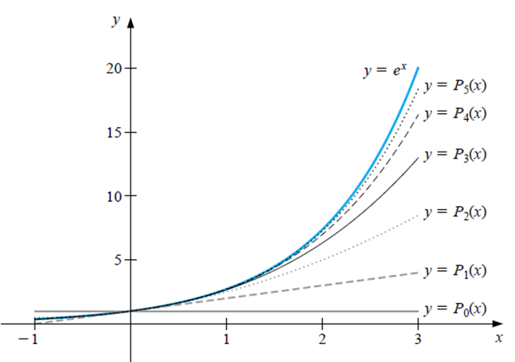
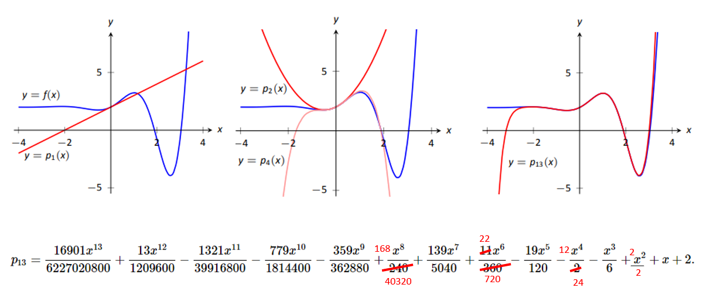
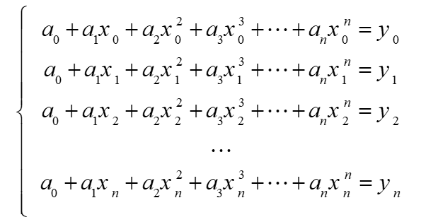
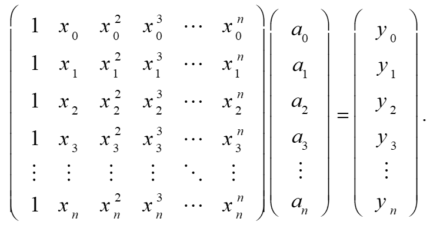
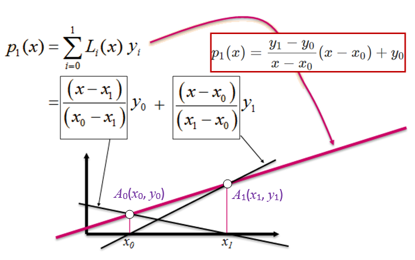
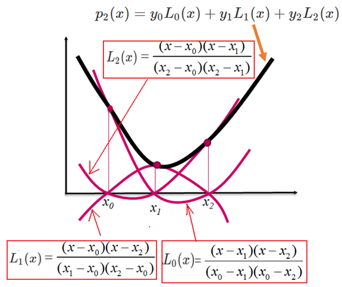

```{=html}

<style type="text/css">

/* Cascading Style Sheets (CSS) is a stylesheet language used to describe the presentation of a document written in HTML or XML. it is a simple mechanism for adding style (e.g., fonts, colors, spacing) to Web documents. */

h1.title {  /* Title - font specifications of the report title */
  font-size: 24px;
  color: DarkRed;
  text-align: center;
  font-family: "Gill Sans", sans-serif;
}
h4.author { /* Header 4 - font specifications for authors  */
  font-size: 20px;
  font-family: system-ui;
  color: DarkRed;
  text-align: center;
}
h4.date { /* Header 4 - font specifications for the date  */
  font-size: 18px;
  font-family: system-ui;
  color: DarkBlue;
  text-align: center;
}
h1 { /* Header 1 - font specifications for level 1 section title  */
    font-size: 22px;
    font-family: system-ui;
    color: navy;
    text-align: left;
}
h2 { /* Header 2 - font specifications for level 2 section title */
    font-size: 20px;
    font-family: "Times New Roman", Times, serif;
    color: navy;
    text-align: left;
}

h3 { /* Header 3 - font specifications of level 3 section title  */
    font-size: 18px;
    font-family: "Times New Roman", Times, serif;
    color: navy;
    text-align: left;
}

h4 { /* Header 4 - font specifications of level 4 section title  */
    font-size: 18px;
    font-family: "Times New Roman", Times, serif;
    color: darkred;
    text-align: left;
}

body { background-color:white; }

.highlightme { background-color:yellow; }

p { background-color:white; }

</style>
```
```{r setup, include=FALSE}
# Detect, install and load packages if needed.
if (!require("knitr")) {
   install.packages("knitr")
   library(knitr)
}
if (!require("pander")) {
   install.packages("pander")
   library(pander)
}
#
# specifications of outputs of code in code chunks
knitr::opts_chunk$set(echo = TRUE,      
                      warnings = FALSE,   
                      messages = FALSE,  
                      results = TRUE     
                      )   
```


\

# Introduction

In many computational applications, one must approximate an intractable real-valued function $f(x)$ with a computationally tractable function $\hat{f}(x)$. Broadly speaking, there are two types of function approximation problems that arise often in real-world applications: interpolation and functional equation problems.


Starting from this note, we will focus on numerical approximation problems via interpolation. We have noticed that a given continuous function can be approximated by a polynomial function. The following figure shows that $y = e^x$ can be approximated by Taylor polynomials reasonably well. 

```{r echo=FALSE, fig.align ="center",  out.width = '50%'}

```

where

$$
P_n(x) = 1 + x + \frac{x^2}{2!} + \frac{x^3}{3!} + \cdots + \frac{x^n}{n!}.
$$

Note that the Taylor expansion of $y = e^x$ is given by


$$
y = e^x = P_n(x) + R_n(x)
$$

With

$$
R_n(x) = \frac{e^{\xi}x^{n+1}}{(n+1)!} \ \ \text{ for some } \xi \in (0, x).
$$

It is not surprising that, as $n$ gets bigger, $P_n(x)$ gets closer to $y = e^x$. The next figure gives the curve of a function that is *more complex* than $e^x$. We can see a similar pattern as seen in the above figure.

```{r echo=FALSE, fig.align ="center",  out.width = '90%'}

```

The approximation error is summarized in the following Theorem (will not prove it in this class)

**Theorem**. Let $f(x)$ be a real-valued function that has continuous derives up to order $n+1$, Then the remainder of the Taylor expansion at $x = a$ (i.e., approximation error) can be expressed in the following integral form
$$
R_n^a[f(x)] = \int_a^x \frac{f^{(n+1)}(t)}{n!}(t-a)^n dt.
$$

In the above two examples, the underlying function $f(x)$ was expanded at $x = 0$ (i.e., Maclaurin expansion). In general, Taylor expansion (approximation) uses values of the function and its derivatives: $f(a), f^\prime(a), f^{(2)}(a), \cdots, f^{(n)}$ and $f^{(n+1)(\xi)}$ where $\xi \in (a, x)$.

We can also consider Taylor expansion as a linear combination of basis functions $\{1, x, x^2, x^3, \cdots, x^n, \cdots \}$.

There are several obvious disadvantages of the Taylor polynomial approximation:

* $y = f(x)$ must be explicitly given and is $n$-th order differentiable. That is, to get an n-th degree Taylor polynomial, we need to assume $f(x)$ to have an n-th order derivative.

* The approximation is very well in the neighborhood of $x= a$ at which the function $y = f(x)$ is expanded (via Taylor expansion) but is poor far away from the neighborhood.


<font color = "red">**\color{red}A natural question**:</font> *whether we can sample a set of points on the curve of $y = f(x)$ and then find a lower degree (than Taylor) polynomial for approximating $y = f(x)$ such that $P_n(x_i) = f(x_i)$*.

The answer to the question is **YES**. Several methods using this idea will be introduced in the next few notes.


# Concepts of Interpolation Method


A function is said to **interpolate** a set of data points if it passes through those points. 

**Definition**: The function $y = f(x)$ interpolates the data points $\{(x_1, y_1), (x_2, y_2), \cdots, (x_n, x_n)\}$ if $y_i = P_n(x_i)$ for each $1 \le i \le n$.

Since $f(x)$ is a function; $x_i$'s must be all distinct in order for a function to pass through them. 

\

## Data-fitting / Interpolation: 


For the following given points samples from an **unknown function** $f(x)$: 

| $x$ | $x_0$  | $x_1$ | $x_2$  | $\cdots$  |  $x_n$  |
|:----|:-------|:------|:-------|:----------|:--------|
| $y$ | $y_0$  | $y_1$ | $y_2$  | $\cdots$  |  $y_n$  |


and we try to find a polynomial $P_n(x)$ of degree $\le n$ for which,

$$
P_n(x_i) = y_i, \  \ \text{ for } \ \ 0 \le i \le n.
$$
such a polynomial is said to interpolate the data (data fitting). This type of question is very common in almost areas that produce data. 

**Existence of Polynomial Interpolation**: if $\{x_0, x_1, x_2, \cdots, x_n \}$ are distinct real numbers, then  for arbitrary values $\{y_0, y_1, y_2, \cdots, y_n \}$ there is a unique polynomial $P_n(x)$ of degree $\le n$  such that

$$
P_n(x_i) = y_i, \ \ \text{ for } 0 \le i \le n.
$$

**Proof**. For any polynomial $P_n(x)$ of degree $\le n$, we have the following form :

$$
P_n(x) = a_0 + a_1x + a_2 x^2 + \cdots + a_n x^n.
$$

To determine the polynomial $P_n(x)$ is to find the coefficient $a_i$'s. We will use the interpolation condition $P_n(x_i) = y_i, \ \ \text{ for } 0 \le i \le n$.

```{r echo=FALSE, fig.align ="center",  out.width = '50%'}

```

Note that $\{a_0, a_1, a_2, \cdots, a_n \}$, are unknown. We rewrite it in the following matrix form

```{r echo=FALSE, fig.align ="center",  out.width = '60%'}

```


Since the coefficient matrix is a **Vandermonde matrix**, it is nonsingular if and only if $\{x_0, x_1, x_2, \cdots, x_n \}$ are distinct. This imply that the system exists a unique solution $(a_0, a_1, a_2, \cdots, a_n)^T$ if and only if $\{x_0, x_1, x_2, \cdots, x_n \}$ are distinct since the determinant of that matrix is 

$$
\prod_{1 \le i < j \le n}(x_i-x_j)
$$

Hence, there exists a unique polynomial $P_n(x)$ of degree  $\le n$ if $\{x_0, x_1, x_2, \cdots, x_n \}$ are distinct.


\

## Functional Equation (Curve Approximation)

Another type of interpolation problem is formulated as follows: given a set of $\{ x_0, x_1, x_3, \cdots, x_n\}$ and a continuous function $f(x)$, find a polynomial $P_n(x)$ of degree less than or equal to n such that $P_n(x_i) = f(x_i)$ for $0 \le i \le n$.

The Newton interpolation is one type of this problems. We will introduce this method in a subsequent note.

\

# The Lagrange Interpolation

The basic idea of Lagrange interpolation is approximate a function by using a linear combination of Lagrange basis polynomials defined based on a given set of distinct points $\{(x_0, y_0), (x_1, y_1), (x_2, y_2), \cdots, (x_n, y_n)\}$ sampled from a curve of a function $f(x)$ with an unknown analytic expression. The given points are called interpolation nodes.

Next, we use several special interpolations to illustrate the construction of Lagrange basis polynomials.

## Linear Lagrange Interpolation

Assume that we are given two distinct points $\{(x_0, y_0), (x_1, y_1)\}$. The objective is to find an interpolation "*polynomial*" that passes through the two points. Intuitively, we use the following two-point form

$$
y = \frac{y_1 - y_0}{x - x_0}(x - x_0) + y_0
$$
The above function is linear (degree 1 polynomial). We use 

$$
p_1(x) = \frac{y_1 - y_0}{x - x_0}(x - x_0) + y_0.
$$
Next, we re-express the above degree one polynomial in the following

$$
p_1(x) = y_1\frac{x-x_0}{x_1-x_0} + y_0\left(1-\frac{x-x_0}{x_1-x_0} \right) = y_1\frac{x-x_0}{x_1-x_0} + y_0\frac{x-x_1}{x_0-x_1}
$$

We denote

$$
L_0(x) = \frac{x-x_1}{x_0-x_1} \ \ \text{ and } \ \ L_1(x) = \frac{x-x_0}{x_1-x_0} .
$$

$L_0(x)$ and $L_1(x)$ are both degree-one polynomials. They are called **Lagrange Basis Polynomials with degree 1**.

**Observations of Lagrange Basis Polynomials**: For $i, j = 0, 1$,

$$
L_i(x_j) = \begin{cases} 
      1 & i = j \\
      0 & i \ne j. 
   \end{cases}
$$


The degree-one interpolation polynomial is expressed as $p_1(x) = y_0 L_0(x) + y_1 L_1(x)$. The following figure illustrates how the interpolated polynomial is expressed as the linear combination of the **Lagrange Basis Polynomials**.

```{r echo=FALSE, fig.align ="center",  out.width = '50%'}

```

We can check that $p_1(x_0) = y_0$ and $p_1(x_1) = y_1.$.


\

## Quadratic Lagrange Interpolation

Quadratic Lagrange interpolation assumes that three distinct points were sampled from the curve.


| $x$ | $x_0$  | $x_1$ | $x_2$  |
|:----|:-------|:------|:-------|
| $y$ | $y_0$  | $y_1$ | $y_2$  |


The objective is to find a polynomial $p_2(x)$ of degree $\le 2$ such that

$$
p_2(x_i) = y_i, \ \ \text{ for } i = 1, 2, 3.
$$


we construct the basis $L_0(x), L_1(x), L_2(x)$ such that 

$$
L_i(x_j) = \begin{cases} 
      1 & i = j \\
      0 & i \ne j. 
   \end{cases}
$$

We only construct the basis function $L_0(x)$ associated with the point $x_0$. Since $x_1$ and $x_2$ are zeros of $L_0(x)$, it should have the following form

$$
L_0(x) = c(x-x_1)(x-x_2).
$$
Since $L_0(x_0) = 1$, which implies that

$$
c = \frac{1}{(x_0-x_1)(x_0-x_2)}
$$

Therefore,

$$
L_0 = \frac{(x-x_1)(x-x_2)}{(x_0-x_1)(x_0-x_2)}
$$

Similarly, we can construct $L_1(x)$ and $L_2(x)$ in the following

$$
L_1(x) = \frac{(x-x_0)(x-x_2)}{(x_1-x_0)(x_1-x_2)} \ \ \text{ and } \ \ L_2(x) = \frac{(x-x_0)(x-x_1)}{(x_2-x_0)(x_2-x_1)}
$$
Hence the interpolation polynomial is as follows

$$
p_2(x) = y_0L_0(x) + y_1 L_1(x) + y_2 L_2(x)
$$


```{r echo=FALSE, fig.align ="center",  out.width = '55%'}

```

\

## General Lagrange Interpolation

Assume now that we are given the following distinct points

| $x$ | $x_0$  | $x_1$ | $x_2$  | $\cdots$  |  $x_n$  |
|:----|:-------|:------|:-------|:----------|:--------|
| $y$ | $y_0$  | $y_1$ | $y_2$  | $\cdots$  |  $y_n$  |

then a unique polynomial $p_n(x)$ of degree at most $n$ exists with

$$
p_n(x) = y_k
$$
This polynomial is explicitly defined as follows

$$
p_n(x) = y_0L_{n,0}(x) + y_1 L_{n,1}(x) + \cdots + y_nL_{n,n}(x),
$$

where

$$
L_{n,k} = \frac{(x-x_0)(x-x_1)\cdots(x-x_{k-1})(x-x_{k+1})\cdots(x_k-x_n)}{(x_k-x_0)(x_k-x_1)\cdots(x_k-x_{k-1})(x_k-x_{k+1})\cdots(x_k-x_n)}.
$$


# Lagrange Algorithm


The algorithm of the Lagrange interpolation involves two nested iterative processes:

* Approximated individual basis polynomial and evaluate it at a given x-value (including the x-coordinates in the approximating notes);

* Estimated the set of estimated polynomials with the approximated value of Pn(x).

The pseudo-code is given by:

```
INPUT: x1, x2, ... ,xn
       y1, y2, ... ,yn
        (or f(x1), f(x2), ..., f(xn))
       pred.x  

OUTPUT: return Pn(x)

STEP 1: set initial values
        Pn = 0     (initial value of interpolated polynomial)
        LP = 1     (vector with all 1s)

Step 2: FOR i = 1, 2, ..., n. DO
        STEP 3: FOR j = 1, 2, ..., n. DO
                    IF i != j DO:
                       LP = LP*(pred.x-xj)/(xi-xj)
                    ENDIF
                ENDFOR
        STEP 4  Pn = LP*yi + Pn
        ENDFOR        
STEP 5: OUTPUT Pn              
```

## R Function with Scalar Input

The next function takes only a single x value and returns the value of the approximated polynomial at the provided x value.


```{r}
#######################################################
##        Lagrange Interpolation
#######################################################
LagrangeInterpolation =function(
                        pred.x,      # scalar x for eval Pn() 
                        fn = NULL,   # input function or
                        yvec = NULL, # input y-coordinates
                        xvec         # input x-coordinates
                        ){
     # 
     if(length(yvec) == 0) yvec = fn(xvec) #
     n = length(xvec)       # input x-coordinates
     Pn = 0
     for (i in 1:n){
         LP = 1
         for (j in (1:n)[-i]){  
              LP = LP * (pred.x - xvec[j])/(xvec[i] - xvec[j])
             }
         Pn = Pn + LP * yvec[i]
       }
   Pn
  }
```

\

**Example 1**: Find a Lagrange polynomial to approximate the function $f(x) = e^x\cos(3x)$ and estimate the value of $f(x)$ at $x = 0.5$ and $0.3$ respectively.

**Solution**: We use the above R function to estimate $f(x)$ at $x = 0.5$ and $0.3$. We also print out the true values $f(x)$  at $x = 0.5$ and $0.3$ for comparison.


```{r}
fn=function(x) exp(x)*cos(3*x)
approx.val0.3 = LagrangeInterpolation(fn=fn, xvec=c(0, 0.3, 0.6), pred.x = 0.3)
approx.val0.5 = LagrangeInterpolation(fn=fn, xvec=c(0, 0.3, 0.6), pred.x = 0.5)
true.val = fn(c(0.3,0.5))
pander(cbind(approx.val0.3 = approx.val0.3, true.val0.3 = true.val[1],  
             approx.val0.5 = approx.val0.5, true.val0.5 = true.val[2]))
```


## R Function with Vector Input 


```{r}
#######################################################
##        Lagrange Interpolation
#######################################################
Lagrange.Interpolation.Vector =function(
                        pred.x,      # vector x for eval Pn() 
                        fn = NULL,   # input function or
                        yvec = NULL, # input y-coordinates
                        xvec         # input x-coordinates
                        ){
  # 
  if(length(yvec) == 0) yvec = fn(xvec) #
  n = length(xvec)       # input x-coordinates
  m = length(pred.x)     # number of input x values
  PV = rep(0, m)
  for (k in 1:m){
     Pn = 0
     for (i in 1:n){
         LP = 1
         for (j in (1:n)[-i]){  
              LP = LP * (pred.x[k] - xvec[j])/(xvec[i] - xvec[j])
             }
         Pn = Pn + LP * yvec[i]
       }
     PV[k] = Pn
    }
   PV
  }
```

```{r}
fn=function(x) exp(x)*cos(3*x)
approx.value = Lagrange.Interpolation.Vector(fn=fn, xvec=c(0, 0.3, 0.6), 
                                             pred.x = c(0.3, 0.5))
true.value = fn(c(0.3, 0.5))
pander(rbind(true.value=true.value, approx.value = approx.value))
```

**Example 3**: Consider Lagrange interpolation approximation of $f(x) = \frac{1}{1+25x^2}$. The x-nodes used in the approximation are (-1.0, -0.8, -0.6, -0.4, -0.2, 0, 0.2, 0.4, 0.6, 0.8, 1). Plot the curves of $f(x)$ and $P_{10}(x)$.

**Solution**: Based on the given information, we use the above vector-based function to find the P_n(x) and create a sequence of 100 x-values from [-1, 1] that are equally spaced.

```{r fig.align='center', fig.width=5, fig.height=5}
fn=function(x) 1/(1 + 25*x^2)
pred.x = seq(-1, 1, length = 100)
xvec = c(-1.0, -0.8, -0.6, -0.4, -0.2, 0, 0.2, 0.4, 0.6, 0.8, 1)
##
approx.value = Lagrange.Interpolation.Vector(fn=fn, xvec=xvec, 
                                             pred.x = pred.x)
true.value = fn(pred.x)
plot(pred.x, approx.value, type = "l", col = "red", lwd = 2, lty = 1,
            main = "Lagrange Interpolation",
             xlab = "",
             ylab = "")
lines(pred.x, true.value, lty = 2, lwd = 2, col = "blue")
points(xvec, fn(xvec), pch = 19, col = "purple", cex = 1.2)
legend("top", c("Interpolated Polynomial", "Original Function"), 
       lwd=rep(2,2), lty=1:2, col = c("red", "blue"), bty="n")
```


