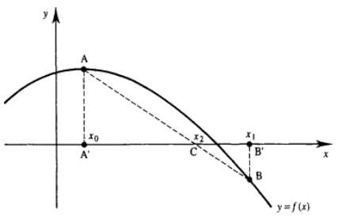
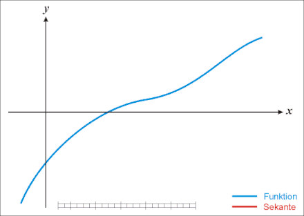
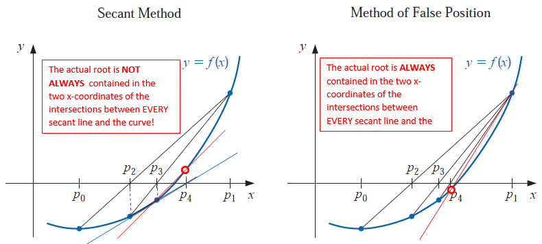
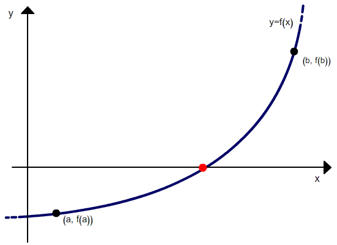

```{=html}

<style type="text/css">

/* Cascading Style Sheets (CSS) is a stylesheet language used to describe the presentation of a document written in HTML or XML. it is a simple mechanism for adding style (e.g., fonts, colors, spacing) to Web documents. */

h1.title {  /* Title - font specifications of the report title */
  font-size: 24px;
  color: DarkRed;
  text-align: center;
  font-family: "Gill Sans", sans-serif;
}
h4.author { /* Header 4 - font specifications for authors  */
  font-size: 20px;
  font-family: system-ui;
  color: DarkRed;
  text-align: center;
}
h4.date { /* Header 4 - font specifications for the date  */
  font-size: 18px;
  font-family: system-ui;
  color: DarkBlue;
  text-align: center;
}
h1 { /* Header 1 - font specifications for level 1 section title  */
    font-size: 22px;
    font-family: system-ui;
    color: navy;
    text-align: left;
}
h2 { /* Header 2 - font specifications for level 2 section title */
    font-size: 20px;
    font-family: "Times New Roman", Times, serif;
    color: navy;
    text-align: left;
}

h3 { /* Header 3 - font specifications of level 3 section title  */
    font-size: 18px;
    font-family: "Times New Roman", Times, serif;
    color: navy;
    text-align: left;
}

h4 { /* Header 4 - font specifications of level 4 section title  */
    font-size: 18px;
    font-family: "Times New Roman", Times, serif;
    color: darkred;
    text-align: left;
}

body { background-color:white; }

.highlightme { background-color:yellow; }

p { background-color:white; }

</style>
```
```{r setup, include=FALSE}
# Detect, install and load packages if needed.
if (!require("knitr")) {
   install.packages("knitr")
   library(knitr)
}
if (!require("pander")) {
   install.packages("pander")
   library(pander)
}
#
# specifications of outputs of code in code chunks
knitr::opts_chunk$set(echo = TRUE,      
                      warnings = FALSE,   
                      messages = FALSE,  
                      results = TRUE     
                      )   
```


\

# Introduction

Recall that Newton's method uses Taylor expansion to derive the functional recursive relationship between adjacent approximated roots
$$
x_{n+1} = x_n - \frac{f(x_n)}{f^\prime(x_n)} \text{ for }n = 0, 1, \cdots.
$$

where $f^\prime(x_n)$ is the slope of the tangent line passing through $x=x_n$. If we use the slope of a secant line that passes through points $(x_n, f(x_n))$ and $(x_{n-1}, f(x_{n-1}))$, we can use the x-coordinates of the intersection between the secant line and x-axis to approximate the root of $f(x) = 0$.  


# Secant Method

Assume we have two distinct initial values $x = x_0$ and $x = x_1$. Then slope of the secant line passing through A$(x_0, f(x_0))$ and B$(x_1, f(x_1))$ is
$$
\frac{f(x_1)-f(x_0)}{x_1-x_0} \approx f^\prime(x_1) \text{ when } |x_1-x_0| \text{ is small}.
$$
The secant method uses the x-coordinate of the intersection of the secant line
$$
f(x) = f(x_1) + \frac{f(x_1)-f(x_0)}{x_1-x_0}(x - x_1)
$$
and $f(x) = 0$ (equation of the x-axis). Solving for $x$, we have 
$$
x = x_1 -\frac{x_1-x_0}{f(x_1)-f(x_0)} f(x_1) \equiv x_2.
$$

```{r echo=FALSE, fig.align ="center",  out.width = '50%'}

```

In general, the recursive relationship between approximated roots of the **secant method** is given by
$$
x_{n+1} = x_n -\frac{x_n-x_{n-1}}{f(x_n)-f(x_{n-1})} f(x_n), \text{ for } n =0, 1, \cdots 
$$
```{r echo=FALSE, fig.align ="center",  out.width = '55%'}
if (knitr:::is_latex_output()) {
  knitr::asis_output('\\url{https://github.com/pengdsci/MAT325/raw/main/w05/img/w05-betterSecantAnimation.gif}')
} else {
  
}
```


* **Secant Algorithm**

We develop the following pseudo-code of the secant method.

```{}
INPUT:  f(x)            (satisfying f(x) = 0)
        x0              (initial value 1)
        x1              (initial value 2)

STEP 1: x0
        x1              (f(x0)*f(x1) must be negative)
        M = 200
        TOL = 10^(-6)
        n = 0
        ERR = |x1 - x0|  
STEP 2: WHILE ERR > TOL DO
           n = n + 1
           new.x = x1 - ((x1-x0)/(f(x1)-f(x0)))*f(x1)
           ERR = |new.x - x1|
           IF ERR < TOL DO:
              OUTPUT        (results and optional relevant info)
              STOP
           ENDIF
           IF ERR >= TOL DO:
              OUTPUT        (message or intermediate outputs)
              x1 = new.x    (update)
              x0 = x1
           ENDIF
           IF n == M DO:
             OUTPUT         (warning messages)
             STOP
           ENDIF
        ENDWHILE
```
           


* **Implementation with R**

We next write an R function to implement the secant method.

```{r}
########################################
##     Root Finding: Secant Method
#########################################
Secant.Method = function(fn,            # input function
                  TOL,                  # error tolerance 
                  max.iter,             # max allowed iterations
                  x1,                   # initial value #1
                  x2                    # initial value #2
                  ){
  ctr = 0                # counter of iteration
  ERR = abs(x2 - x1)     # initial error - width of initial interval
  # Define a data frame (data table) to store the output of each iteration
  ERR.table =  data.frame(Iteration = 1:max.iter,   
                          Est.root = rep(NA, max.iter),
                          Abs.error = rep(NA, max.iter))
  while(ERR > TOL){ 
      ctr = ctr + 1
      new.x = x2 - fn(x2) * (x2 - x1) / (fn(x2) - fn(x1))
      ERR = abs(new.x - x2)
      if(ERR < TOL){
         ERR.table[ctr,] = c(ctr, new.x, ERR)
         break
         } else{
            ERR.table[ctr,] = c(ctr, new.x, ERR)
            # updating the two values. CAUTION: order matters
            x1 = x2
            x2 = new.x
         }
        if(ctr == max.iter){
         #cat("\n\nThe maximum number of iterations attained!\n\n\n")
         break
       }
   }                     # close the while-loop
  if(ctr==max.iter){
    pander(data.frame(message = "The maximum number of iterations attained!"))
  } else{
  na.omit(ERR.table)     # delete rows with NAs (missing values)
  }
}                        # close the function environment

```

\

**Example 1**: Find a root of equation $x^3+x^2+6x+18 = 0$.

**Solution**: we use the above R function of the Newton method to find the approximated root of the equation.

```{r echo = TRUE, fig.align='center', fig.height=5, fig.width=5}
# define the function f(x) that satisfies f(x) = 0
example01.func = function(x){x^3+x^2+6*x+18 }
###
xx = seq(-5,5, length=500)    # 500 evenly x-values evenly spread on [-5, 5]
yy = example01.func(xx)       # the corresponding y values
plot(xx, yy, type = "l", xlab ="", ylab="", main="", lwd = 2, col = "blue")
abline(h=0, col = "darkred", lty = 2)
```

Based on the above graph, we search a root over $[-5, 5]$ in the follwoing function call.

```{r echo = TRUE}
# call the function
error.matrix = Secant.Method(fn = example01.func,       # input function
                      TOL = 10^(-8),               # error tolerance 
                      max.iter = 5,               # max allowed iterations
                      x1 = -5,                     # initial value #1
                      x2 = 5)                      # initial value #2
pander(error.matrix)
```

The error plot is given by

```{r echo = TRUE, fig.align='center', fig.width=5, fig.height=5}
if(length(dim(error.matrix))>0){ 
  ###
  Error = error.matrix$Abs.error
  nitr = length(Error)
  plot(1:nitr, Error, type = "l", lwd = 2, col = "blue",
             main="Error Plot",
             xlim = c(0,nitr+1),
             ylim = c(0, max(Error)),
             xlab = "Iteration Numbers",
             ylab = "Absolute Error",
             cex.main = 0.8,
             col.main = "darkred"
        )
  }else{
  pander(data.frame(meesage ="The approximation error is unavailable!"))
}

```


**Practice Exercise**: find the solution to $0.8(x+0.5)^3-1=0$ 0n $[0.25, 2.75]$.


\

# Error Analysis

Let $e_n = x_n - p$, then $e_n - e_{n-1} = x_n - x_{n-1}$.  From the definition of the secant method we have
$$
e_{n+1} = e_n + x_{n+1} - x_n = e_n -\frac{x_n-x_{n-1}}{f(x_n)-f(x_{n-1})}f(x_n).
$$
With some algebraic manipulation, we can express $e_{n+1}$ as
$$
e_{n+1} = \frac{x_n-x_{n-1}}{f(x_n)-f(x_{n-1})}\frac{f(x_n)/e_n - f(x_{n-1})/e_{n-1}}{x_n-x_{n-1}}e_ne_{n-1}.
$$
Note that
$$
\frac{x_n-x_{n-1}}{f(x_n)-f(x_{n-1})} \approx \frac{1}{f^\prime(p)}
$$
After expanding $f(x_n)$ and $f(x_{n-1})$ at $p$, we have
$$
\frac{f(x_n)/e_n - f(x_{n-1})/e_{n-1}}{x_n-x_{n-1}} \approx \frac{f^{\prime\prime}(p)}{2}
$$

Therefore,
$$
e_{n+1} \approx \frac{f^{\prime\prime}(p)}{2f^\prime(p)}e_ne_{n-1}
$$

Consequently,
$$
\lim_{n\to \infty}\frac{e_{n+1}}{e_ne_{n-1}} = \frac{f^{\prime\prime}(p)}{2f^\prime(p)} = C_0
$$
To find the order of convergence, we assume that $e_{n+1} = C_ne_n^\alpha$ where $\lim_{n \to \infty} C_n = C$. Then

$$
\lim_{n\to \infty}\frac{e_{n+1}}{e_ne_{n-1}}=\lim_{n\to \infty}\frac{C[Ce_{n-1}^\alpha]^\alpha}{Ce^\alpha_{n-1}e_{n-1}} = \lim_{n\to\infty}C^\alpha e_{n-1}^{\alpha^2-\alpha -1} = C_0.
$$

This implies that
$$
\alpha^2 -\alpha - 1 = 0
$$
The positive root of the above equation is
$$
\alpha = \frac{1+\sqrt{5}}{2} \approx 1.62
$$


Therefore, the convergence order for the secant method is between linear and quadratic orders – we call this **super-linear** convergence!

\

# False Position Method


The method of False Position (also called Regula Falsi) generates approximations using the x-coordinates of successive secant lines defined prior approximated roots in such a ways that the actual roots is always $[x_n, x_{n-1}]$ in the n-th iteration. <font color = "red"><b>**\color{red}Programmatically, it is the secant method with an additional control statement.**</b></font>

>First choose initial approximations $p_0$ and $p_1$ with $f ( p_0) \times f ( p_1) < 0$. The approximation $p_2$ is chosen in the same manner as in the Secant method, as the x-intercept of the line joining $( p_0, f ( p_0))$ and $( p_1, f ( p_1))$. To decide which secant line to use to compute $p_3$, consider $f ( p_2) \times f ( p_1)$, or more correctly $\text{sgn} f ( p_2) \times \text{sgn} f ( p_1)$ 

>* If $\text{sgn} f ( p_2) \times \text{sgn} f ( p_1) < 0$, then $p_1$ and $p_2$ bracket a root. Choose $p_3$ as the x-intercept of the line joining $( p_1, f ( p_1))$ and $( p_2, f ( p_2))$.

>* If not, choose $p_3$ as the x-intercept of the line joining $( p_0, f ( p_0))$ and $( p_2, f ( p_2))$, and then interchange the indices on $p_0$ and $p_1$.

\

```{r echo=FALSE, fig.align ="center",  out.width = '80%'}

```

The following is an animated graph showing the process of search the root using false position method.

```{r echo=FALSE, fig.align ="center",  out.width = '55%'}
if (knitr:::is_latex_output()) {
  knitr::asis_output('\\url{https://github.com/pengdsci/MAT325/raw/main/w05/img/w05-regula.gif}')
} else {
  
}
```

Finally, the order of convergence of **false position method** is same as the **secant method**. 

\

# Chapter 2 Homework - Part II.

**Section 2.3**. If you use MAT

Problem 2 [page 75]. *Use either R or MATLAB to do this problem.*

Problem 3(a) [page 75]. *Do this problem manually first and then call an R/MATLAB function we developed to verify your results.*

Problem 17(b,c), [Page 76]. *Call the functions we developed in class. If you use MATLAB, please include the the MATLAB script with your annotations (line-by-line).*

Problem 19 (**optional**)

