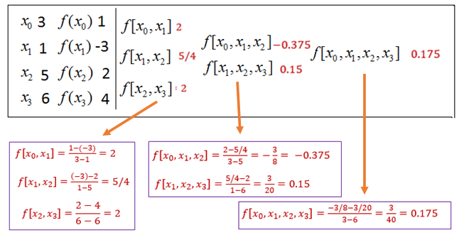

```{=html}

<style type="text/css">

/* Cascading Style Sheets (CSS) is a stylesheet language used to describe the presentation of a document written in HTML or XML. it is a simple mechanism for adding style (e.g., fonts, colors, spacing) to Web documents. */

h1.title {  /* Title - font specifications of the report title */
  font-size: 24px;
  color: DarkRed;
  text-align: center;
  font-family: "Gill Sans", sans-serif;
}
h4.author { /* Header 4 - font specifications for authors  */
  font-size: 20px;
  font-family: system-ui;
  color: DarkRed;
  text-align: center;
}
h4.date { /* Header 4 - font specifications for the date  */
  font-size: 18px;
  font-family: system-ui;
  color: DarkBlue;
  text-align: center;
}
h1 { /* Header 1 - font specifications for level 1 section title  */
    font-size: 22px;
    font-family: system-ui;
    color: navy;
    text-align: left;
}
h2 { /* Header 2 - font specifications for level 2 section title */
    font-size: 20px;
    font-family: "Times New Roman", Times, serif;
    color: navy;
    text-align: left;
}

h3 { /* Header 3 - font specifications of level 3 section title  */
    font-size: 18px;
    font-family: "Times New Roman", Times, serif;
    color: navy;
    text-align: left;
}

h4 { /* Header 4 - font specifications of level 4 section title  */
    font-size: 18px;
    font-family: "Times New Roman", Times, serif;
    color: darkred;
    text-align: left;
}

body { background-color:white; }

.highlightme { background-color:yellow; }

p { background-color:white; }

</style>
```
```{r setup, include=FALSE}
# Detect, install and load packages if needed.
if (!require("knitr")) {
   install.packages("knitr")
   library(knitr)
}
if (!require("MASS")) {
   install.packages("MASS")
   library(MASS)
}
if (!require("nleqslv")) {
   install.packages("nleqslv")
   library(nleqslv)
}
if (!require("pander")) {
   install.packages("pander")
   library(pander)
}
#
# specifications of outputs of code in code chunks
knitr::opts_chunk$set(echo = TRUE,      # include code chunk in the output file
                      warnings = FALSE,  # sometimes, you code may produce warning messages,
                                         # you can choose to include the warning messages in
                                         # the output file. 
                      messages = FALSE,  #
                      results = TRUE     # you can also decide whether to include the output
                                         # in the output file.
                      )   
```


\

# Introduction

This lab note introduces how to reduce loops through vectorization. For any vectorized language, there are different extensions such as user-defined functions and routines to carry vectorized operation instead of element-wise operation. Most R functions are vectorized. We will use some examples to illustrate how a loop can be avoided if vectorization is available.


# Implicit in R Primitive Functions
 
R was written in C. It has a long list of primitive functions written in C. Most of these functions are vectorized. Calling an internal vectorized function is the same as performing an implicit loop.

**Example 1**: Consider the sum of two matrices with the same dimension. Define

$$
A = \begin{pmatrix}
1 & 2 & 3\\
3 & 7 & 9
\end{pmatrix}
$$
and 

$$
B = \begin{pmatrix}
5 & 2 & 7\\
4 & 1 & 6
\end{pmatrix}
$$

We find the sum of $A$ and $B$

$$
A + B = \begin{pmatrix}
6 & 4 & 10\\
7 & 8 & 15
\end{pmatrix}
$$

**Method 1**: Using explicit loops. Since the sum of compatible matrices is an element-wise operation, in order to access individual elements, we need to use two indexes - one for the row and one for the column. We use the double loops to calculate the sum of two matrices in the following code.

```{r}
loopSum = function(A,B){
    sumAB = matrix(0, nrow = dim(A)[1], ncol = dim(A)[2])
        for(i in 1:dim(A)[1]) {
            for (j in 1:dim(A)[2]){
                sumAB[i,j] = A[i,j] + B[i,j]
             }
         }
    sumAB
 }
```

We can also use R primitive function `+` to perform the matrix summation.

```{r}
vectorSum = function(A,B) {A + B}
```


```{r}
A = matrix(c(1,2,3,3,7,9), ncol = 3, byrow = TRUE)
B = matrix(c(5,2,7,4,1,6), ncol = 3, byrow = TRUE)
```

```{r}
start <- Sys.time()
loopSum(A,B)
print( Sys.time() - start )
```


```{r}
start <- Sys.time()
vectorSum(A,B)
print( Sys.time() - start )
```

**Example 2**: Summation of large matrices.

```{r}
A0 = matrix(runif(10000000), ncol = 5000)
B0 = matrix(runif(10000000), ncol = 5000)
```


```{r}
start <- Sys.time()
AplusB.lp = loopSum(A0,B0)
print( Sys.time() - start )
```


```{r}
start <- Sys.time()
AplusB.vec = vectorSum(A0,B0)
print( Sys.time() - start )
```
The obvious benefits of using an implicit vectorized primitive function to perform matrix operation:

1. The code is simple.

2. It is faster.


# Some Vectorized Primitive Functions

Since the numerator and denominator are defined as the difference between adjacent terms. We can vectorize these differences using the R function **diff()** that computes the difference between pairs of consecutive elements of a numeric vector.

**Example 2**: Consider `vec.x = (1, 1.3, 1.6, 1.9, 2.2)` and `vec.y = (0.7651977, 0.6200860, 0.4554022, 0.2818186, 0.1103623)`. We use the **diff()** to calculate the divided differences in the following table step by step.


```{r echo=FALSE, fig.align ="center",  out.width = '70%'}

```

The following are manual steps for calculating the divided differences in the above table.

* *Step 1*: zero-th order divided differences (i = 1)
```{r}
vec.x = c(3,1,5,6)          
vec.y = c(1,-3,2,4)
n = length(vec.x)
```

* *Step 2*: The first order divided differences (i = 2)

```{r}
i=2
## divided difference
i2.y = diff(vec.y)
i2.x = vec.x[-(1:(i-1))] - vec.x[-((n+2-i):n)]
i2.divDif = i2.y/i2.x
cbind(i2.y = i2.y, i2.x = i2.x, i2.divDif = i2.divDif)
```

* *Step 3*: The first order divided differences (i = 3)

```{r}
i = 3
i3.y = diff(i2.divDif)    # Caution 
i3.x = vec.x[-(1:(i-1))] - vec.x[-((n+2-i):n)]
i3.divDif = i3.y/i3.x
cbind(i3.y = i3.y, i3.x = i3.x, i3.divDif = i3.divDif)
```

* *Step 4*: The first order divided differences (i = 4)

```{r}
i = 4
i4.y = diff(i3.divDif)            
i4.x = vec.x[-(1:(i-1))] - vec.x[-((n+2-4):n)]
i4.divDif = i4.y/i4.x
cbind(i4.y = i4.y, i4.x = i4.x, i4.divDif = i4.divDif)
```


# Divided Difference Variants


Recall the definitions of the divided difference in the Newton form interpolation.


$$
N_n(x) = f[x_0] + f[x_0, x_1](x-x_0) + f[x_0, x_1, x_2](x-x_0)(x-x_1) + \cdots + f[x_0, \cdots, x_n](x-x_0)\cdots(x-x_{n-1})
$$


```{r echo=FALSE, fig.align ="center",  out.width = '99%'}
include_graphics("img/w06-DividedDifferenceTableExtended.png")
```


```{r}
NewtonInterp = function(xvec, 
                        yvec = NULL, 
                        fn = NULL,
                        pred.x
                        ){
 if(length(yvec)==0) yvec = fn(xvec)
 n=length(xvec)
 DivDiff = rep(0,n)         # zero vector to store divided differences
 NewtonBasis = rep(0,1)     # zero vector to store Newton form basis polynomial 
 DivDiff[1]=yvec[1]         # 1st order divided difference loaded to the first
 NewtonBasis[1]=1           # zero-degree basis polynomial
 old.NewtonBasis = 1        # initialize Newton basis polynomial for updating newer basis
 ##
 for (i in 2:n){
    NewtonBasis[i] = old.NewtonBasis*(pred.x-xvec[i-1])  # updating Basis polynomial   
    dfx = xvec[-(1:(i-1))] - xvec[-((n-(i-2)):n)]         # denominator in the divided difference
    dy = diff(yvec)              # difference of lower order divided difference for the numerator
    ##        
    DivForm = dy/dfx                   # new vector of divided differences
    DivDiff[i]=DivForm[1]              # pick the top one store in the vector of DivDiff
    yvec = DivForm                     # updating for operation in the next row
    old.NewtonBasis = NewtonBasis[i]   # updating Newton basis polynomial
   }
 Nx=sum(DivDiff*NewtonBasis)           # predicted y value of the given pred.x
 list(Pred.y = Nx, DividedDifference = DivDiff, NewtonBasis = NewtonBasis)
}
```

**Example 3**: Reproduce the result in the above illustrative table.

```{r}
vec.x = c(3,1,5,6)          
vec.y = c(1,-3,2,4)
example1 = NewtonInterp(yvec = vec.y, xvec = vec.x, pred.x = 5)
example1
sum(example1$DividedDifferenc* example1$NewtonBasis)
```

**Example 5**: Reproduce *Example 1* of Burden and Faires' textbook, 9th edition, page 127) Complete the divided difference table for the following data.

-------------
x       y
--- ---------
1.0 0.7651977
1.3 0.6200860
1.6 0.4554022
1.9 0.2818186
2.2 0.1103623
-------------

```{r}
vec.x = c(1, 1.3, 1.6, 1.9, 2.2)          
vec.y = c(0.7651977, 0.6200860, 0.4554022, 0.2818186, 0.1103623)
example2 = NewtonInterp(yvec = vec.y, xvec = vec.x, pred.x = 1)
example2
sum(example2$DividedDifferenc* example2$NewtonBasis)

```


# Vectorizing **NewtonInterp()**

Next, we vectorize the above R function for Newton interpolation polynomial so that it can take a vector input. We will also compare this new function with the two R functions created in the lecture note.

```{r}
Vectorizing.Newton = function(xvec, 
                                yvec = NULL, 
                                fn = NULL,
                                pred.x     # numerical vector or scalar input
                        ){
 if(length(yvec) == 0) yvec = fn(xvec)
 n = length(xvec)  
 m = length(pred.x)            # dimension of the input vector for prediction
 NewtonPolynomial = rep(0, m)  # predicted value of the Newton interpolation polynomial
 for (k in 1:m){
    yvec0 = yvec     # CAUTION: Must be REINSTATED! diff(yvec) will change its original values!! 
    DivDiff = rep(0,n)         # zero vector to store divided differences
    NewtonBasis = rep(0,1)     # zero vector to store Newton form basis polynomial 
    DivDiff[1] = yvec[1]       # 1st order divided difference loaded to the first
    NewtonBasis[1] = 1         # zero-degree basis polynomial
    old.NewtonBasis = 1        # initialize Newton basis polynomial for updating the newer basis
    ##
    for (i in 2:n){
       NewtonBasis[i] = old.NewtonBasis*(pred.x[k]-xvec[i-1])  # updating basis polynomial   
       dfx = xvec[-(1:(i-1))] - xvec[-((n-(i-2)):n)]     # denominator in the divided difference
       dy = diff(yvec0)         # difference of lower order divided difference for the numerator
       DivForm = dy/dfx         # new vector of divided differences
       #cat("\n\n Inner loop:",i,". dfx =",dfx, ". dy =", dy, ". ")
       DivDiff[i] = DivForm[1]  # pick 1st component to store in vector DivDiff
       yvec0 = DivForm          # updating for operation in the next row
       old.NewtonBasis = NewtonBasis[i]
      }
      NewtonPolynomial[k] = sum(DivDiff*NewtonBasis)
      #cat("\n\n",k,"-th Pred.y:",NewtonPolynomial,", Diff:", DivDiff, ", Basis:", NewtonBasis,".")
     }
 NewtonPolynomial
}
```


```{r}
vec.x = c(1, 1.3, 1.6, 1.9, 2.2)          
vec.y = c(0.7651977, 0.6200860, 0.4554022, 0.2818186, 0.1103623)
Vectorizing.Newton(yvec = vec.y, xvec = vec.x, pred.x = c(1, 2))
```


For comparison, we copy the two functions in the lecture note.


```{r}
Divided.Dif = function(
        vec.x,          # input nodes:
        vec.y = NULL,   # one of vec.y and fn must be given
        fn = NULL,
        pred.x          # scalar x for predicting pn(pred.x)
         ){
   n = length(vec.x)
   if (length(vec.y) == 0) vec.y = fn(vec.x) #
   node.x = vec.x
   A = matrix(c(rep(0,n^2)), nrow = n, ncol = n, byrow = TRUE)
   A[1,] = vec.y     # fill the first row with vec.y
   #
   for(i in 2:(n)){
     for(j in 1:(n-i+1)){
      denominator = vec.x[j] - vec.x[j+1+(i-2)]
      numerator = A[i-1,j]- A[i-1,j+1]
      A[i,j] = numerator/denominator
      }
    }
  A
 }
```


```{r}
##################################################################################
##  Newton Interpolated Polynomial Approximation: vector-enabled input
##################################################################################

Looping.Newton = function( vec.x,            # input interpolation nodes
                                vec.y = NULL,    
                                fn = NULL,        # either vec.y or fn must be provided
                                pred.x            # VECTOR INPUT!!!
                              ){
   if(length(vec.y) ==0) vec.y = fn(vec.x)
   DivDif = Divided.Dif(vec.x, vec.y)[,1]       # the values in the first column of the div dif matrix
   n = length(vec.x)
   ############
   m = length(pred.x)
   NV = rep(0, m)                 # values of Nn(pred.x)
   for(k in 1:m) {
   ################
   Nn = vec.y[1]                  # f[xo]
   for (i in 1:(n-1)){            # Must be n - 1 according to the last term in the polynomial
     cumProd = 1                  # initial value to calculate the cumulative product
     for(j in 1:i){               # forward difference formula
       cumProd = cumProd*(pred.x[k]-vec.x[j])   # updating the cumulative product in the inner loop
     }
      Nn = Nn + DivDif[i+1]*cumProd    # adding high order terms alliteratively to the Nn(x) 
    }
    NV[k] = Nn                                  # return the value the Newton polynomial
   }
 NV  
}
```


## 

```{r}
start <- Sys.time()
pred.x = c(1.6, 1.1, 2.0)   # pred.x is the argument is a local variable!
pred.NIP0 = Vectorizing.Newton(xvec = c(1, 1.3, 1.6, 1.9, 2.2),           
                    yvec = c(0.7651977, 0.6200860, 0.4554022, 0.2818186, 0.1103623), 
                    pred.x = c(1.6, 1.1, 2.0))
pander(cbind(pred.x = pred.x, pred.NIP=pred.NIP0))
print( Sys.time() - start )
```
```{r}
start <- Sys.time()
pred.x = c(1.6, 1.1, 2.0)   # pred.x is the argument is a local variable!
pred.NIP = Looping.Newton(vec.x = c(1, 1.3, 1.6, 1.9, 2.2),           
                    vec.y = c(0.7651977, 0.6200860, 0.4554022, 0.2818186, 0.1103623), 
                    pred.x = c(1.6, 1.1, 2.0))
pander(cbind(pred.x = pred.x, pred.NIP=pred.NIP))
print( Sys.time() - start )
```
