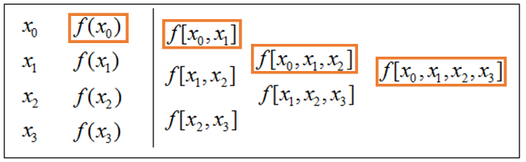
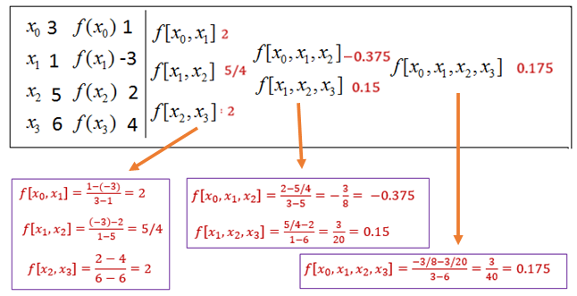
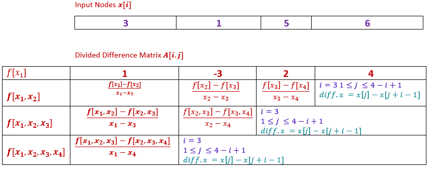

```{=html}

<style type="text/css">

/* Cascading Style Sheets (CSS) is a stylesheet language used to describe the presentation of a document written in HTML or XML. it is a simple mechanism for adding style (e.g., fonts, colors, spacing) to Web documents. */

h1.title {  /* Title - font specifications of the report title */
  font-size: 24px;
  color: DarkRed;
  text-align: center;
  font-family: "Gill Sans", sans-serif;
}
h4.author { /* Header 4 - font specifications for authors  */
  font-size: 20px;
  font-family: system-ui;
  color: DarkRed;
  text-align: center;
}
h4.date { /* Header 4 - font specifications for the date  */
  font-size: 18px;
  font-family: system-ui;
  color: DarkBlue;
  text-align: center;
}
h1 { /* Header 1 - font specifications for level 1 section title  */
    font-size: 22px;
    font-family: system-ui;
    color: navy;
    text-align: left;
}
h2 { /* Header 2 - font specifications for level 2 section title */
    font-size: 20px;
    font-family: "Times New Roman", Times, serif;
    color: navy;
    text-align: left;
}

h3 { /* Header 3 - font specifications of level 3 section title  */
    font-size: 18px;
    font-family: "Times New Roman", Times, serif;
    color: navy;
    text-align: left;
}

h4 { /* Header 4 - font specifications of level 4 section title  */
    font-size: 18px;
    font-family: "Times New Roman", Times, serif;
    color: darkred;
    text-align: left;
}

body { background-color:white; }

.highlightme { background-color:yellow; }

p { background-color:white; }

</style>
```
```{r setup, include=FALSE}
# Detect, install and load packages if needed.
if (!require("knitr")) {
   install.packages("knitr")
   library(knitr)
}
if (!require("MASS")) {
   install.packages("MASS")
   library(MASS)
}
if (!require("nleqslv")) {
   install.packages("nleqslv")
   library(nleqslv)
}
if (!require("pander")) {
   install.packages("pander")
   library(pander)
}
#
# specifications of outputs of code in code chunks
knitr::opts_chunk$set(echo = TRUE,      # include code chunk in the output file
                      warnings = FALSE,  # sometimes, you code may produce warning messages,
                                         # you can choose to include the warning messages in
                                         # the output file. 
                      messages = FALSE,  #
                      results = TRUE     # you can also decide whether to include the output
                                         # in the output file.
                      )   
```


\


# Introduction


Let $f(x)$ be a function whose values are known or can be calculated at a set of points (nodes) $\{ x_0. x_1, \cdots, x_n\}$. Assume that these points are distinct, but NOT necessarily be ordered on the real line. There exists a polynomial $p_n(x)$ of degree at most n that interpolates $f(x)$ at $n+1$ nodes:

$$
p_n(x) = f(x_i), \ \ 0 \le i \le n.
$$

We have discussed the Lagrange form of the interpolation polynomial. In this note, we introduce Newton's form of interpolation polynomial.

\

#  Some Definitions

We introduce several definitions related to the divided differences and how to calculate the dived difference manually and programmatically.


## Definitions

**The Newton form basis polynomials** is defined in the following 

$$
\begin{array}{lcl} 
q_0(x) & = & a \\ 
q_1(x) & = & x-x_0  \\
q_2(x) & = & (x-x_0)(x-x_1) \\
\cdots & \cdots & \cdots \\
q_n(x) & = & (x-x_0)(x-x_1)\cdots(x-x_{n-1})
\end{array}
$$

The $q_0(x), q_1(x), \cdots, 1_n(x)$ is basis of span $\{x^0, x^1, x^2, \cdots, x^n \}$.

\

**The Newton Form Polynomial** is defined as
$$
p_n(x) = \sum_{i=0}^nc_i q_i(x).
$$
\

**Divided Differences** are defined based on the coordinates of a set of given points on the curve of $f(x)$.


|  $x$   |  $x_0$  |  $x_1$  |  $x_2$  | $\cdots$  | $x_n$   |
|:-------|:--------|:--------|:--------|:----------|:--------|
| $f(x)$ |$f(x_0)$ | $f(x_1)$| $f(x_2$)| $\cdots$  | $f(x_n)$|

For $i, j, k = 0, 1, 2, \cdots, n$,


* The zero-th order *divided difference* is $f[x_i] = f(x_i)$.

* The second order *divided difference* based on distinct nodes $x_i$ and $x_j$ is defined as
$$
f[x_i, x_j] = \frac{f(x_i) - f(x_j)}{x_i - x_j}.
$$

  + This is the slope of the secant line that passes the two given points on the curve of $f(x)$. 
  + It is also used to approximate the derivative of the function over interval $[x_i, x_j]$ (assuming $x_i < x_j$) if it exists.
  
* The third order *divided difference* based on the distinct nodes $x_i < x_j < x_k$ is defined as

$$
f[x_i, x_j, x_k] = \frac{f[x_i, x_j] - f[x_j, x_k]}{x_i-x_k}
$$

  
* The high order *divided difference* based on nodes $x_0 < x_1 < \cdots < x_n$ is similarly defined as

$$
f[x_0, x_1, \cdots, x_n] = \frac{f[x_0, x_1, \cdots, x_{n-1}] - f[x_1, \cdots, x_n]}{x_0-x_n}
$$


## Calculation of Divided Difference

The Newton interpolation is defined based on the divided difference. We first look at the structure of the divided difference and then develop an algorithm to compute the divided difference programmatically.


* *Iterative Nature of Divided Differences*: Consider the following given points on the curve of $f(x)$

|  $x$   |  $x_0$  |  $x_1$  |  $x_2$  | $x_3$   |
|:-------|:--------|:--------|:--------|:--------|
| $f(x)$ |$f(x_0)$ | $f(x_1)$| $f(x_2$)| $f(x_3)$|

  + Three *first-order divided differences* are defined based on the given 4 nodes. The first one based 

$$
f[x_0, x_1] = \frac{f(x_0) - f(x_1)}{x_0 - x_1}, \ \ f[x_1, x_2] = \frac{f(x_1) - f(x_2)}{x_1 - x_2}, \ \ f[x_2, x_3] = \frac{f(x_2) - f(x_3)}{x_2 - x_3},
$$

* Two second order *divided differences* are defined by

$$
f[x_0, x_1, x_2] = \ \frac{f[x_0, x_1] - f[x_1, x_2]}{x_0-x_2} =\frac{\frac{f(x_0) - f(x_1)}{x_0 - x_1}-\frac{f(x_1) - f(x_2)}{x_1 - x_2}}{x_0 - x_2}, 
$$

$$
f[x_1, x_2, x_3] = \frac{f[x_1, x_2] - f[x_2, x_3]}{x_1-x_3} = \frac{\frac{f(x_1) - f(x_2)}{x_1 - x_2}-\frac{f(x_2) - f(x_3)}{x_2 - x_3}}{x_1 - x_3}
$$

* The third-order divided difference is defined by

$$
f[x_0, x_1, x_2, x_3] = \frac{f[x_0, x_1, x_2] - f[x_1, x_2, x_3]}{x_0-x_3} 
$$

```{r echo=FALSE, fig.align ="center",  out.width = '55%'}

```

**Example 1**: Calculate all divided differences based on the following given data table

|  $x$   |  3  |  1  |  5  | 6 |
|:-------|:----|:----|:----|:--|
| $f(x)$ |  1  | -3  |   2 | 4 |

Based definition, the divided differences are calculated and summarized in the following table.

```{r echo=FALSE, fig.align ="center",  out.width = '70%'}

```


## Algorithm of Calculating Divided Differences

We re-organize the above calculation in the following matrix and use the logic to develop the pseudo-code for calculating the divided differences.


```{r echo=FALSE, fig.align ="center",  out.width = '95%'}

```


**Divided Algorithm**

```{}
INPUT: vec.x              (nodes)
       vec.y (or fn() )
       pred.x
       
OUTPUT: pn(pred.x)

STEP 1: Define a square zero matrix (array): A
STEP 2: Store vec.y in the first row of A
STEP 3: FOR i from 2 to ncol DO:      (Caution: 2nd row!)
            FOR j from 1 to (ncol - i + 1) DO:
                denominator = vec.x[j] - vec.x[j+i-1]
                numerator = A[i-1,j] - A[i-1, j+1]      (using previous row of A)
                A[i,j] = numerator / denominator        (next order divided difference)
            ENDFOR
        ENDFOR
STEP 4: RETURN A
```


```{r}
Divided.Dif = function(
        vec.x,          # input nodes:
        vec.y = NULL,   # one of vec.y and fn must be given
        fn = NULL,
        pred.x          # scalar x for predicting pn(pred.x)
         ){
   n = length(vec.x)
   if (length(vec.y) == 0) vec.y = fn(vec.x) #
   node.x = vec.x
   A = matrix(c(rep(0,n^2)), nrow = n, ncol = n, byrow = TRUE)
   A[1,] = vec.y     # fill the first row with vec.y
   #
   for(i in 2:(n)){
     for(j in 1:(n-i+1)){
      denominator = vec.x[j] - vec.x[j+1+(i-2)]
      numerator = A[i-1,j]- A[i-1,j+1]
      A[i,j] = numerator/denominator
      }
    }
  A
 }
```


```{r}
pander(Divided.Dif(
        vec.x = c(3,1,5,6),    # input nodes:
        vec.y = c(1,-3,2,4),   # one of vec.y and fn must be given
        fn = NULL
        )
)
```


**Example 2**:  (Example 1 of Burden and Faires' textbook, 9th edition, page 127) Complete the divided difference table for the following data.

-------------
x       y
--- ---------
1.0 0.7651977
1.3 0.6200860
1.6 0.4554022
1.9 0.2818186
2.2 0.1103623
-------------

We use the above function to calculate the divided differences.

```{r}
pander(Divided.Dif(
        vec.x = c(1, 1.3, 1.6, 1.9, 2.2),           
        vec.y = c(0.7651977, 0.6200860, 0.4554022, 0.2818186, 0.1103623),    
        fn = NULL
        )
     )
```

The resulting table is the same as the one obtained in the table of the textbook (except for rounding errors).

\

# Newton Interpolation Polynomial

From the definition of the divided difference, for any $x$ and $x_0$, we have

$$
f[x,x_0] = \frac{f(x)-f(x_0)}{x-x_0}
$$

Solving for $f(x)$, we have 

$$
f(x) = f(x_0) + f[x, x_0](x - x_0).
$$

Similarly, for $x_0$ and $x_1$, the second order divided difference is given by

$$
f[x,x_0, x_1] = \frac{f[x, x_0]-f[x_0,x_1]}{x-x_1}
$$

Therefore,

$$
f[x,x_0] = f[x_0,x_1] + f[x, x_0, x_1](x - x_1).
$$
That is,

$$
f(x) = f[x_0] + f[x_0, x_1](x - x_0)  + f[x, x_0, x_1](x - x_0)(x - x_1).
$$

Repeating the above calculation, we have 

$$
f(x) = f[x_0] + f[x_0, x_1](x-x_0) + f[x_0, x_1, x_2](x-x_0)(x-x_1) + \cdots + f[x, x_0, \cdots, x_n](x-x_0)\cdots(x-x_{n-1})
$$

## Definition of Newton Interpolation


Based on the above derivation, we define **Newton Form Interpolation Polynomial** to be of the following form

$$
N_n(x) = f[x_0] + f[x_0, x_1](x-x_0) + f[x_0, x_1, x_2](x-x_0)(x-x_1) + \cdots + f[x_0, \cdots, x_n](x-x_0)\cdots(x-x_{n-1})
$$

We can see that $N_n(x)$ passes all interpolating points:

$$
N_n(x_0) = f(x_0)
$$

$$
N_n(x_1) = f(x_0) + f[x_0, x_1](x_1-x_0) = f(x_0) + \frac{f(x_1)-f(x_0)}{x_1-x_0}(x_1-x_0) = f(x_1)
$$
In general,

$$
N_n(x_k) = f(x_k), \ \ \text{ for } \ \ 0 \le k \le n.
$$


## Newton Interpolation Algorithm


The associated **divided differences** in the above **Newton Interpolation Polynomial** are returned in the first column of the function `Divided.Dif()`. To write the algorithmic function 


**Newton Interpolation Algorithm 2**

```
INPUT:  vec.x
        vec.y or fn
        pred.x     (for prediction)
OUTPUT: pred.y     (pn(pred.x))

STEP 1: initialization:
        Divided.Dif          (function call)
        Pn = 0
        
STEP 2: FOR i from 1 to n DO:
          cumProd = 1             (initial value for the cumulative product)
          FOR j from 1 to i DO:
              cumProd = cumProd*(pred.x-vec.x[j])
          ENDFOR
          Pn = Pn + Divided.Dif[i]*cumProd
        ENDFOR
STEP 3: RETURN(Pn)

```

Next, we write an R function to implement the Newton interpolation polynomial.

```{r}
NewtonInterpolation = function( vec.x,            # input interpolation nodes
                                vec.y = NULL,    
                                fn = NULL,        # either vec.y or fn must be provided
                                pred.x            # single value of x for prediction
                              ){
   if(length(vec.y) ==0) vec.y = fn(vec.x)
   DivDif = Divided.Dif(vec.x, vec.y)[,1]       # the values in the first column of the div dif matrix
   n = length(vec.x)
   Nn = vec.y[1]                  # f[xo]
   for (i in 1:(n-1)){            # Must be n - 1 according to the last term in the polynomial
     cumProd = 1                  # initial value to calculate the cumulative product
     for(j in 1:i){               # forward difference formula
       cumProd = cumProd*(pred.x-vec.x[j])   # updating the cumulative product in the inner loop
     }
     Nn = Nn + DivDif[i+1]*cumProd    # adding high order terms alliteratively to the Nn(x) 
   }
  Nn                                  # return the value of the Newton polynomial
}

```


**Example 3** (Continuation of *example 2*). We evaluate the Newton interpolation polynomial $p_4(x)$ at $x = 1.1, 1.6$ and $2.0$, respectively. Recall the given data points are


-------------
x       y
--- ---------
1.0 0.7651977
1.3 0.6200860
1.6 0.4554022
1.9 0.2818186
2.2 0.1103623
-------------


**Solution**: We use the above R function to evaluate the function at the two given nodes.

```{r}
pred.1.6 = NewtonInterpolation(vec.x = c(1, 1.3, 1.6, 1.9, 2.2),           
                    vec.y = c(0.7651977, 0.6200860, 0.4554022, 0.2818186, 0.1103623), 
                    pred.x = 1.6)
pred.1.1 = NewtonInterpolation(vec.x = c(1, 1.3, 1.6, 1.9, 2.2),           
                    vec.y = c(0.7651977, 0.6200860, 0.4554022, 0.2818186, 0.1103623), 
                    pred.x = 1.1)
pred.2.0 = NewtonInterpolation(vec.x = c(1, 1.3, 1.6, 1.9, 2.2),           
                    vec.y = c(0.7651977, 0.6200860, 0.4554022, 0.2818186, 0.1103623), 
                    pred.x = 2.0)

pander(cbind(pred.1.6=pred.1.6, pred.1.1=pred.1.1, pred.2.0 = pred.2.0))
```
The results are the same as those obtained in the textbook Burden and Faires (9th edition, page 131).


**R Function: Vector Enabled Newton Interpolated Polynomial**

Next, we modify the previous R function to take a vector of input x-values for prediction just like other R functions.


```{r}
##################################################################################
##  Newton Interpolated Polynomial Approximation: vector-enabled input
##################################################################################

Newton.Interpolation = function( vec.x,            # input interpolation nodes
                                vec.y = NULL,    
                                fn = NULL,        # either vec.y or fn must be provided
                                pred.x            # VECTOR INPUT!!!
                              ){
   if(length(vec.y) ==0) vec.y = fn(vec.x)
   DivDif = Divided.Dif(vec.x, vec.y)[,1]       # the values in the first column of the div dif matrix
   n = length(vec.x)
   ############
   m = length(pred.x)
   NV = rep(0, m)                 # values of Nn(pred.x)
   for(k in 1:m) {
   ################
   Nn = vec.y[1]                  # f[xo]
   for (i in 1:(n-1)){            # Must be n - 1 according to the last term in the polynomial
     cumProd = 1                  # initial value to calculate the cumulative product
     for(j in 1:i){               # forward difference formula
       cumProd = cumProd*(pred.x[k]-vec.x[j])   # updating the cumulative product in the inner loop
     }
      Nn = Nn + DivDif[i+1]*cumProd    # adding high order terms alliteratively to the Nn(x) 
    }
    NV[k] = Nn                                  # return the value the Newton polynomial
   }
 NV  
}
```


```{r}
pred.x = c(1.6, 1.1, 2.0)   # pred.x is the argument is a local variable!
pred.NIP = Newton.Interpolation(vec.x = c(1, 1.3, 1.6, 1.9, 2.2),           
                    vec.y = c(0.7651977, 0.6200860, 0.4554022, 0.2818186, 0.1103623), 
                    pred.x = c(1.6, 1.1, 2.0))
pander(cbind(pred.x = pred.x, pred.NIP=pred.NIP))

```

# Error Analysis

Using the generalized Rolle theorem repeatedly on the expression of the divided difference, have the following result.

**Theorem**: Let $x_0, \cdots , x_{n-1}$, $x$ be $n+1$ distinct points. Let $a = \min (x_0, \cdots , x_{n-1}, x)$ and $b = \max(x_0, \cdots , x_{n-1},x)$. Assume that $f(x)$ has a continuous derivative of order $n$ in the interval $(a, b)$. Then

$$
f[x_0, x_1, \cdots, x_{n-1}, x] = \frac{f^{(n)}(\xi)}{n!}
$$

where $\xi \in (a, b)$.

**Proof**: Let $P_{n+1}(y)$ be the interpolated polynomial at $y$ for given nodes $\{ x_0, x_1, x_2, \cdots, x_{n-1},x \}$ such that $P_{n+1}(x_i) = f(x_i)$ for $i = 0, 1, 2, \cdots, n-1$, and $P_{n+1}(x) = f(x)$. From the construction of Newton interpolating polynomial $P_n(x)$, we know that
$$
P_n(y) = P_{n-1}(x) + f[x_0, x_1, x_2, \cdots, x_{n-1},x] (x-x_0)\cdots(x-x_{n-1})
$$
Apparently, 

$$
f(x) =P_n(x) = P_{n-1}(x) + f[x0, x1, x2, \cdots, x_{n-1},x] (x-x_0)\cdots(x-x_{n-1})
$$
Using the theorem introduced in the last unit and the uniqueness of the app, we have

$$
f(x) = P_{n-1}(x) + \frac{f^{(n)}(\xi)}{n!}(x-x_0)(x-x_1)\cdots(x-x_{n-1}).
$$
 
Using the same arguments in the Lagrange interpolation polynomial, we can establish the error bound for the Newton form interpolation polynomials.


# Some Remarks of Newton Interpolation

First of all, both Lagrange and Newton interpolation polynomials introduced earlier can be viewed as a linear combination of basis polynomials $\{x^0, x^1, x^2, x^2, \cdots, x^n \}$. In fact, Lagrange and Newton interpolation polynomials are two different algebraic representations of the same polynomial.

That is, $P_n(x)$ and $N_n(x)$ be Lagrange and Newton interpolation polynomials based on $(x_0, y_0), (x_1, y_1), (x_2, y_2), \cdots, (x_n, y_n)$. We express both $P_n(x)$ and $N_n(x)$ in terms of basis polynomials $\{x^0, x^1, x^2, x^2, \cdots, x^n \}$ as

$$
P_n(x) = a_0 + a_1x + a_2x^2 + \cdots + a_nx^n \ \ \text{ and } \ \ N_n(x) = b_0 + b_1x + b_2x^2 + \cdots + b_nx^n
$$
Since $P_n(x_i) = y_i = N_n(x_i)$ for $i = x_0, x_1, \cdots, x_n$, we can easily show that $a_j = b_j$ for $j = 0, 1, 2, \cdots, n$. Therefore, the error bounds of both Lagrange and Newton interpolation polynomials are the same.


For the Newton form interpolation polynomial, we only need to add more terms if additional interpolation nodes are added to the existing ones. Since the divided differences are independent of the newly added nodes. But for the Lagrange form, we need to restart the program. This is a unique feature of the Newton interpolation polynomial.


**Example 4**. Use the Newton Interpolation polynomial to approximate $f(x) = \sin(x)$ with interpolating nodes $x = -\pi, -0.75\pi, -0.5\pi, 0.25\pi, 0, 0.25\pi, 0.5\pi, 0.75\pi, \pi$.

**Solution**: We plot both $f(x) = \sin(x)$ and $N_8(x)$ over interval $[-2\pi, 2\pi]$ and see the performance of the approximation.

```{r fig.align='center', fig.width=5, fig.height=5}
nodes = c(-1.5*pi, -pi, -0.5*pi, -0.25*pi, 0, 0.25*pi, 0.5*pi,  pi, 1.5*pi)
####
xx = seq(-2*pi, 2*pi, length = 50)
yy = sin(xx)
Nn = Newton.Interpolation(vec.x = nodes,           
                    vec.y = sin(nodes), 
                    pred.x = xx)
plot(xx, Nn, xlab = "", ylab = "", type = "l", lwd = 2, col = "red", ylim = c(-2,2), 
         main = "Newton Interpolation Polynomial")
lines(xx, yy, lty =2, col = "blue", lwd = 2)
abline(h = 0, lty = 2, col = "purple")
```


