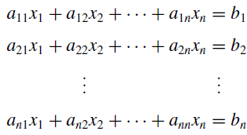
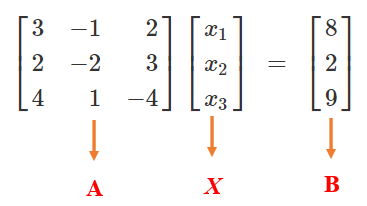
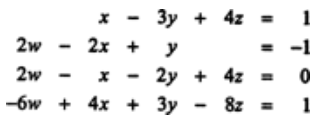
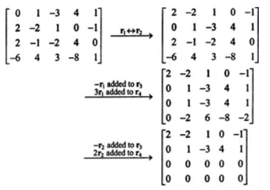
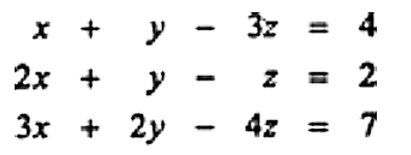
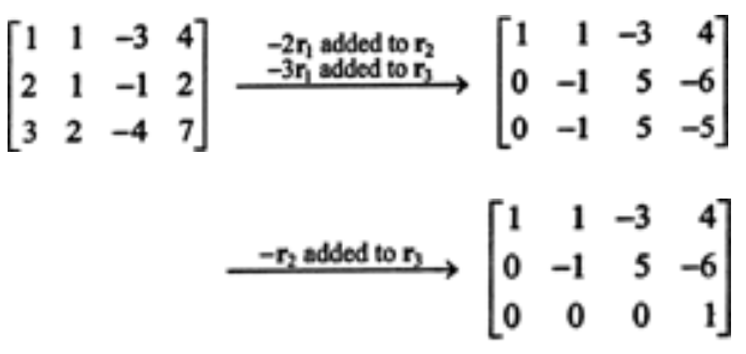
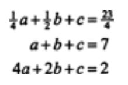
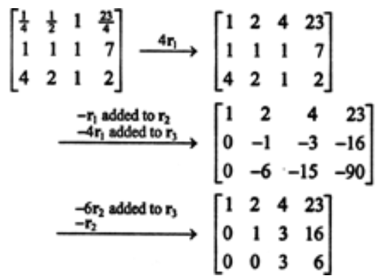
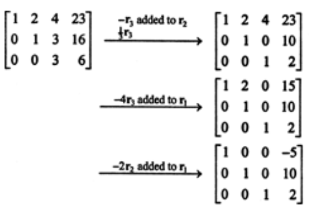

```{=html}

<style type="text/css">

/* Cascading Style Sheets (CSS) is a stylesheet language used to describe the presentation of a document written in HTML or XML. it is a simple mechanism for adding style (e.g., fonts, colors, spacing) to Web documents. */

h1.title {  /* Title - font specifications of the report title */
  font-size: 24px;
  color: DarkRed;
  text-align: center;
  font-family: "Gill Sans", sans-serif;
}
h4.author { /* Header 4 - font specifications for authors  */
  font-size: 20px;
  font-family: system-ui;
  color: DarkRed;
  text-align: center;
}
h4.date { /* Header 4 - font specifications for the date  */
  font-size: 18px;
  font-family: system-ui;
  color: DarkBlue;
  text-align: center;
}
h1 { /* Header 1 - font specifications for level 1 section title  */
    font-size: 22px;
    font-family: system-ui;
    color: navy;
    text-align: left;
}
h2 { /* Header 2 - font specifications for level 2 section title */
    font-size: 20px;
    font-family: "Times New Roman", Times, serif;
    color: navy;
    text-align: left;
}

h3 { /* Header 3 - font specifications of level 3 section title  */
    font-size: 18px;
    font-family: "Times New Roman", Times, serif;
    color: navy;
    text-align: left;
}

h4 { /* Header 4 - font specifications of level 4 section title  */
    font-size: 18px;
    font-family: "Times New Roman", Times, serif;
    color: darkred;
    text-align: left;
}

body { background-color:white; }

.highlightme { background-color:yellow; }

p { background-color:white; }

</style>
```
```{r setup, include=FALSE}
# Detect, install and load packages if needed.
if (!require("knitr")) {
   install.packages("knitr")
   library(knitr)
}
if (!require("MASS")) {
   install.packages("MASS")
   library(MASS)
}
if (!require("nleqslv")) {
   install.packages("nleqslv")
   library(nleqslv)
}
if (!require("pander")) {
   install.packages("pander")
   library(pander)
}
#
# specifications of outputs of code in code chunks
knitr::opts_chunk$set(echo = TRUE,      # include code chunk in the output file
                      warnings = FALSE,  # sometimes, you code may produce warning messages,
                                         # you can choose to include the warning messages in
                                         # the output file. 
                      messages = FALSE,  #
                      results = TRUE     # you can also decide whether to include the output
                                         # in the output file.
                      )   
```


\


# Introduction

We discuss numerical solutions to the linear system of equations. Consider the following general linear system of equations

```{r echo=FALSE, fig.align ="center",  out.width = '35%'}

```

The goal is to find the solution to this system. There are different methods to solve the linear system. One way is to re-express the linear system into a matrix equation and then solve the matrix equation. 


**Example 1** Consider the following linear system of functions

$$
\begin{array}{ccc}
3x_1 - x_2 + 2x_3 & = & 8  \\ 
2x_1 - 2x_2 + 3x_3 & = & 2 \\ 
4x_1 + x_2 - 4x_3 & = & 9 
\end{array}
$$


We can re-write the above system of linear equations into the following matrix form

```{r echo=FALSE, fig.align ="center",  out.width = '45%'}

```


We denote

$$
\mathbf{A} = \left[
\begin{array}{ccc}
 3 & -1 &  2 \\ 
 2 & -2 &  3 \\ 
 4 &  1 & -4 
\end{array}
\right]
$$
be the coefficient matrix.

$$
\mathbf{X} = \left[ \begin{array}{c} x_1 \\ x_2 \\ x_3  \end{array} \right]
$$


the vector of unknown, and 

$$
\mathbf{B} = \left[ \begin{array}{c} 8 \\ 2 \\ 9  \end{array} \right]
$$


Then, the matrix form of the equation is equivalent to $\mathbf{A}\mathbf{X} ~=~ \mathbf{B}$. If the inverse of $\mathbf{A}$, denoted by $\mathbf{A}^{-1}$, exists, we multiply $\mathbf{A}^{-1}$ to the left of the matrix equation to get the solution of the linear system in the following

$$
\mathbf{X} = \mathbf{A}^{-1}\mathbf{B}
$$


Finding the inverse of the matrix could be a challenge when the system is large. The R built-in function `solve()` to calculate the inverse of a matrix (if it exists). 
For example, the inverse of $\mathbf{A}$ can be found using the following code.

```{r}
A = matrix(c(3, -1, 2, 2, -2, 3, 4, 1, -4), ncol = 3, byrow = TRUE)
A.inv = solve(A)
A.inv        # print out the 
# matrix multiplication
A%*%A.inv    # expected to be the identity matrix
```
Two ways to find the solution to the system

```{r}
B = c(8,2,9)
X.1 = solve(A)%*%B  # returns a matrix form solution
X.1    
X.2 = solve(A,B)   # returns a vector form solution
X.2
```


# Naive Gaussian Elimination Methods 


Linear algebra texts discuss elimination methods to find the solution. The method has two processes: elimination and backward substitution. We use the equation in the above **Example 1** to review the elimination method.

Recall the linear system

$$
\begin{array}{ccc}
3x_1 - x_2 + 2x_3 & = & 8  \\ 
2x_1 - 2x_2 + 3x_3 & = & 2 \\ 
4x_1 + x_2 - 4x_3 & = & 9 
\end{array}
$$


We define the following augmented matrix.

$$
\mathbf{A} = \left[
\begin{array}{ccccc}
 3 & -1 & 2 & \vdots & 8\\ 
 2 & -2 & 3 & \vdots & 2\\ 
 4 & 1 & -4 & \vdots & 9\\ 
\end{array}
\right]
$$

**Solution** We show the detailed steps of forward elimination and backward substitution.

**Forward Elimination**

We use $R_1$, $R_2$, and $R_3$ to denote the three rows of the above-augmented matrix and then find the solution in the following $r =  3 - 1$ steps:

**Step 1** The equation in the first row is called **pivot equation** and $a_{11} = 3$ is called **pivot element**. We first do the following row operations so that the elements in the first column of the resulting **new augmented** matrix are all zeros except for the one in the *pivot* element.


*1.1*. Multiply $-a_{21}/a_{11}$ to $R_1$ and add it to $R_2$ to update $R_2$. **Row 2**: $i = 2$


$$
R_2 \leftarrow R_2 -(a_{21}/a_{11})\times R_1  = (a_{21}, a_{22}, a_{23}, b_2) - \frac{a_{21}}{a_{11}}(a_{11}, a_{12}, a_{13}, b_1)
$$


$$
= (a_{21} - \frac{a_{21}}{a_{11}}\times a_{11}, a_{22} - \frac{a_{21}}{a_{11}}\times a_{12}, a_{23}-\frac{a_{21}}{a_{11}}\times a_{11}, b_2-\frac{a_{21}}{a_{11}}\times a_{11})
$$

$$
=(2,-2, 3, 2) - \frac{2}{3}(3,-1,2,8)  = (0, -4/3, 5/3, -10/3)
$$

<font color = "color">**\color{red}The above step can be computed using the implicit loop through vector operation in any vectorized programming language**</font>


*1.2* Multiply $-4/3$ to $R_1$ and add it to $R_3$ to update $R_3.$ **Row 3**: $i = 3$


$$
R_3 \leftarrow R_3 - (a_{31}/a_{11}) \times R1  = (a_{31}, a_{32}, a_{33}, b_3) - \frac{a_{31}}{a_{11}}(a_{11}, a_{12}, a_{13}, b_1) 
$$

$$
=(4,1,-4,9) - \frac{4}{3}(3, -1, 2, 8) = \left(0, \frac{7}{3}, -\frac{20}{3}, -\frac{5}{3} \right)
$$


After this step, we have the updated augmented matrix for the next step elimination.


$$
\left[
\begin{array}{ccccc}
 3 & -1 & 2 & \vdots & 8\\ 
 0 & -4/3 & 5/3 & \vdots & -10/3\\ 
 0 & 7/3 & -20/3 & \vdots & -5/3\\ 
\end{array}
\right]
$$


**Step 2**: The equation in the first row is called *pivot equation* and $a_{22} = -4/3$ (**CAUTION**: *using the above updated augmented matrix!*)is called pivot element. We next do row operation: $R_3 - \frac{a_{32}}{a_{22}}\times R_2$ so that the resulting new augmented matrix.  **Row 3**:  $r = 3$.

$$
R_3 \leftarrow R_3 - \frac{a_{32}}{a_{22}}\times R_2 = (a_{31}, a_{32}, a_{33}, b_3) - \frac{a_{32}}{a_{22}}(a_{21}, a_{22}, a_{23}, b_2)
$$

$$
= \left( 0, \frac{7}{3}, -\frac{20}{3}, -\frac{5}{3}\right) - \frac{7/3}{-4/3}\left(0, -\frac{4}{3}, \frac{5}{3}, -\frac{-10}{3} \right)  = \left(0, ~~0, ~~-\frac{15}{4}, -\frac{15}{2} \right)
$$

With the above row operation, we have the following updated augmented matrix that has a triangular coefficient matrix.

$$
\left[
\begin{array}{ccccc}
 3 & -1 & 2 & \vdots & 8\\ 
 0 & -4/3 & 5/3 & \vdots & -10/3\\ 
 0 & 0 & -15/4 & \vdots & -15/2\\ 
\end{array}
\right].
$$

If we re-write the above-augmented matrix into the linear system of equations, we have

$$
\left\{
\begin{array}{ccccc} 
 3x_1 & - x_2 & 2x_3 & = & 8\\ 
   & -\frac{4}{3}x_2 & \frac{5}{3}x_3 & = & -\frac{10}{3}\\ 
   &  & -\frac{15}{4}x_3 & = & -\frac{15}{2}\\ 
\end{array}
\right.
$$

**Backward Substitution**


Next, we do backward substitution to find the solution to the system. The general backward substitution is given by

$$
x_i =\frac{1}{a_{ii}}\left(b_i-\sum_{j=i+1}^3 a_{ij}x_j \right),
$$

where $i = 3-1, 3-2$. However $i = 3$

$$
x_3 =  \frac{b_3}{a_{33}} = \frac{-15/2}{-15/4} = 2.
$$


We start from **row 3** of the last augmented matrix:

**Row #3**: $r = 3$:  

$$
x_3 = \frac{b_3}{a_{33}} = \frac{-15/2}{-15/4} = 2.
$$
**Row #2**: $r=2$
$$
x_2 = \frac{1}{a_{22}}\left( b_2 - a_{23}x_3 \right)= -\frac{1}{4/3}\left(-\frac{10}{3} - \frac{5}{3}\times 2\right) = \frac{3}{4}\frac{20}{3} = 5.
$$

**Row #1**: $r = 1$

$$
x_1 = \frac{1}{a_{11}} \left(b_1 -[a_{12}x_2 + a_{13}x_3]  \right) = \frac{1}{3}\left(8-[-1\times 5 + 2\times 2]\right) = \frac{1}{3}(8-(-1)) = 3. 
$$

Therefore, the solution to the above system linear equation is $(x_1, x_2, x_3) = (3, 5, 2)$.


**Remark**: We re-arrange the following linear system of linear equations


$$
\left\{
\begin{array}{ccccc} 
 3x_1 & - x_2 & 2x_3 & = & 8\\ 
   & -\frac{4}{3}x_2 & \frac{5}{3}x_3 & = & -\frac{10}{3}\\ 
   &  & -\frac{15}{4}x_3 & = & -\frac{15}{2}\\ 
\end{array}
\right.
$$

to get the following equivalent linear system

$$
\left\{
\begin{array}{ccccc} 
 -\frac{15}{4}x_3 &  &  & = & -\frac{15}{2}\\ 
  \frac{5}{3}x_3& -\frac{4}{3}x_2 &  & = & -\frac{10}{3}\\ 
 2x_3  & -x_2 & + 3x_1 & = & 8\\ 
\end{array}
\right.
$$

That can be re-written in the following matrix form

$$
\left[
\begin{array}{ccc}
 -\frac{15}{4} & 0 &  0 \\ 
 \frac{5}{3} & -\frac{4}{3} &  0 \\ 
 2&  -1 & 3 
\end{array}
\right]
\left[ \begin{array}{c} x_3 \\ x_2 \\ x_1  \end{array} \right]
=
\left[ \begin{array}{c}-\frac{15}{2} \\ -\frac{10}{3} \\ 8  \end{array} \right]
$$

The augmented matrix of the above linear system of equations can be written as

$$
\left[
\begin{array}{ccccc}
 -\frac{15}{4} & 0 &  0 &\vdots & -\frac{15}{2}\\ 
 \frac{5}{3} & -\frac{4}{3} &  0 &\vdots & -\frac{10}{3} \\ 
 2 &  -1 & 3 & \vdots & 8
\end{array}
\right]
$$

We can repeat the Gaussian **forward elimination** with the above-augmented matrix:  

1. pivot element $a_{11} = -\frac{15}{4}$

$$
R_2 \leftarrow R_2-\frac{a_{21}}{a_{11}}R_1 = \left(\frac{5}{3}, -\frac{4}{3},0, -\frac{10}{3} \right)-\frac{5/3}{-15/4}\left(-\frac{15}{4}, 0, 0, -\frac{15}{2} \right) =\left(0, -\frac{4}{3}, 0, -\frac{20}{3} \right)
$$

$$
R_3 \leftarrow R_3 - \frac{a_{31}}{a_{11}}R_1 = \left(2,-1,3,8 \right) - \frac{2}{-15/4}\left(-\frac{15}{4}, 0, 0, -\frac{15}{2} \right) = \left(0,-1, 3, 4 \right)
$$

We obtain the following updated augmented matrix

$$
\left[
\begin{array}{ccccc}
 -\frac{15}{4} & 0 &  0 &\vdots & -\frac{15}{2}\\ 
 0 & -\frac{4}{3} &  0 &\vdots & -\frac{20}{3} \\ 
 0 &  -1 & 3 & \vdots & 4
\end{array}
\right]
$$
We need one more row operation on the above-augmented matrix

$$
R_3 \leftarrow R_3 - \frac{a_{32}}{a_{22}}R_2 = \left(0, -1, 3, 4 \right) - \frac{-1}{-4/3}\left(0, -\frac{4}{3}, 0, -\frac{20}{3} \right) = \left(0, 0, 3, 9 \right)
$$

The final augmented matrix has the following form

$$
\left[
\begin{array}{ccccc}
 -\frac{15}{4} & 0 &  0 &\vdots & -\frac{15}{2}\\ 
 0 & -\frac{4}{3} &  0 &\vdots & -\frac{20}{3} \\ 
 0 &  0 & 3 & \vdots & 9
\end{array}
\right].
$$
Its equivalent linear system is given by

$$
\left\{
\begin{array}{ccc} 
 -\frac{15}{4}x_3 & = & -\frac{15}{2}\\ 
  -\frac{4}{3}x_2 &  = & -\frac{20}{3}\\ 
   3x_1 & = & 9\\ 
\end{array}
\right.
$$
Therefore, the solution to the original system of equation is (using vector operation - pair-wise division)

$$
(x_3, x_2, x_1) = \frac{(-15/2, -20/3, 9)}{(-15/4, -4/3, 3)} = (2,5,3)
$$

We will apply the logic used in this example to implement the **Gaussian Elimination method** (using *backward substitution*).


\

# Gaussian Elimination Algorithm 

In the elimination step, the first row of the augmented matrix is the basis, and all other elements (cells) in the augmented matrix are updated iteratively using the algorithm using the recursive formula 

$$
R_i \leftarrow (a_{i1}, a_{i2}, \cdots, a_{in}, b_i) - \frac{a_{ik}}{a_{kk}}(a_{k1}, a_{k2}, \cdots, a_{kn}, b_k)   
$$

where

* $k = 1, 2, \cdots, n-1$, the iteration index for selecting the *pivot element*.

* $i = k+1, k+2, ...n$, the iterator of the row of the augmented matrix.

\


# Gaussian Elimination Algorithm

We focus on Gaussian row elimination. The Gaussian forward elimination and backward substitution (Gauss-Jordan) are optional.

## Gauss Forward Elimination

The algorithm of Gaussian is relatively simple compared with the iterative algorithms we learned earlier. We only need to convert the following recursive equation to an algorithm with double loops to accomplish the Gaussian forward elimination.

**Gaussian Forward Elimination Algorithm**

```{}
INPUT: A    (augmented matrix)

OUTPUT: A0  (row-echelon matrix)

STEP 1: find n = # of row

STEP 2: FOR i = 1 TO n
        STEP 3:  IF A[i,i] == 0 DO: 
                    find j with A[j,i] != 0
                    swap row i and row j
                 ENDIF
         
        STEP 4:  IF A[i,i] != 0 DO:
                    FOR j = i + 1 TO n DO: 
                       A[j,] = A[j,]-(A[j,i]/A[i,i])*A[i,]
                    ENDFOR
                 ENDIF
STEP 5: RETURN A0   
```


The vector operation was used in **Step 4** of the pseudo-code. Row-swapping in **step 3** could also involve vector operation.

Next, we write R code to implement the pseudo-code.


```{r}
Gauss.Elimination = function(A){
  # Input A: augmented matrix. Make sure that he diagonal 
  #          elements of the coefficient matrix are non-zero! 
  A0 = A        
  n = dim(A0)[1]                # number of rows
  for(i in 1:(n-1)){            # iterator fo pivot element A0[i,i]
                                # i = 1, 2, ..., n-1
      #~~~~~~~~~~~~~~~~~~~~~   Make the function robust  ~~~~~~~~~~~~~~~~~~~~~~~~~#
      if(A0[i,i] == 0){
          non.0 = which(A0[,i] != 0)
              #cat("\n\n i =",i, ", non.0 =", non.0,". (i+1):n =", (i+1):n, ".")
              id = intersect(non.0, (i+1):n)[1] # which() equiv to find() in MATLAB
              if(!is.na(id)){
              tempi = A0[i,]                    # put the i-th row in a place-holder
              A0[i,] = A0[id,]                  # row swapping
              A0[id,] = tempi    
            }
      }
      #~~~~~~~~~~~~~~~~~~~~~~~~~~~~~~~~~~~~~~~~~~~~~~~~~~~~~~~~~~~~~~~~~~~~~~~~#
       if(A0[i,i] != 0){    # A0[i,i] is in the denominator of recursive equation
          for(j in (i+1):n){  # to make the augmented matrix in the row echelon form
             #cat("\n\n j =",j,".")
             A0[j,] = A0[j,] - (A0[j,i]/A0[i,i])*A0[i,]
           }
        }
      }
   A0
 }

```


We now look at several examples using the above R function `Gauss.Elimination()`.

**Example 2**: Find the solution of the following system of linear equations. 

```{r echo=FALSE, fig.align ="center",  out.width = '35%'}

```

**Solution**: Performing Gaussian eliminations (i.e., the series of row operations), we have

```{r echo=FALSE, fig.align ="center",  out.width = '55%'}

```

```{r}
##
A1 = matrix(c(0,1,-3,4,1,2,-2,1,0,-1,2,-1,-2,4,0,-6,4,3,-8,1), ncol =5, byrow = TRUE)
Gauss.Elimination(A = A1)
```

\

**Example 3** Solve the following system of linear equations.

```{r echo=FALSE, fig.align ="center",  out.width = '35%'}

```

**Solution**: Performing Gaussian eliminations (i.e., the series of row operations), we have

```{r echo=FALSE, fig.align ="center",  out.width = '55%'}

```

```{r}
A1 = matrix(c(1,1,-3,4,2,1,-1,2,3,2,-4,7), ncol = 4, byrow = TRUE)
Gauss.Elimination(A = A1)
```


\

**Example 4** Solve the following system of linear equations.

```{r echo=FALSE, fig.align ="center",  out.width = '22%'}

```

**Solution**: Performing Gaussian eliminations (i.e., the series of row operations), we have

```{r echo=FALSE, fig.align ="center",  out.width = '50%'}

```

```{r}
A1 = matrix(c(1/4, 1/2, 1, 23/4, 1,1,1,7,4,2,1,2), ncol = 4, byrow = TRUE)
Gauss.Elimination(A = A1)
```


## Gauss-Jordan Elimination (`Optional`)


```{r}
####
Gauss.Jordan = function(A){
  # A is the augmented matrix
  A1 = Gauss.Elimination(A)           # perform Gauss elimination
  n = length(A1[,1])
  id.0 = rep(1,n)                     # indicator of zero A[i,i]
  for (i in 1:n){
    if(A1[i,i] == 0) id.0[i] = 0
  }
  if(sum(id.0) == n){                  # A[i,i] != 0
        k = n
        A2 = A1[k:1, c(k:1,(n+1))]     # re-arrange rows and columns
        A3 = Gauss.Elimination(A2)     # perform Gauss elimination
        A4 = A3[k:1, c(k:1,(n+1))]     # backward re-arrangement
      } else{                          # if exists A[i,i] =0
        k = which(id.0==0)[1]-1   # select rows and columns for re-arrangement
        A2 = A1[c(k:1,(k+1):n), c(k:1,(k+1):(n+1))]
        A3 = Gauss.Elimination(A2)
        A4 = A3[c(k:1,(k+1):n), c(k:1,(k+1):(n+1))]
      }
   A4
}

```

**Example 5** (continuation of **Example 4**)

We can perform additional row operations (Gaussian-Jordan) to get

```{r echo=FALSE, fig.align ="center",  out.width = '50%'}

```


```{r}
A1 = matrix(c(1/4, 1/2, 1, 23/4, 1,1,1,7,4,2,1,2), ncol = 4, byrow = TRUE)
Gauss.Jordan(A = A1)
```

\

**Example 6** (continuation of **Example 2**) Gauss-Jordan elimination
```{r}
A6 = matrix(c(0,1,-3,4,1,2,-2,1,0,-1,2,-1,-2,4,0,-6,4,3,-8,1), ncol =5, byrow = TRUE)
Gauss.Jordan(A = A6)
```

\

**Example 7** (continuation of **Example 3**) Gauss-Jordan form

```{r}
A7 = matrix(c(1,1,-3,4,2,1,-1,2,3,2,-4,7), ncol = 4, byrow = TRUE)
Gauss.Jordan(A = A7)
```

\

**Example 8** (continuation of **Example 4**) Gauss-Jordan form

```{r}
A8 = matrix(c(1/4, 1/2, 1, 23/4, 1,1,1,7,4,2,1,2), ncol = 4, byrow = TRUE)
Gauss.Jordan(A = A8)
```


# Chapter 6 HW Part I

6.1.8.  Use the code in the note to solve the linear systems.

6.2.10 (d). **optional**, need to modify the code by using three-digit chopping approach in each row operation.  


