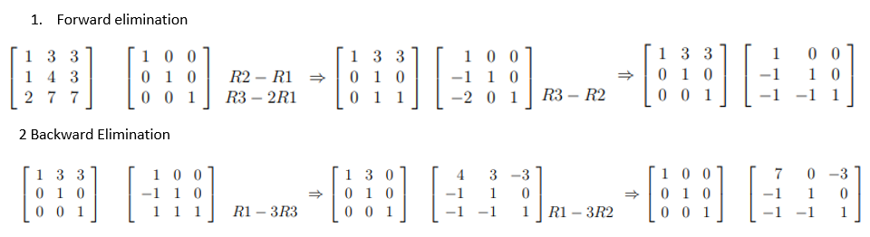

```{=html}

<style type="text/css">

/* Cascading Style Sheets (CSS) is a stylesheet language used to describe the presentation of a document written in HTML or XML. it is a simple mechanism for adding style (e.g., fonts, colors, spacing) to Web documents. */

h1.title {  /* Title - font specifications of the report title */
  font-size: 24px;
  color: DarkRed;
  text-align: center;
  font-family: "Gill Sans", sans-serif;
}
h4.author { /* Header 4 - font specifications for authors  */
  font-size: 20px;
  font-family: system-ui;
  color: DarkRed;
  text-align: center;
}
h4.date { /* Header 4 - font specifications for the date  */
  font-size: 18px;
  font-family: system-ui;
  color: DarkBlue;
  text-align: center;
}
h1 { /* Header 1 - font specifications for level 1 section title  */
    font-size: 22px;
    font-family: system-ui;
    color: navy;
    text-align: left;
}
h2 { /* Header 2 - font specifications for level 2 section title */
    font-size: 20px;
    font-family: "Times New Roman", Times, serif;
    color: navy;
    text-align: left;
}

h3 { /* Header 3 - font specifications of level 3 section title  */
    font-size: 18px;
    font-family: "Times New Roman", Times, serif;
    color: navy;
    text-align: left;
}

h4 { /* Header 4 - font specifications of level 4 section title  */
    font-size: 18px;
    font-family: "Times New Roman", Times, serif;
    color: darkred;
    text-align: left;
}

body { background-color:white; }

.highlightme { background-color:yellow; }

p { background-color:white; }

</style>
```
```{r setup, include=FALSE}
# Detect, install and load packages if needed.
if (!require("knitr")) {
   install.packages("knitr")
   library(knitr)
}
if (!require("MASS")) {
   install.packages("MASS")
   library(MASS)
}
if (!require("nleqslv")) {
   install.packages("nleqslv")
   library(nleqslv)
}
if (!require("pander")) {
   install.packages("pander")
   library(pander)
}
#
# specifications of outputs of code in code chunks
knitr::opts_chunk$set(echo = TRUE,      # include code chunk in the output file
                      warnings = FALSE,  # sometimes, you code may produce warning messages,
                                         # you can choose to include the warning messages in
                                         # the output file. 
                      messages = FALSE,  #
                      results = TRUE     # you can also decide whether to include the output
                                         # in the output file.
                      )   
```


\


# Introduction

We have introduced the Gaussian elimination method to solve the linear system of equations. This note focuses on the algorithm for finding the inverse of square matrices and then use the algorithm to solve matrix equations,


# Review of Basics Matrix.

We first define some special matrices and then review the basic properties of matrices.

## Definitions of Some Special Matrices

A general form of a $n\times m$ matrix is given by

$$
A_{n\times m} = \left[\begin{array}{ccccc} 
a_{11} & a_{12} & \cdots & a_{1m}  \\ 
a_{21} & a_{22} & \cdots & a_{2m}  \\ 
\vdots & \vdots & \vdots & \vdots  \\
a_{n-1,1} & a_{n-1.2} & \cdots & a_{n-1,m}  \\
a_{n1} & a_{n2} & \cdots & a_{nm}  
\end{array}
\right]
$$

That $n$ rows and $m$ columns. If $n = m$, the corresponding matrix is called the **square matrix**. If all off-diagonal elements of a square matrix are equal to zero, the square matrix is called **diagonal matrix**

$$
D_{n\times n} = \left[\begin{array}{ccccc} 
a_{11} & 0 & \cdots & 0  \\ 
0 & a_{22} & \cdots & 0  \\ 
\vdots & \vdots & \ddots & \vdots  \\
0 & 0& \cdots & a_{nn}  
\end{array}
\right]
$$
A very important special diagonal matrix with all diagonal elements being 1 is called **identity matrix** and has the following form

$$
I_{n\times n} = \left[\begin{array}{ccccc} 
1 & 0 & \cdots & 0  \\ 
0 & 1 & \cdots & 0  \\ 
\vdots & \vdots & \ddots & \vdots  \\
0 & 0& \cdots & 1  
\end{array}
\right]
$$

The following square matrix is called a symmetric matrix

$$
A_{n\times n} = \left[\begin{array}{ccccc} 
a_{11} & a_{12} & \cdots & a_{1n}  \\ 
a_{12} & a_{22} & \cdots & a_{2n}  \\ 
\vdots & \vdots & \vdots & \vdots  \\
a_{1,n-1} & a_{2,n-1} & \cdots & a_{n,n-1}  \\
a_{1n} & a_{2n} & \cdots & a_{nn}  
\end{array}
\right]
$$
A square matrix is called lower triangular if all the entries above the main diagonal are zero. Similarly, a square matrix is called upper triangular if all the entries below the main diagonal are zero. S and T represent lower and upper triangular matrices respectively.


$$
S_{n\times n} = \left[\begin{array}{ccccc} 
a_{11} & a_{12} & \cdots & a_{1n}  \\ 
0 & a_{22} & \cdots & a_{2n}  \\ 
\vdots & \vdots & \vdots & \vdots  \\
0 & 0 & \cdots & a_{nn}  
\end{array}
\right]
~
~
\text{and}
~
~
T_{n\times n} = \left[\begin{array}{ccccc} 
b_{11} & 0 & \cdots & 0  \\ 
b_{21} & b_{22} & \cdots & 0  \\ 
\vdots & \vdots & \vdots & 0  \\
b_{n1} & b_{n2} & \cdots & b_{nn}  
\end{array}
\right]
$$


\

## Binary Operations 

We perform matrix addition and subtraction, the two matrices must have the same dimensions.

\

**Addition and Subtraction**

Let

$$
A_{n\times m} = \left[\begin{array}{ccccc} 
a_{11} & a_{12} & \cdots & a_{1m}  \\ 
a_{21} & a_{22} & \cdots & a_{2m}  \\ 
\vdots & \vdots & \vdots & \vdots  \\
a_{n-1,1} & a_{n-1.2} & \cdots & a_{n-1,m}  \\
a_{n1} & a_{n2} & \cdots & a_{nm}  
\end{array}
\right]
~
~
\text{and}
~
~
B_{n\times m} = \left[\begin{array}{ccccc} 
b_{11} & b_{12} & \cdots & b_{1m}  \\ 
b_{21} & b_{22} & \cdots & b_{2m}  \\ 
\vdots & \vdots & \vdots & \vdots  \\
b_{n-1,1} & b_{n-1.2} & \cdots & b_{n-1,m}  \\
b_{n1} & b_{n2} & \cdots & b_{nm}  
\end{array}
\right]
$$


$$
A_{n\times m}\pm B_{n\times m} = \left[\begin{array}{ccccc} 
a_{11}\pm b_{11} & a_{12}\pm b_{12} & \cdots & a_{1m}\pm b_{1m}  \\ 
a_{21}\pm b_{21} & a_{21}\pm b_{22} & \cdots & a_{21}\pm b_{2m}  \\ 
\vdots & \vdots & \vdots & \vdots  \\
a_{n-1,1}\pm b_{n-1,1} & a_{n-1,1}\pm b_{n-1.2} & \cdots & a_{n-1,1}\pm b_{n-1,m}  \\
a_{n1}\pm b_{n1} & a_{n1}\pm b_{n2} & \cdots & a_{nm}\pm b_{nm}  
\end{array}
\right]
$$
\

**Multiplication**

When multiplying two matrices, the two matrices must be compatible. That is the number of **columns** of the first (left) matrix MUST be equal to the number of **rows** in the second (right) matrix. To illustrate this compatibility, we define


$$
C_{p\times q} = \left[\begin{array}{ccccc} 
c_{11} & c_{12} & \cdots & c_{1q}  \\ 
c_{21} & c_{22} & \cdots & c_{2q}  \\ 
\vdots & \vdots & \vdots & \vdots  \\
c_{p-1,1} & c_{p-1,2} & \cdots & c_{p-1,m}  \\
c_{p1} & c_{p2} & \cdots & c_{pq}  
\end{array}
\right]
~
~
\text{and}
~
~
D_{q\times k} = \left[\begin{array}{ccccc} 
d_{11} & d_{12} & \cdots & d_{1k}  \\ 
d_{21} & d_{22} & \cdots & d_{2k}  \\ 
\vdots & \vdots & \vdots & \vdots  \\
d_{q-1,1} & d_{q-1.2} & \cdots & d_{q-1kk}  \\
d_{q1} & d_{q2} & \cdots & d_{qk}  
\end{array}
\right]
$$

The product of the above two matrices is defined to be


$$
M_{p\times k} = \left[\begin{array}{ccccc} 
c_{11}\times d_{11} + c_{12}\times d_{21} + \cdots + c_{1q}\times d_{q1}  & \cdots & c_{11}\times d_{1k} + c_{12}\times d_{2k} + \cdots + c_{1q}\times d_{qk} \\ 
c_{21}\times d_{11} + c_{22}\times d_{21} + \cdots + c_{2q}\times d_{q1}  & \cdots & c_{21}\times d_{1k} + c_{22}\times d_{2k} + \cdots + c_{2q}\times d_{qk} \\ 
\vdots & \vdots & \vdots  \\
c_{p-1,1}\times d_{11} + c_{p-1,2}\times d_{21} + \cdots + c_{p-1,q}\times d_{q1}  & \cdots & c_{p-1,1}\times d_{1k} + c_{p-1,2}\times d_{2k} + \cdots + c_{p-1,q}\times d_{qk}  \\
c_{p1}\times d_{11} + c_{p2}\times d_{21} + \cdots + c_{pq}\times d_{q1}  & \cdots & c_{p1}\times d_{1k} + c_{p2}\times d_{2k} + \cdots + c_{pq}\times d_{qk}  
\end{array}
\right]
$$

In general, multiplication is NOT commutative. That is, $A\times B \ne B\times A$.

**Example 1**:  Define
$$
C_{3\times 4} = \left[\begin{array}{ccccc} 
1& 2 & 3 & 4  \\ 
4 & 3 & 2 & 1 \\ 
1 & 3 & 5 & 2  
\end{array}
\right]
~
~
\text{and}
~
~
D_{4\times 3} = \left[\begin{array}{ccccc} 
2 & 1 & 4   \\ 
3 & 2 & 2  \\ 
0 & 1 & 3  \\
1 & 2 & 5
\end{array}
\right]
$$
Then
$$
C_{3\times 4} \times D_{4\times 3} = \left[\begin{array}{ccccc} 
1& 2 & 3 & 4  \\ 
4 & 3 & 2 & 1 \\ 
1 & 3 & 5 & 2  
\end{array}
\right]
\times
\left[\begin{array}{ccccc} 
2 & 1 & 4   \\ 
3 & 2 & 2  \\ 
0 & 1 & 3  \\
1 & 2 & 5
\end{array}
\right]
~
=
~
 \left[\begin{array}{ccccc} 
12 & 16 & 37   \\ 
18 & 14 & 33  \\ 
13 & 16 & 35  \\
\end{array}
\right].
$$
However,

$$
D_{4\times 3} \times C_{3\times 4} = 
\left[\begin{array}{ccccc} 
2 & 1 & 4   \\ 
3 & 2 & 2  \\ 
0 & 1 & 3  \\
1 & 2 & 5
\end{array}
\right]
\times
\left[\begin{array}{ccccc} 
1& 2 & 3 & 4  \\ 
4 & 3 & 2 & 1 \\ 
1 & 3 & 5 & 2  
\end{array}
\right]
~
=
~
 \left[\begin{array}{ccccc} 
10 & 19 & 28 & 17 \\ 
13 & 18 & 23 & 18\\ 
7 & 12 & 17 & 7\\
14 & 23 & 32 & 16
\end{array}
\right].
$$


\

**Division** is not defined in matrix algebra. For example, Even with two square matrices $P_{nn}$ and $Q_{nn}$, $P \div Q$ is NOT defined! The concept of the inverse of a square matrix is analogous to the concept of the reciprocal of a number. The detail of the inverse matrix will be discussed in the subsequent sections.

\

## Unary Operations

Addition, subtraction, and multiplication involve two matrices. Next look at some unary operations in matrix algebra.

**Transpose**. The matrix that is resulting from a given matrix B after changing or reversing its rows to columns and columns to rows is called the transpose of a matrix B. For example,

$$
D_{3\times 4} = \left[\begin{array}{ccccc} 
1& 2 & 3 & 4  \\ 
4 & 3 & 2 & 1 \\ 
1 & 3 & 5 & 2  
\end{array}
\right]
~
~
\text{and}
~
~
D^T_{4\times 3} = \left[\begin{array}{ccccc} 
1 & 4 & 1   \\ 
2 & 3 & 3  \\ 
3 & 2 & 5  \\
4 & 1 & 2
\end{array}
\right]
$$

Note that **transpose** is defined for any matrices (square or non-square) matrices. 

**Trace of A Matrix**: The trace is the sum of all diagonal elements of a **square matrix**.

$$
A_{n\times n} = \left[\begin{array}{ccccc} 
a_{11} & a_{12} & \cdots & a_{1n}  \\ 
a_{21} & a_{22} & \cdots & a_{2n}  \\ 
\vdots & \vdots & \vdots & \vdots  \\
a_{n-1,1} & a_{n-1.2} & \cdots & a_{n-1,n}  \\
a_{n1} & a_{n2} & \cdots & a_{nn}  
\end{array}
\right],
~
~
\text{then}
~
~
\text{Trace}(A_{n\times n}) = \sum_{i=1}^n a_{ii}
$$

# Determinant of a Square Matrix

The determinant of a matrix is the scalar value or number calculated using a square matrix. The calculation of a general square matrix is not straightforward, an iterative algorithm is needed. We will not introduce these algorithms in this class. But for triangular matrices, we can use the mathematical induction method to show the following theorem

\

**Theorem**: Let $T_n$ be an upper triangular matrix of order $n$. 

$$
T_{n} = \left[\begin{array}{ccccc} 
a_{11} & a_{12} & \cdots & a_{1n}  \\ 
0 & a_{22} & \cdots & a_{2n}  \\ 
\vdots & \vdots & \vdots & \vdots  \\
0 & 0 & \cdots & a_{nn}  
\end{array}
\right]
$$

Let $\text{det}(T_n)$ be the determinant of $T_n$. Then $\text{det}(T_n)$ is equal to the product of all the diagonal elements of $T_n$. That is

$$
\text{det}(T_n)=\sum_{i=1}^n a_{ii}.
$$

**Sketch of Proof**: We use mathematical induction to prove this theorem.

1.  The determinant is $a_{11}$, which is clearly also the diagonal element. That is, $\text{det}(T_1) = a_{11}$. This establishes the induction basis.

2.  Assume that $\text{det}(T_k) = \sum_{i=1}^k a_{ii}$ for 
$$
T_{k} = \left[\begin{array}{ccccc} 
a_{11} & a_{12} & \cdots & a_{1k}  \\ 
0 & a_{22} & \cdots & a_{2k}  \\ 
\vdots & \vdots & \vdots & \vdots  \\
0 & 0 & \cdots & a_{kk}  
\end{array}
\right].
$$

We now consider

$$
T_{k+1} = \left[\begin{array}{ccccc} 
a_{11} & a_{12} & \cdots & a_{1k} & a_{1,k+1} \\ 
0 & a_{22} & \cdots & a_{2k}  & a_{2,k+1} \\ 
\vdots & \vdots & \vdots & \vdots & \vdots \\
0 & 0 & \cdots & a_{kk}  & a_{k,k+1} \\
0 & 0 & \cdots & 0  & a_{k+1,k+1}
\end{array}
\right].
$$

Expanding above matrix by the $(k+1)$-th row, we have

$$
T_{k+1} = \left[\begin{array}{ccccc} 
a_{11} & a_{12} & \cdots & a_{1k} & a_{1,k+1} \\ 
0 & a_{22} & \cdots & a_{2k}  & a_{2,k+1} \\ 
\vdots & \vdots & \vdots & \vdots & \vdots \\
0 & 0 & \cdots & a_{nk}  & a_{k,k+1} \\
0 & 0 & \cdots & 0  & a_{k+1,k+1}
\end{array}
\right]
~
=
~
a_{k+1, k+1}\times \left[\begin{array}{ccccc} 
a_{11} & a_{12} & \cdots & a_{1k}  \\ 
0 & a_{22} & \cdots & a_{2k}  \\ 
\vdots & \vdots & \vdots & \vdots  \\
0 & 0 & \cdots & a_{kk}  
\end{array}
\right].
$$

Therefore, 
$$
\text{det}(T_{k+1}) = \text{det}(a_{k+1,k+1}T_k) = a_{k+1, k+1} \text{det}(T_k) = a_{k+1, k+1}\sum_{i=1}^k a_{ii} = \sum_{i=1}^{k+1} a_{ii}.
$$

This completes the proof.

\

We have introduced the Gaussian elimination algorithm that can be used for the triangulation of a square matrix. Therefore, we can use the R function we developed earlier to find the determinant of square matrices.


```{r}
DET = function(A){
  # Input A: Must be a square matrix
  A0 = A        
  n = dim(A0)[1]                # number of rows
  for(i in 1:(n-1)){            # iterator fo pivot element A0[i,i]
                                # i = 1, 2, ..., n-1
      #~~~~~~~~~~~~~~~~~~~~~   Make the function robust  ~~~~~~~~~~~~~~~~~~~~~~~~~#
      if(A0[i,i] == 0){
          non.0 = which(A0[,i] != 0)
              #cat("\n\n i =",i, ", non.0 =", non.0,". (i+1):n =", (i+1):n, ".")
              id = intersect(non.0, (i+1):n)[1] # which() equiv to find() in MATLAB
              if(!is.na(id)){
              tempi = A0[i,]                    # put the i-th row in a place-holder
              A0[i,] = A0[id,]                  # row swapping
              A0[id,] = tempi    
            }
      }
      #~~~~~~~~~~~~~~~~~~~~~~~~~~~~~~~~~~~~~~~~~~~~~~~~~~~~~~~~~~~~~~~~~~~~~~~~#
       if(A0[i,i] != 0){    # A0[i,i] is in the denominator of recursive equation
          for(j in (i+1):n){  # to make the augmented matrix in the row echelon form
             #cat("\n\n j =",j,".")
             A0[j,] = A0[j,] - (A0[j,i]/A0[i,i])*A0[i,]
           }
        }
      }
     DET = prod(diag(A0))    # prod() - vectorized multiplication, diag() extracts a[i,i]
     if(dim(A)[1] != dim(A)[2]) {
        cat("\n\nNeed a square matrix!")
      } else{
       list(Triangular.Metrix = round(A0,4), Determinant = round(DET,4))
      }
 }
```


**Example 3**. Let

$$
A = \left[\begin{array}{cccc} 
1 & 9 & 8 & 7 \\ 
3 & 8 & 3 & 8\\ 
7 & 2 & 7 & 7\\
4 & 3 & 2 & 6
\end{array}
\right].
$$

The determinant of A can be calculated using R in the following

```{r}
A = matrix(c(1,9,8,7,3,8,3,8,7,2,7,7,4,3,2,6), ncol = 4, byrow = TRUE)
DET(A)
```

The determinant $det(A) = -235$.

**Example 4**: Let
$$
C_{3\times 4} = \left[\begin{array}{cccc} 
1& 2 & 3 & 4  \\ 
4 & 3 & 2 & 1 \\ 
1 & 3 & 5 & 2  
\end{array}
\right]
$$

```{r}
C=matrix(c(1,2,3,4,4,3,2,1,1,3,5,2), ncol = 4, byrow = TRUE)
DET(C)
```

\

# Matrix Inversion


**Inverse of a square matrix** Let $A$ be a square matrix of order $n \times n$ and let $I_n$ be an identity matrix of same order. If there exists a square matrix $B$, such that $AB = BA = I$, then the matrix $A$ is said to be invertible. The matrix $B$ is called inverse of $A$, that is denoted by $A^{-1}$. 

We can use the Gauss-Jordan algorithm to find the inverse of a square matrix if the inverse exists. 


**Example 5** Find the inverse of the following matrix
$$
A = \left[\begin{array}{cccc} 
1 & 3 & 3    \\ 
1 & 4 & 3  \\ 
2 & 7 & 7  \\
\end{array}
\right].
$$
**Solution**: We perform the forward and backward eliminations in the following

```{r echo=FALSE, fig.align ="center",  out.width = '99%'}

```

Therefore, 
$$
A^{-1} = \left[\begin{array}{cccc} 
7 & 0 & -3    \\ 
-1 & 1 & 0  \\ 
-1 & -1 & 1  \\
\end{array}
\right].
$$


The algorithm is based on the extended augmented matrix. The following is an outline of the algorithm.

Let the following square matrix be invertible.

$$
A_{n\times n} = \left[\begin{array}{cccc} 
a_{11} & a_{12} & \cdots & a_{1n}  \\ 
a_{12} & a_{22} & \cdots & a_{2n}  \\ 
\vdots & \vdots & \ddots & \vdots  \\
a_{1n} & a_{2n} & \cdots & a_{nn}  
\end{array}
\right]
$$

The extended augmented matrix is
$$
AM_{n,2n} = \left[\begin{array}{cccccccccc} 
a_{11} & a_{12} & \cdots & a_{1n} & \text{|} & 1 & 0 & \cdots & 0 \\ 
a_{21} & a_{22} & \cdots & a_{2n}  & \text{|} & 0 & 1 & \cdots & 0 \\ 
\vdots & \vdots & \ddots & \vdots & \text{|} & \vdots & \vdots & \ddots & 0 \\
a_{n1} & a_{n2} & \cdots & a_{nn}  & \text{|} & 0 & 0 & \cdots & 1 
\end{array}
\right]_{n\times 2n}.
$$

We can use Gauss-Jordan row operations to turn the above extended augmented matrix into the following form

$$
IM_{n,2n} = \left[\begin{array}{ccccccccc} 
 1 & 0 & \cdots & 0& \text{|} & w_{11} & w_{12} & \cdots & w_{1n} \\ 
0 & 1 & \cdots & 0 & \text{|} & w_{21} & w_{22} & \cdots & w_{2n}  \\ 
\vdots & \vdots & \ddots & \vdots & \text{|} & \vdots & \vdots & \ddots & 0 \\
0 & 0 & \cdots & 1  & \text{|} &  w_{n1} & w_{n2} & \cdots & w_{nn}
\end{array}
\right]_{n\times 2n}.
$$

Then the inverse of A is given by

$$
A^{-1} = \left[\begin{array}{ccccc} 
w_{11} & w_{12} & \cdots & w_{1n} \\ 
w_{21} & w_{22} & \cdots & w_{2n}  \\ 
\vdots & \vdots & \ddots & 0 \\
w_{n1} & w_{n2} & \cdots & w_{nn}
\end{array}
\right]_{n\times 2n}.
$$

We can modify the `Gauss.Jordan()` in the previous note to get the following function to calculate the inverse matrix.

```{r}
M.inv = function(A){
  # Input A: Must be a square matrix
  n = dim(A)[1]                # number of rows
  A0 = cbind(A, diag(rep(1,n)))        
  ##
  for(i in 1:(n-1)){   # iterator fo pivot element A0[i,i], i < n.
      #~~~~~~~~~~~~~~~~~~~~~   Make the function robust  ~~~~~~~~~~~~~~~~~~~~~~~~~#
      if(A0[i,i] == 0){
          non.0 = which(A0[,i] != 0)
              #cat("\n\n i =",i, ", non.0 =", non.0,". (i+1):n =", (i+1):n, ".")
              id = intersect(non.0, (i+1):n)[1] # which() equiv to find() in MATLAB
              if(!is.na(id)){
              tempi = A0[i,]                    # put the i-th row in a place-holder
              A0[i,] = A0[id,]                  # row swapping
              A0[id,] = tempi    
            }
        }
      #~~~~~~~~~~~~~~~~~~~~~~~~~~~~~~~~~~~~~~~~~~~~~~~~~~~~~~~~~~~~~~~~~~~~~~~~#
       if(A0[i,i] != 0){    # A0[i,i] is in the denominator of recursive equation
          for(j in (i+1):n){  # to make the augmented matrix in the row echelon form
             #cat("\n\n j =",j,".")
             A0[j,] = A0[j,] - (A0[j,i]/A0[i,i])*A0[i,]
           }
        }
    }
    A1=A0  
    n = length(A1[,1])
    id.0 = rep(1,n)                     # indicator of zero A[i,i]
    for (i in 1:n){
          if(A1[i,i] == 0) id.0[i] = 0
        }
    if(sum(id.0) == n){                        # A[i,i] != 0
             for (i in 1:n){
                    A1[i,] = A1[i,] /A1[i,i]   # Divide each row by A1[i,i] 
                   }                           # so that new A1[i,i] = 1.
             k = n
            A2 = A1[k:1, c(k:1,(n+1):(2*n))]     # re-arrange rows and columns
           #_______________________________________________________________##
             for(i in 1:(n-1)){
                  if(A2[i,i] != 0){    # A0[i,i] is in the denominator of recursive equation
                  for(j in (i+1):n){  # to make the augmented matrix in the row echelon form
                       A2[j,] = A2[j,] - (A2[j,i]/A2[i,i])*A2[i,]
                       }
                  }
               }
           #--------------------------------------------------------------##
             A4 = A2[k:1, c(k:1,(n+1):(2*n))]     # backward re-arrangement
             round(A4[, (n+1):(2*n)],7)
           } else if(dim(A)[1] != dim(A)[2]){
               cat("\n\nA square matrix is needed!")
           }else {# if exists A[i,i] =0
             cat("The matrix is singular")
          }
 }
```


**Example 6** (continuation of example 3) Let

$$
A = \left[\begin{array}{cccc} 
1 & 9 & 8 & 7 \\ 
3 & 8 & 3 & 8\\ 
7 & 2 & 7 & 7\\
4 & 3 & 2 & 6
\end{array}
\right].
$$


The determinant of $A$ can be calculated using R in the following

```{r}
A = matrix(c(1,9,8,7,3,8,3,8,7,2,7,7,4,3,2,6), ncol = 4, byrow = TRUE)
M.inv(A)   
solve(A)   # calling internal function solve() for comparison!
```

**Example 7** (continuation of example 4)

```{r}
C=matrix(c(1,2,3,4,4,3,2,1,1,3,5,2), ncol = 4, byrow = TRUE)
M.inv(C)
```


**Example 8** (continuation of example 5) Find the inverse of the following matrix
$$
A = \left[\begin{array}{cccc} 
1 & 3 & 3    \\ 
1 & 4 & 3  \\ 
2 & 7 & 7  \\
\end{array}
\right].
$$

```{r}
A=matrix(c(1,3,3,1,4,3,2,7,7), ncol = 3, byrow = TRUE)
M.inv(A)
```


# Chapter 6 HW: Part II

6.3.1 (c).  Do this manually and then use the code in the note to check your answer.

6.3.3 (c).  Do this manually and then use the code in the note to check your answer.

6.3.5(d). Do this problem using the code in the note or write your own code,

6.3.7. Do these two problems using the code in the note or write your own code,

6.4.1(c). Calculate the determinant manually and use the code to check your answer.

6.4.5.Do this manually.

6.4.10. Do this manually.


