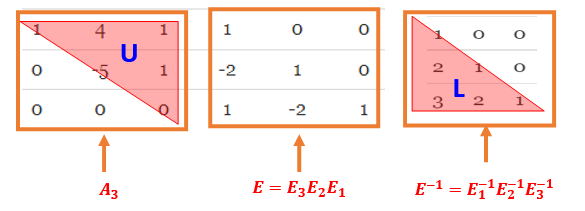
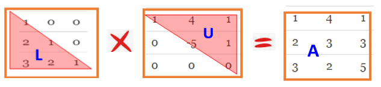

```{=html}

<style type="text/css">

/* Cascading Style Sheets (CSS) is a stylesheet language used to describe the presentation of a document written in HTML or XML. it is a simple mechanism for adding style (e.g., fonts, colors, spacing) to Web documents. */

h1.title {  /* Title - font specifications of the report title */
  font-size: 24px;
  color: DarkRed;
  text-align: center;
  font-family: "Gill Sans", sans-serif;
}
h4.author { /* Header 4 - font specifications for authors  */
  font-size: 20px;
  font-family: system-ui;
  color: DarkRed;
  text-align: center;
}
h4.date { /* Header 4 - font specifications for the date  */
  font-size: 18px;
  font-family: system-ui;
  color: DarkBlue;
  text-align: center;
}
h1 { /* Header 1 - font specifications for level 1 section title  */
    font-size: 22px;
    font-family: system-ui;
    color: navy;
    text-align: left;
}
h2 { /* Header 2 - font specifications for level 2 section title */
    font-size: 20px;
    font-family: "Times New Roman", Times, serif;
    color: navy;
    text-align: left;
}

h3 { /* Header 3 - font specifications of level 3 section title  */
    font-size: 18px;
    font-family: "Times New Roman", Times, serif;
    color: navy;
    text-align: left;
}

h4 { /* Header 4 - font specifications of level 4 section title  */
    font-size: 18px;
    font-family: "Times New Roman", Times, serif;
    color: darkred;
    text-align: left;
}

body { background-color:white; }

.highlightme { background-color:yellow; }

p { background-color:white; }

</style>
```
```{r setup, include=FALSE}
# Detect, install and load packages if needed.
if (!require("knitr")) {
   install.packages("knitr")
   library(knitr)
}
if (!require("MASS")) {
   install.packages("MASS")
   library(MASS)
}
if (!require("nleqslv")) {
   install.packages("nleqslv")
   library(nleqslv)
}
if (!require("pander")) {
   install.packages("pander")
   library(pander)
}
#
# specifications of outputs of code in code chunks
knitr::opts_chunk$set(echo = TRUE,      # include code chunk in the output file
                      warnings = FALSE,  # sometimes, you code may produce warning messages,
                                         # you can choose to include the warning messages in
                                         # the output file. 
                      messages = FALSE,  #
                      results = TRUE     # you can also decide whether to include the output
                                         # in the output file.
                      )   
```


\


# Introduction

In linear algebra, a matrix factorization is a factorization of a matrix into a product of matrices. There are differences in factorizing a matrix for different purposes. Among various ways of factorization, **lower–upper (LU)** factorization is the basic and is useful in solving linear systems.  Although LU factorization works for any $m\times n$ matrix, it is common to factorize square matrix. In this note, we only discuss LU for square matrices.   

Let $A$  be the $n\times n$ matrix 

$$
A_{n\times n} = \left[\begin{array}{ccccc} 
a_{11} & a_{12} & \cdots & a_{1n}  \\ 
a_{21} & a_{22} & \cdots & a_{2n}  \\ 
\vdots & \vdots & \ddots & \vdots  \\
a_{n1} & a_{n2} & \cdots & a_{nn}  
\end{array}
\right]
$$
$A$ is said to have a $LU$-decomposition if there exists matrices $L$ and $U$ with the following properties:

1. $L$ is a $n\times n$ lower triangular matrix with all diagonal entries being 1.

$$
L_{n\times n} = \left[\begin{array}{cccc} 
1 & 0 & \cdots & 0  \\ 
l_{21} & 1 & \cdots & 0  \\ 
\vdots & \vdots & \ddots & \vdots  \\
l_{n1} & l_{n2} & \cdots & 1  
\end{array}
\right]
$$

2. $U$ is a $n\times n$ matrix in some echelon form.

$$
U_{n\times n} = \left[\begin{array}{ccccc} 
u_{11} & u_{12} & \cdots & u_{1n}  \\ 
0 & u_{22} & \cdots & u_{2n}  \\ 
\vdots & \vdots & \ddots & \vdots  \\
0 & 0 & \cdots & u_{nn}  
\end{array}
\right]
$$

3. $A = LU$.

$$
A_{n\times n} = \left[\begin{array}{ccccc} 
a_{11} & a_{12} & \cdots & a_{1n}  \\ 
a_{21} & a_{22} & \cdots & a_{2n}  \\ 
\vdots & \vdots & \ddots & \vdots  \\
a_{n1} & a_{n2} & \cdots & a_{nn}  
\end{array}
\right]
~
=~
\left[\begin{array}{ccccc} 
1 & 0 & \cdots & 0  \\ 
l_{21} & 1 & \cdots & 0  \\ 
\vdots & \vdots & \ddots & \vdots  \\
l_{n1} & l_{n2} & \cdots & 1  
\end{array}
\right]
\times
\left[\begin{array}{ccccc} 
u_{11} & u_{12} & \cdots & u_{1n}  \\ 
0 & u_{22} & \cdots & u_{2n}  \\ 
\vdots & \vdots & \ddots & \vdots  \\
0 & 0 & \cdots & u_{nn}  
\end{array}
\right]
~=~
L_{n\times n}\times U_{n\times n}
$$
\

# Elementary and Permutation Matrices 

Any **elementary matrix**, which we often denote by  $E$, is obtained from applying **one** row operation to the **identity matrix** of the same size.

**Examples** Consider the resulting matrices after row operations to the identity matrix.

1. Adding one row to the other row: $R_1 + R_2 \to R_2$

$$
E_1 = \left[\begin{array}{ccccc} 
1 & 0 &  0  \\ 
1 & 1 & 0  \\ 
0 & 0 & 1  
\end{array}
\right]
$$

2. Multiplying a scalar to a row:  $3\times R2 \to R_2$

$$
E_2 = \left[\begin{array}{ccccc} 
1 & 0 &  0  \\ 
1 & 3 & 0  \\ 
0 & 0 & 1  
\end{array}
\right]
$$


3. Multiplying a scalar to a Row and then adding it to the other row: $5\times R_1 + R3 \to R_3$


$$
E_3 = \left[\begin{array}{ccccc} 
1 & 0 &  0  \\ 
0 & 1 & 0  \\ 
5 & 0 & 1  
\end{array}
\right]
$$

4. Switching two rows: $R_1 \leftrightarrow R_2$: 

$$
E_3 = \left[\begin{array}{ccccc} 
0 & 1 &  0  \\ 
1 & 0 & 0  \\ 
0 & 0 & 1  
\end{array}
\right]
$$

The elementary matrix obtained from switching two rows is commonly called **permutation matrix**.

\

<font color = "red" size =4>**\color{red}\LARGE To perform any of the first three row-operations on a matrix $A$, it suffices to take the product (left-multiplication) $E\times A$, where  $E$ is the elementary matrix obtained by using the desired row operation on the identity matrix.**</font>

\

Note that row operations (row switching) were used in matrix inversion and triangulation.


**Example 1**: Consider the triangulation problem:

$$
A= \left[\begin{array}{ccccc} 
1 & 4 & 1   \\ 
2 & 3 & 3  \\ 
3 & 2 & 5  
\end{array}
\right]
$$
**Solution**: The following three steps will complete the triangulation.

(1). $-2\times R_1 + R_2 \to R_2$:

$$
A= \left[\begin{array}{ccccc} 
1 & 4 & 1   \\ 
2 & 3 & 3  \\ 
3 & 2 & 5  
\end{array}
\right]
~
\xrightarrow{-2\times R_1 + R_2 \to R_2}
~
A_1= \left[\begin{array}{ccccc} 
1 & 4 & 1   \\ 
0 & -5 & 1  \\ 
3 & 2 & 5  
\end{array}
\right],
~~
E_1 =\left[\begin{array}{ccccc} 
1 & 0 & 0   \\ 
-2 & 1 & 0  \\ 
0 & 0 & 1  
\end{array}
\right]
$$
Note that

$$
E_1\times A = \left[\begin{array}{ccccc} 
1 & 0 & 0   \\ 
-2 & 1 & 0  \\ 
0 & 0 & 1  
\end{array}
\right]
\times
\left[\begin{array}{ccccc} 
1 & 4 & 1   \\ 
2 & 3 & 3  \\ 
3 & 2 & 5  
\end{array}
\right]
~=~
\left[\begin{array}{ccccc} 
1 & 4 & 1   \\ 
0 & -5 & 1  \\ 
3 & 2 & 5  
\end{array}
\right]
$$

(2). $-3\times R_1 + R_3 \to R_3$:

$$
A_1= \left[\begin{array}{ccccc} 
1 & 4 & 1   \\ 
0 & -5 & 1  \\ 
3 & 2 & 5  
\end{array}
\right]
~
\xrightarrow{-3\times R_1 + R_3 \to R_3}
~
A_2= \left[\begin{array}{ccccc} 
1 & 4 & 1   \\ 
0 & -5 & 1  \\ 
0 & -10 & 2  
\end{array}
\right],
~~
E_2 =\left[\begin{array}{ccccc} 
1 & 0 & 0   \\ 
0 & 1 & 0  \\ 
-3 & 0 & 1  
\end{array}
\right]
$$

Note also that 
$$
E_2\times E_1\times A = E_2\times A_1 = \left[\begin{array}{ccccc} 
1 & 0 & 0   \\ 
0 & 1 & 0  \\ 
-3 & 0 & 1  
\end{array}
\right]
\times
\left[\begin{array}{ccccc} 
1 & 4 & 1   \\ 
0 & -5 & 1  \\ 
3 & 2 & 5  
\end{array}
\right]
~=~
\left[\begin{array}{ccccc} 
1 & 4 & 1   \\ 
0 & -5 & 1  \\ 
0 & -10 & 2  
\end{array}
\right] = A_2
$$

(3). $-2\times R_1 + R_3 \to R_3$:

$$
A_2= \left[\begin{array}{ccccc} 
1 & 4 & 1   \\ 
0 & -5 & 1  \\ 
0 & -10 & 2  
\end{array}
\right]
~
\xrightarrow{-3\times R_1 + R_3 \to R_3}
~
A_3= \left[\begin{array}{ccccc} 
1 & 4 & 1   \\ 
0 & -5 & 1  \\ 
0 & 0 & 0  
\end{array}
\right],
~~
E_3 =\left[\begin{array}{ccccc} 
1 & 0 & 0   \\ 
0 & 1 & 0  \\ 
0 & -2 & 1  
\end{array}
\right]
$$

We note similarly that

$$
E_3\times E_2\times E_1\times A = E_3\times A_2 =\left[\begin{array}{cccc} 
1 & 0 & 0   \\ 
0 & 1 & 0  \\ 
0 & -2 & 1  
\end{array}
\right]
\times
\left[\begin{array}{cccc} 
1 & 4 & 1   \\ 
0 & -5 & 1  \\ 
0 & -10 & 2  
\end{array}
\right]
~=~
\left[\begin{array}{cccc} 
1 & 4 & 1   \\ 
0 & -5 & 1  \\ 
0 & 0 & 0  
\end{array}
\right] = A_3
$$
Next, we look at the product of the three (lower angular) elementary matrices. 

$$
E = E_3\times E_2 \times E_1 =  
\left[\begin{array}{ccccc} 
1 & 0 & 0   \\ 
0 & 1 & 0  \\ 
0 & -2 & 1  
\end{array}
\right]
\times
\left[\begin{array}{ccc} 
1 & 0 & 0   \\ 
0 & 1 & 0  \\ 
-3 & 0 & 1  
\end{array}
\right]
\times
\left[\begin{array}{ccc} 
1 & 0 & 0   \\ 
-2 & 1 & 0  \\ 
0 & 0 & 1  
\end{array}
\right]
~=~
\left[\begin{array}{ccc} 
1 & 0 & 0   \\ 
-2 & 1 & 0  \\ 
1 & -2 & 1  
\end{array}
\right]
$$

Several important observations help develop algorithms to perform the $LU$ factorization.

1. All elementary matrices that are based on the forward row operations (NOT  the row-swapping) are **lower triangular matrices** (and are obviously non-singular).

2. The product of all **lower triangular matrices** will also be a **lower triangular matrix**. This can easily be proved by the definition of matrix multiplication.

3. The product of elementary matrices is **non-singular** (i.e., the determinant is NOT equal to zero).

4. The inverse of a **lower triangular matrix** (if exists) is also a lower triangular. This is also obvious from the process of finding the inverse of a function

\

In the above example, $A_3$ is an upper triangular matrix (special echelon form). We now rewrite the row operations in the following

$$
E\times A = \left[\begin{array}{cccc} 
1 & 0 & 0   \\ 
-2 & 1 & 0  \\ 
1 & -2 & 1  
\end{array}
\right]
\times
\left[\begin{array}{cccc} 
1 & 4 & 1   \\ 
2 & 3 & 3  \\ 
3 & 2 & 5  
\end{array}
\right]
~
=
~
\left[\begin{array}{cccc} 
1 & 4 & 1   \\ 
0 & -5 & 1  \\ 
0 & 0 & 0  
\end{array}
\right] = A_3
$$
This implies that

$$
A =
\left[\begin{array}{cccc} 
1 & 4 & 1   \\ 
2 & 3 & 3  \\ 
3 & 2 & 5  
\end{array}
\right]
~
=
~
\left[\begin{array}{cccc} 
1 & 0 & 0   \\ 
-2 & 1 & 0  \\ 
1 & -2 & 1  
\end{array}
\right]^{-1}
\times
\left[\begin{array}{cccc} 
1 & 4 & 1   \\ 
0 & -5 & 1  \\ 
0 & 0 & 0  
\end{array}
\right] = E^{-1}\times A_3
$$

Let $L = E^{-1}$ (lower triangular matrix) and $U = A_3$. Then $A = LU$! For a $3 \times 3$ matrix, we need to perform $3(3-1)/2 = 3$ row operations, which means, we need to take the product 3 elementary matrices to obtain the upper triangular matrix $A_3$. The calculation of $E$ is tedious and time-consuming. However, we can use the R function `Gauss.Elimination()` on an arguments matrix to get E.

$$
\left[\begin{array}{ccccccc} 
1 & 4 & 1 & \vdots & 1 & 0 & 0  \\ 
2 & 3 & 3 & \vdots & 0 & 1 & 0  \\  
3 & 2 & 5 & \vdots & 0 & 0 & 1    
\end{array}
\right]
\xrightarrow{\text{Gaussian Row Elimination}}
\left[\begin{array}{cccccccc} 
1 & 4 & 1  & \vdots & 1 & 0 & 0  \\ 
0 & -5 & 1 & \vdots &-2 & 1 & 0  \\  
0 & 0 & 0  & \vdots & 1 & -2 & 1    
\end{array}
\right]
$$

Using the code we developed in the earlier note to find the $E=E_3E_2E_1$ (order is important!)


```{r}
Gauss.Elimination = function(A){
  # Input A: an n-by-m matrix 
  n = dim(A)[1]         # number of rows
  A0 = cbind(A, diag(rep(1,n)))   # Extended augmented matrix
  #P = diag(rep(1,n))     # identity matrix for permutation
  for(i in 1:(n-1)){     # iterator fo pivot element A0[i,i]
                         # i = 1, 2, ..., n-1
      #~~~~~~~~~~~~~~~~~~~~~   Make the function robust  ~~~~~~~~~~~~~~~~~~~~~~~~~#
      if(A0[i,i] == 0){
          non.0 = which(A0[,i] != 0)     # which() equiv to find() in MATLAB
              #cat("\n\n i =",i, ", non.0 =", non.0,". (i+1):n =", (i+1):n, ".")
              id = intersect(non.0, (i+1):n)[1] # vector of common row ID in the
                                                # lower triangular part of the matrix.
              if(!is.na(id)){     # if the common vector is not empty, do row-swapping!
              tempi = A0[i,]                    # put the i-th row in a place-holder
              A0[i,] = A0[id,]                  # row swapping
              A0[id,] = tempi    
              ###                               # updating permutation matrix
              #tempP = P[i,]
              #P[i,] = P[id,]                    
              #P[id,] = tempP 
             }
       }
      #~~~~~~~~~~~~~~~~~~~~~~~~~~~~~~~~~~~~~~~~~~~~~~~~~~~~~~~~~~~~~~~~~~~~~~~~#
       if(A0[i,i] != 0){    # A0[i,i] is in the denominator of recursive equation
          for(j in (i+1):n){  # to make the augmented matrix in the row echelon form
             #cat("\n\n j =",j,".")
             A0[j,] = A0[j,] - (A0[j,i]/A0[i,i])*A0[i,]
           }
        }
      }
   A0 
 }
```


```{r}
A=matrix(c(1,4,1,2,3,3,3,2,5), nrow=3, byrow = TRUE)
Gauss.Elimination(A=A)
```

```{r echo=FALSE, fig.align ="center",  out.width = '75%'}

```

```{r}
A=matrix(c(1,4,1,2,3,3,3,2,5), nrow=3, byrow = TRUE)
B=cbind(A, diag(rep(1,3)))
C = Gauss.Elimination(B)
U = C[,1:3]
L = solve(C[,4:6])
LU = L%*%U
```

```{r}
pander(LU)
pander(A)
```

```{r echo=FALSE, fig.align ="center",  out.width = '75%'}

```

\

# LU Factorization Algorithm


It took three elementary row operations to obtain the lower triangular matrix in the above special $3times 3$ matrix. In general, for an $n\times n$ matrix, we need $n(n-1)/2$ forward row operations (excluding row-swapping) to get the upper triangular matrix. 

\

## Row Operations with Row Swapping

As explained in the illustrative example, we can apply the Gaussian elimination method to the extended augmented matrix to obtain the product of the elementary matrices induced from the corresponding row operations if no row-swapping is involved. To be more specific, let

$$
A_{n\times n} = \left[\begin{array}{ccccc} 
a_{11} & a_{12} & \cdots & a_{1n}  \\ 
a_{21} & a_{22} & \cdots & a_{2n}  \\ 
\vdots & \vdots & \ddots & \vdots  \\
a_{n1} & a_{n2} & \cdots & a_{nn}  
\end{array}
\right],
$$

we define an extended augmented matrix in the following

$$
A^0_{n\times n} = \left[\begin{array}{ccccccccc} 
a_{11} & a_{12} & \cdots & a_{1n} & | & 1 & 0 & \cdots 0 \\ 
a_{21} & a_{22} & \cdots & a_{2n} & | & 0 & 1 & \cdots 0 \\ 
\vdots & \vdots & \ddots & \vdots & | & \vdots & \ddots & \vdots \\
a_{n1} & a_{n2} & \cdots & a_{nn} & | & 0 & 0 & \cdots 1   
\end{array}
\right],
$$

After finishing the Gaussian elimination, we have upper triangular and lower triangular matrices that are similar to those in the example.

\

## Row Operations with Row-swapping

When the row operation involves row-swapping (permutations), say, $P_1, P_2, \cdots, P_k$, we need to calculate $P=P_k\times P_{k-1}\times \cdots \times P_2\times P_1$. Then we can apply the Gaussian elimination to $PA$ to factorize it into the product of an upper triangular matrix and a lower triangular matrix.

Note that, the linear system $AX = B$ is equivalent to linear system $PAX = B$ since $P$ involves only row-swapping.


**Properties of Permutation Matrix**. Let P be a permutation matrix, then

1. The inverse of P exists.

2. The inverse of P is equal to the transpose of P. $P^{-1} = P^T$.


\

## LU ALgorithm

```{}
INPUT: The input n-by-m matrix A

OUTPUT:  L, U, P (if P = I, no permutation involved)

STEP 1: Initialization: 
        n = #rows, 
        A0 = [A,I]       (extended augmented matrix)
        P = I            (n-by-n)

STEP 2: FOR i = 1 TO n DO:     (running through pivot elements)
        STEP 3: IF A[i,i] = 0 for some i DO:
                row-swapping and updating P
                ENDIF
        STEP 4: FOR j = 1 TO n DO:
                A0[j,] = A0[j,] - (A0[j,i]/A0[i,i])*A0[i,]
                ENDFOR
        ENDFOR
STEP 5: Extract P, U = A0[,1:n], L = inverse of A0[, (n+1):2n] 
STEP 6: RETURN A, P, PA, L, U.  
```

\

**R function for LU factorization**


```{r}
LU = function(A){
  # Input A: an n-by-m matrix 
  n = dim(A)[1]         # number of rows
  A0 = cbind(A, diag(rep(1,n)))   # Extended augmented matrix
  P = diag(rep(1,n))     # identity matrix for permutation
  for(i in 1:(n-1)){     # iterator fo pivot element A0[i,i]
                         # i = 1, 2, ..., n-1
         #~~~~~~~~~~~~~~~~~~~~~   Make the function robust  ~~~~~~~~~~~~~~~~~~~~~~~~~#
         if(A0[i,i] == 0){
            non.0 = which(A0[,i] != 0)     # which() equiv to find() in MATLAB
              #cat("\n\n i =",i, ", non.0 =", non.0,". (i+1):n =", (i+1):n, ".")
              id = intersect(non.0, (i+1):n)[1] # vector of common row ID in the
                                                # lower triangular part of the matrix.
              if(!is.na(id)){     # if the common vector is not empty, do row-swapping!
              tempi = A0[i,]                    # put the i-th row in a place-holder
              A0[i,] = A0[id,]                  # row swapping
              A0[id,] = tempi    
              ###                               # updating permutation matrix
              tempP = P[i,]
              P[i,] = P[id,]                    
              P[id,] = tempP 
            }
           }
        #~~~~~~~~~~~~~~~~~~~~~~~~~~~~~~~~~~~~~~~~~~~~~~~~~~~~~~~~~~~~~~~~~~~~~~~~#
        if(A0[i,i] != 0){    # A0[i,i] is in the denominator of recursive equation
        for(j in (i+1):n){  # to make the augmented matrix in the row echelon form
             #cat("\n\n j =",j,".")
             A0[j,] = A0[j,] - (A0[j,i]/A0[i,i])*A0[i,]
           }
        }
     }
   PA = P%*%A
   U = A0[,1:n]
   L = solve(A0[, (n+1):(2*n)])
   A = A
   list(A = A, P = P, PA = PA, L = L, U = U)
 }
```

\

**Example 2**


```{r}
A=matrix(c(0,0,-1, 1, 1, 1, -1, 2, -1, -1, 2, 0, 1, 2, 0, 2), ncol  = 4, byrow = TRUE)
P = matrix(c(0,1,0,0,0,0,0,1,0,0,1,0,1,0,0,0), ncol = 4, byrow = TRUE)
LU(A)
```


# Benefit of LU Factorization

Suppose that $A$ has been factored into the triangular form $A = LU$, where $L$ is lower triangular and $U$ is upper triangular. Then we can solve for x more easily by using a two-step process.

* Let $y = Ux$ and solve the lower triangular system $Ly = b$ for $y$. Since $L$ is triangular, determining $y$ from this equation requires only $O(n^2)$ operations.

* Once $y$ is known, the upper triangular system $Ux = y$ requires only an additional $O(n^2)$ operations to determine the solution $x$.

Solving a linear system $Ax = b$ in factored form means that the number of operations needed to solve the system $Ax = b$ is reduced from $O(n^3/3)$ to $O(2n^2)$.


\


# Chapter 6 HW: Part III

6.5.1 1(a). 

6.5.7(b) and (d):  Using the code in the note or writing your code to solve these two linear systems.

6.5.9 (a) and (c): Using the code in the note or writing your code to factorize these two matrices.


