```{=html}
<style type="text/css">
h1.title {
  font-size: 20px;
  color: DarkRed;
  text-align: center;
}
h4.author { /* Header 4 - and the author and data headers use this too  */
    font-size: 18px;
  font-family: "Times New Roman", Times, serif;
  color: DarkRed;
  text-align: center;
}
h4.date { /* Header 4 - and the author and data headers use this too  */
  font-size: 18px;
  font-family: "Times New Roman", Times, serif;
  color: DarkBlue;
  text-align: center;
}
h1 { /* Header 3 - and the author and data headers use this too  */
    font-size: 22px;
    font-family: "Times New Roman", Times, serif;
    color: darkred;
    text-align: center;
}
h2 { /* Header 3 - and the author and data headers use this too  */
    font-size: 18px;
    font-family: "Times New Roman", Times, serif;
    color: navy;
    text-align: left;
}

h3 { /* Header 3 - and the author and data headers use this too  */
    font-size: 15px;
    font-family: "Times New Roman", Times, serif;
    color: navy;
    text-align: left;
}

h4 { /* Header 4 - and the author and data headers use this too  */
    font-size: 18px;
    font-family: "Times New Roman", Times, serif;
    color: darkred;
    text-align: left;
}
</style>
```
```{r setup, include=FALSE}
# code chunk specifies whether the R code, warnings, and output 
# will be included in the output files.
if (!require("knitr")) {
   install.packages("knitr")
   library(knitr)
}
if (!require("Matrix")) {
   install.packages("Matrix")
   library(Matrix)
}
knitr::opts_chunk$set(echo = TRUE, warnings = FALSE, results = TRUE)   
```


\

# Introduction

\

We will start with the concepts of various basic concepts of spline curves before introducing the cubic smoothing spline for estimating the functions with given points (knots). 

Roughly speaking, splines are functions that are piece-wise polynomials. The coefficients of the polynomial differ from interval to interval, but the order of the polynomial is the same. An essential feature of splines is that function is continuous - i.e. has no breaks on the boundaries between two adjacent intervals. That is, they create smooth curves out of irregular data points.

```{r echo=FALSE, fig.align ="center", out.width='45%'}
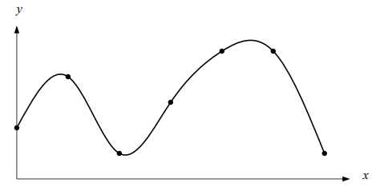
```

* Suppose that $n+1$ distinct points $x_0, x_1, \cdots, x_n$ have been specified and satisfy $x_0<x_1<\cdots < x_n$. *These points are called knots*.

* Suppose also that an integer $k \ge 0$ has been prescribed. A spline function of degree $k$ having knots $x_0, x_1, \cdots, x_n$ is a function $S(\cdot)$ such that:

  + On each interval [$x_{i-1}, x_i$], $S(\cdot)$ is a polynomial of degree $\le k$.

  + $S(\cdot)$ has a continuous $(k-1)$-th derivative on [$x_0, x_n$].

That is if $S(\cdot)$ is a piece-wise polynomial of degree at most 3 having continuous derivatives of all orders up to 2.


**Example 1** Spline of degree 0 is piece-wise constant. A spline of degree 0 can be given explicitly in the form

```{r echo=FALSE, fig.align ="center", out.width='40%'}
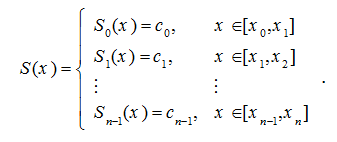
```

The intervals [$x_{i-1}, x_i$] do not intersect each other and so no ambiguity arises in defining such a function at the knots. For example, in the following four-knot data, the zero-degree spline is graphically represented below.

```{r echo=FALSE, fig.align ="center", out.width='40%'}
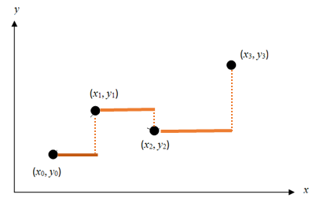
```

\

The three dimensional zero-degree spline can be similarly constructed.

```{r echo=FALSE, fig.align ="center", out.width='40%'}
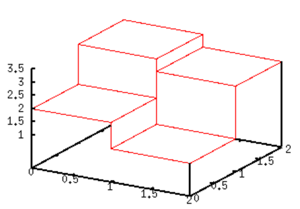
```


We have also used this spline interpolation in Riemann sum in multivatiable integration in calculus.
<https://demonstrations.wolfram.com/ApproximatingADoubleIntegralWithCuboids/>

\


\

# Linear Splines

Linear spline interpolation is simply a line plot that connects all consecutive points $\{(x_0, y_0), (x_1, y_1), \cdots, (x_{n-1}, y_{n-1}),(x_{n}, y_{n})\}$ ($x_0, x_1, \cdots, x_n$). So if the above data is given in ascending order, the linear splines are given by $y_i = f(x_i)$.

```{r echo=FALSE, fig.align ="center", out.width='35%'}
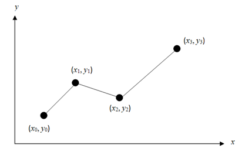
```

The function of the above curve (i.e., line plot) is given below.

```{r echo=FALSE, fig.align ="center", out.width='55%'}
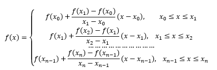
```


**Example 2**: The upward velocity of a rocket is given as a function of time in the table below. Using the linear spline to determine the value of the velocity at $t = 16$ seconds.

```{r echo=FALSE, fig.align ="center", out.width='20%'}
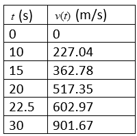
```

The linear spline is plotted in the following

```{r echo=FALSE, fig.align ="center", out.width='40%'}
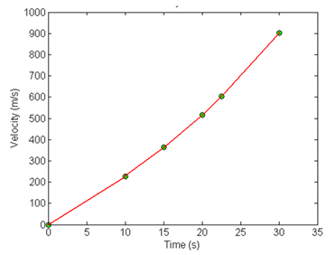
```

We can use the data table to calculate the slope of each individual line segment in the above curve and express the spline function explicitly. The predicted velocity at $Time = 16$ can be found using the piece of the spline in the figure below.

```{r echo=FALSE, fig.align ="center", out.width='40%'}
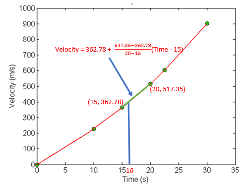
```

That is,

$$
\text{Velocity}_{pred} = 362.78 + \frac{517.35 - 362.78}{20-15}(16-15) = 393.694.
$$\

\

**R/MATLAB Program** to implement **Linear Spline**.

Assume $n$ given points with coordinates $\{(x_0, y_0), (x_1, y_1), \cdots, (x_n, y_n) \}$ ($x_0 < x_1 < \cdots < x_n$). We use the vectorized function `which()` in R or `find()` in MATLAB to avoid using a loop in the algorithm.


```{}
INPUT: input nodes    (xi,yi) (i = 1, 2, ..., n)
       x.new          (a vector of x values for predicting y.new)

OUTPUT: y.new

STEP 1: Initializing:
        m = number of input x values
        y.new = NULL  (storing pred y)
STEP 2: FOR i = 1 TO m DO;
           IF x[k] <= x.new[i] < x[k+1] DO
               y.new[i] = ((y[k+1]-y[k])/(x[k+1] - x[k]))*(x.new-x[k]) + y[k]
           ENDIF
        ENDFOR
STEP 3: RETURN y.new
```


\

**R Code**

```{r}
LSpline = function(x,        # x-coordinates of the input knots
                   y,        # y-coordinates of the input knots
                   x.new     # the new x values to be evaluated and returned
                   ){
    m = length(x.new)
    y.new = NULL
    for (i in 1:m){
       k = which(x >= x.new[i])[1]
       y.new[i] = ((y[k+1]-y[k])/(x[k+1] - x[k]))*(x.new[i]-x[k]) + y[k]
    }  
    y.new
}
```

**Example** (reproduce the results of **Examples 2**) using the above function.

```{r}
x = c(0, 10, 15, 20, 22.5, 30)
y = c(0, 227.04, 362.78, 517.35, 602.97, 901.67)
LSpline(x = x, y = y, x.new = c(10, 15, 16, 20))
```

\

As expected, linear spline idea can be used in the high dimensional space.

```{r echo=FALSE, fig.align ="center", out.width='60%'}
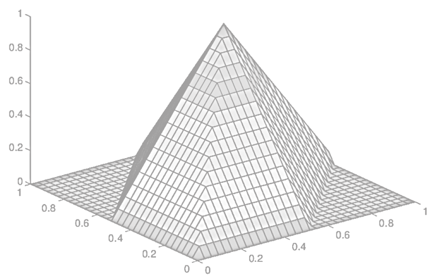
```


\

# Quadratic Spline Interpolation

Unlike linear spline interpolation in which two consecutive knots are connected by a line segment, in quadratic spline interpolation, two consecutive knots are connected by a curve of quadratic function, and every adjacent quadratic curve is connected smoothly (i.e., the derivative of the resulting quadratic spline exists at all **inner knots**).

\

```{r echo=FALSE, fig.align ="center", out.width='55%'}
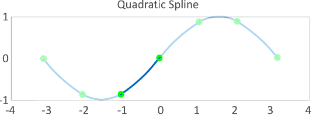
```


## Formulation of Quadratic Spline
\

In these splines, a quadratic polynomial approximates the data between two consecutive data points. Given $\{(x_0, y_0), (x_1, y_1), \cdots, (x_{n-1}, y_{n-1}),(x_{n}, y_{n}), \}$, fit quadratic splines through the data. The splines are given by

```{r echo=FALSE, fig.align ="center", out.width='45%'}
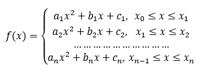
```


There are $3n$ coefficients ($a_i, b_i, c_i$) for $i = 1, 2, \cdots, n$ that must satisfy the following conditions so that the adjacent quadratic curves are connected smoothly.

-   **Adjacent connection** implies that the quadratic curves pass through every knot. We have the following $2n$ equations.

```{r echo=FALSE, fig.align ="center", out.width='60%'}
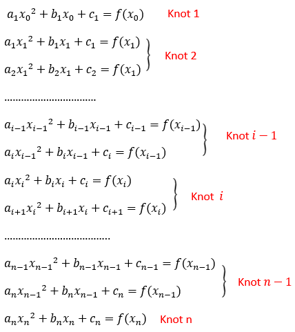
```

-   **Smooth connection** requires the first-order derivatives of adjacent quadratic curves at each knot to be equal. This gives the following $n-1$ equations:

$$
2a_kx_k + b_k = 2a_{k+1}x_k + b_{k+1}
$$ 

for $k=1,2,\cdots, n-1.$ that can be written as

$$
(2x_k)a_k + b_k -(2x_k)a_{k+1} - b_{k+1} = 0
$$

-   **Default Assumption**. A common assumption we can take is to set $a_1 = 0$ or $a_1 = a_n$.

For given $n+1$ points ($n-1$ interior points), we can solve for the $3n$ coefficients for the $n$ quadratic equations.


\

## Matrix Representation of Quadratic Spline Problem

Since the knots will be given, the actual unknowns are the coefficients of the quadratic functions. We can write the spline problem in the following matrix form.

$$
\left[
\begin{array}{ccccccccccccc}
 x_0^2 & x_0 & 1 & 0 & 0 & 0 & \cdots & 0 & 0 & 0 & 0 & 0 & 0 \\ 
 x_1^2 & x_1 & 1 & 0 & 0 & 0 & \cdots & 0 & 0 & 0 & 0 & 0 & 0 \\ 
 0 & 0 & 0 & x_1^2 & x_1 & 1 & \cdots & 0 & 0 & 0 & 0 & 0 & 0 \\ 
 0 & 0 & 0 & x_2^2 & x_2 & 1 & \cdots & 0 & 0 & 0 & 0 & 0 & 0 \\ 
 \cdots & \cdots & \cdots & \cdots & \cdots & \cdots & \cdots & \cdots & \cdots & \cdots & \cdots & \cdots & \cdots \\ 
 0 & 0 & 0 & 0 & 0 & 0 & \cdots & x_{n-2}^2 & x_{n-2} & 1 & 0 & 0 & 0 \\ 
 0 & 0 & 0 & 0 & 0 & 0 & \cdots & x_{n-1}^2 & x_{n-1} & 1 & 0 & 0 & 0 \\ 
 0 & 0 & 0 & 0 & 0 & 0 & \cdots & 0 & 0 & 0 & x_{n-1}^2 & x_{n-1} & 1 \\ 
 0 & 0 & 0 & 0 & 0 & 0 & \cdots & 0 & 0 & 0 & x_n^2 & x_n & 1 \\ 
 2x_1 & 1 & 0 & - 2x_1 & -1 & 0 & \cdots & 0 & 0 & 0 & 0 & 0 & 0\\ 
 0 & 0 & 0 & 2x_2 & 1 & 0 & \cdots & 0 & 0 & 0 & 0 & 0 & 0\\ 
 \cdots & \cdots & \cdots & \cdots & \cdots & \cdots & \cdots & \cdots & \cdots & \cdots & \cdots & \cdots & \cdots \\ 
 0 & 0 & 0 & 0 & 0 & 0 & \cdots &2x_{n-1} & 1 & 0 & -2x_{n-1}& -1 &  0\\ 
 1 & 0 & 0 & 0 & 0 & 0 & \cdots & 0 & 0 & 0 & 0 & 0 & 0
\end{array}
\right]
\left[
\begin{array}{c}
 a_1 \\ 
 b_1 \\ 
 c_1 \\
 a_2 \\
 b_2 \\
 c_2 \\
\cdots \\
a_{n-1} \\
b_{n-1} \\
c_{n-1} \\
a_n \\
b_n \\
c_n
\end{array}
\right]
~=~
\left[
\begin{array}{c}
 y_0 \\ 
 y_1 \\ 
 y_1 \\
 y_2 \\
 y_2 \\
 y_3 \\
\cdots \\
y_n \\
0 \\
0 \\
\cdots \\
0 \\
0 \\
0
\end{array}
\right]
$$

The annotated version of the above matrix equation is given below

```{r echo=FALSE, fig.align ="center", out.width='98%'}
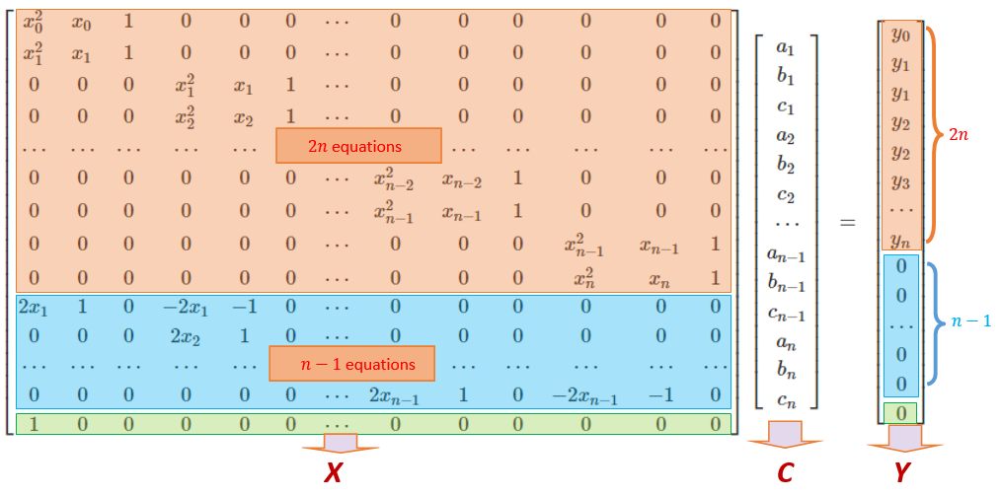
```

## Algorithm of Quadratic Spline

The above matrix representation of the quadratic spline problem is a linear system that has a unique solution. Using the algorithm we developed earlier to solve the linear system:

$$
XC= Y
$$

The solution is
$$
C = X^{-1}Y
$$

The following pseudo-code will be based on this solution based on given knots $\{(x_0, y_0), (x_1, y_1), \cdots, (x_n, y_n)\}$.

\

**Q-Spline Algorithm**

```
INPUT:   (n+1) knots    (vertical and horizontal coordinates)
         x.new          (to be used to evaluate the spline function)
OUTPUT:  y.new

STEP 1:  Define X and Y 
         m = number of values in x.new
         y.new = NULL    (to store values of Q-spline function at x.new)
STEP 2:  solve for C from XC = Y       (coefficients  of Q-spline polynomials)
STEP 3:  FOR i = 1 TO m DO:
            IF x[k] <= x.new[i] < x[k+1] DO:
               y.new[i] = C[3k]*x.new[i]^2 + C[3k+1]*x.new[i] + C[3k+2]
            ENDIF
         ENDFOR
STEP 4: RETURN y.new and coefficients if needed.        
```
\

Next, we write an R function based on the above pseudo-code. We use vector operations in the code to reduce loops.

\

```{r}
QSpline = function(x,        # x-coordinates of the input knots
                   y,        # y-coordinates of the input knots
                   x.new     # the new x values to be evaluated and returned
              ){
     m = length(x.new)
     n = length(x)-1
     y.new = NULL
     ##
     Y = rep(0, 3*n)
     Y[1] = y[1]
     ##
     A1 = matrix(0, ncol = 3*n, nrow = 2*n)     # continuity condition
     A2 = matrix(0, ncol = 3*n, nrow = n -1)    # smooth condition
     A3 = matrix(0, ncol = 3*n, nrow = 1)       # default initial condition
     for (i in 1:n){  # pay attention to the indexes 
       A1[2*i-1,(3*(i-1)+1):(3*(i-1)+3)] = c(x[i]^2, x[i], 1)
       A1[2*i,(3*(i-1)+1):(3*(i-1)+3)] = c(x[i+1]^2, x[i+1], 1)
       if(i == n) break
       A2[i, (3*(i-1)+1):(3*(i-1)+6)] = c(2*x[i+1], 1, 0, -2*x[i+1], -1, 0)
       ##
      }
     A3[1,1] = 1
     X = rbind(A1, A2, A3)
     ##
     Y = rep(0, 3*n)
     Y[1] = y[1]
     for (i in 2:n){
         Y[2*i-2] = y[i]
         Y[2*i-1] = y[i]
        }
     Y[2*n] = y[n+1]
     C=solve(X)%*%Y
     a = C[seq(1,3*n, by = 3),]
     b = C[seq(2,3*n, by = 3),]
     c = C[seq(3,3*n, by = 3),]
     coef = round(cbind(a =a, b = b, c = c),3)
     ## Prediction
     for (j in 1:m){
       k = which(x >= x.new[j])[1]
       y.new[j] = a[k]*x.new[j]^2 + b[k]*x.new[j] + c[k]
     }
    list(y.new = y.new, QSpoly.coef = coef, QSeq.Matrix = X, Y = Y) 
}

```


\

**Example 3**: (**Velocity example continued**) The upward velocity of a rocket is given as a function of time in the table below. Using the linear spline to determine the value of the velocity at $t = 16$ seconds.

```{r echo=FALSE, fig.align ="center", out.width='20%'}

```


We fit the data with a quadratic spline with the assumption that $a_1 = 0$. The matrix form of the final system of $3\times (6-1) =15$ linear equations are given below.

```{r echo=FALSE, fig.align ="center", out.width='75%'}
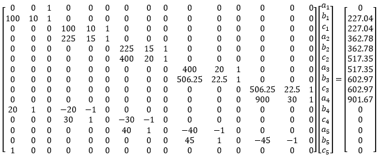
```

The last row in the argument matrix reflects the default assumption $a_1 = 0$. Solve the above system of equations using a computer program, we have the solutions summarized in the following table.

```{r echo=FALSE, fig.align ="center", out.width='25%'}
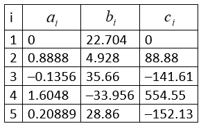
```


Using the above results, we plot the quadratic spline with the following R code.

```{r echo = F, fig.align='center', fig.width=5, fig.height=4}
x1=seq(0,10,0.1)
x2=seq(10,15, 0.1)
x3=seq(15,20,0.1)
x4=seq(20,22.5,0.1)
x5=seq(22.5,30,0.1)
y1 = 22.704*x1
y2=0.8888*x2^2 + 4.928*x2+88.88
y3=-0.1356*x3^2 + 35.66*x3 - 141.61
y4=1.6048*x4^2 - 33.956*x4 + 554.55
y5=0.20889*x5^2 + 28.86*x5 - 152.13
#plot(x1, y1, xlim=c(-5,35), ylim=c(-100, 1000), type="l", col=1, lwd=2,
#     xlab = "Time", ylab = "Velocity")
#lines(x2, y2,col=2, lwd=2)
#lines(x3, y3,col=3, lwd=2)
#lines(x4, y4,col=4, lwd=2)
#lines(x5, y5,col=5, lwd=2)
#title("Velocity as a function of time: Quadratic Spline")
#points(c(0,10,15,20,22.5,30),c(0,227.04, 362.78, 517.35, 602.97, 901.67), pch=16, col="red", cex=1.5)

```


```{r echo=FALSE, fig.align ="center", out.width='45%'}
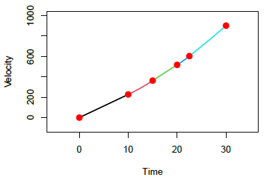
```


Using the above R function, we have the above results.


```{r}
x = c(0, 10, 15, 20, 22.5, 30)
y = c(0, 227.04, 362.78, 517.35, 602.97, 901.67)
x.new = c(0, 10, 15, 16, 20)
QSpline(x = x, y = y, x.new = x.new)
```


