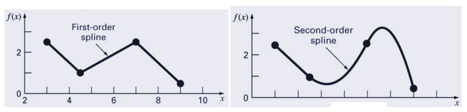
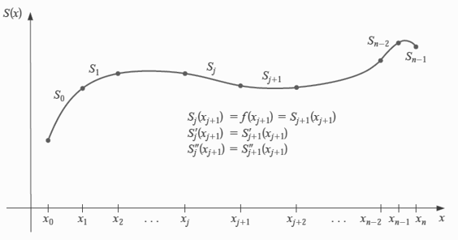
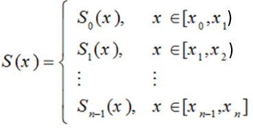
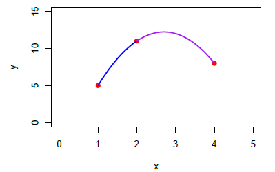
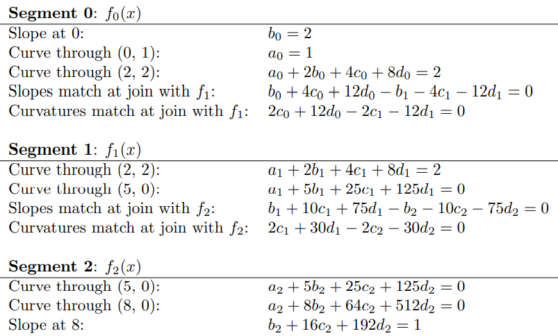
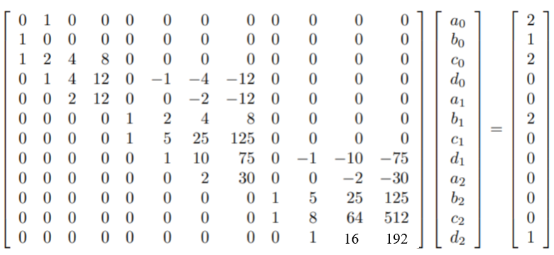
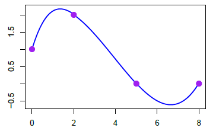

```{=html}
<style type="text/css">
h1.title {
  font-size: 20px;
  color: DarkRed;
  text-align: center;
}
h4.author { /* Header 4 - and the author and data headers use this too  */
    font-size: 18px;
  font-family: "Times New Roman", Times, serif;
  color: DarkRed;
  text-align: center;
}
h4.date { /* Header 4 - and the author and data headers use this too  */
  font-size: 18px;
  font-family: "Times New Roman", Times, serif;
  color: DarkBlue;
  text-align: center;
}
h1 { /* Header 3 - and the author and data headers use this too  */
    font-size: 22px;
    font-family: "Times New Roman", Times, serif;
    color: darkred;
    text-align: center;
}
h2 { /* Header 3 - and the author and data headers use this too  */
    font-size: 18px;
    font-family: "Times New Roman", Times, serif;
    color: navy;
    text-align: left;
}

h3 { /* Header 3 - and the author and data headers use this too  */
    font-size: 15px;
    font-family: "Times New Roman", Times, serif;
    color: navy;
    text-align: left;
}

h4 { /* Header 4 - and the author and data headers use this too  */
    font-size: 18px;
    font-family: "Times New Roman", Times, serif;
    color: darkred;
    text-align: left;
}
</style>
```
```{r setup, include=FALSE}
# code chunk specifies whether the R code, warnings, and output 
# will be included in the output files.
library(knitr)
knitr::opts_chunk$set(echo = TRUE,      # include code chunk in the output file
                      warnings = FALSE, # sometimes, you code may produce warning messages,
                                        # you can choose to include the warning messages in
                                        # the output file. 
                      results = TRUE    # you can also decide whether to include the output
                                        # in the output file.
                      )   
```


\

# Introduction

\

As we have seen from the previous note on linear and quadratic spline interpolation, splines are functions that are piece-wise polynomials. The coefficients of the polynomial differ from interval to interval, but the order of the polynomial is the same. An essential feature of splines is that function is continuous - i.e. has no breaks on the boundaries between two adjacent intervals. That is, they create smooth curves out of irregular data points.


In this note, we use the same idea to discuss cubic spline interpolation.

\

# Cubic Splines


A cubic spline is a piece-wise cubic polynomial function. We will use the same logical process to develop the algorithm to find the cubic polynomials based on given knots. 

\
```{r echo=FALSE, fig.align ="center", out.width='85%'}

```
\

## Formulation of Cubic Spline


Suppose that we want to approximate $y = f(x)$ by cubic spline function $S(x)$. For a sampled set of points on the curve of $f(x)$: $\{(x_0, y_0). (x_1, y_1), (x_2, y_2), \cdots, (x_n, y_n) \}$.

```{r echo=FALSE, fig.align ="center", out.width='55%'}

```

Assume further that $x_0 < x_1 <x_2 < \cdots <x_n$. On each interval $[x_0, x_1), [x_1, x_2), \cdots, [x_{n-1}, x_n]$, $S(x)$ is given by a different cubic polynomial. Let $S_i(x)$ be the cubic polynomial that represents $S(x)$ on $[x_i, x_{i+1}]$. Thus

```{r echo=FALSE, fig.align ="center", out.width='25%'}

```

Where <font color = "red"><b>

$$\color{red}
S_j(x) = a_j + b_j (x - x_j ) + c_j (x - x_j )^2 + d_j (x - x_j)^3
$$ </b></font>

for $j = 0, 1, \cdots, n-1$. There are $4n$ unknowns to be determined subject to the following conditions:

**\color{red} Condition 1**: $S(x_j) = f(x_j)$ for each $j = 0, 1,\cdots,n$; *\color{red} ($n+1$ equations)*

**\color{red} Condition 2**: $S_{j+1}(x_{j+1}) = S_j(x_{j+1})$ for each $j = 0, 1,\cdots,n-2$; *\color{red} ($n-1$ equations)*

**\color{red} Condition 3**: $S^\prime_{j+1}(x_{j+1}) = S^\prime_j(x_{j+1})$ for each $j = 0, 1,\cdots,n-2$; *\color{red}($n-1$ equations)*

**\color{red} Condition 4**: $S^{\prime\prime}_{j+1}(x_{j+1}) = S^{\prime\prime}_j(x_{j+1})$ for each $j = 0, 1,\cdots,n-2$; *\color{red} ($n-1$ equations)*

**\color{red} Condition 5**: One of the following boundary conditions:

  a)  $S^{\prime\prime}(x_0) = S^{\prime\prime}(x_n) = 0$ $\Rightarrow$ **Natural Spline**. *\color{red} ( $2$ equations)*

  b)  $S^\prime(x_0) = f^\prime(x_0)$ and $S^\prime(x_n) = f^\prime(x_n)$ $\Rightarrow$ **Clamped Spline**. <font color = "blue">*\color{blue} Remark: since $f(x)$ is unknown, we need to provide the two slopes according to the trend of the pattern of the scatter plot of the data.*</font> *\color{red} ( $2$ equations)*

\

**Example 1**. Calculate **\color{red} Cubic Natural Splines** based on given data $\{(1, 5), (2, 11), (4, 8)\}$ are sampled from an unknown function $y = f(x)$. Find the approximated values of $f(1.5)$ and $f^\prime(2)$ based on the cubic smoothing spline.

**Solution**: Let $S_0(x) = a_0 + b_0(x-1) + c_0(x-1)^2 + d_0(x-1)^3$ be the spline function on interval [$1, 2$) and $S_1(x) = a_1 + b_1(x-2) + c_1(x-2)^2 + d_1(x-2)^3$ be the spline function on interval [$2, 4$). We need the following 8 equations to determine the two cubic spline functions.

-   The two splines pass individual points yielding

    1.  $a_0 = 5$

    2.  $a_0 + b_0 + c_0 + d_0 = 11$

    3.  $a_1 = 11$

    4.  $a_1 + 2b_1 + 4c_1 + 8d_1 = 8$

-   First order smoothness: $b_0 + 2c_0(x-1) +3d_0(x-1)^2 = b_1 + 2c_1(x-2) +3d_1(x-2)^2$

    5.  $b_0 +2c_0 + 3d_0= b_1$

-   Second order smoothness: $2c_0 +6d_0(x-1) = 2c_1 +6d_1(x-2)$

    6.  $2c_0 +6d_0= 2c_1$

-   Boundary Conditions (natural spline):

    7.  $d_0 = 0$

    8.  $d_1 = 0$

We obtain the following system of equations

$$
\begin{cases} 
1a_0 + 0b_0 +0c_0 +0d_0 + 0a_1 + 0b_1 + 0c_1 +0d_1 = 5  \\
1a_0 + 1b_0 +1c_0 +1d_0 + 0a_1 + 0b_1 + 0c_1 +0d_1 = 11 \\ 
0a_0 + 0b_0 +0c_0 +0d_0 + 1a_1 + 0b_1 + 0c_1 +0d_1 = 11  \\
0a_0 + 0b_0 +0c_0 +0d_0 + 1a_1 + 2b_1 + 4c_1 +8d_1 = 8  \\
0a_0 + 1b_0 +2c_0 +3d_0 + 0a_1 - 1b_1 + 0c_1 +0d_1 = 0  \\
0a_0 + 0b_0 +1c_0 +3d_0 + 0a_1 + 0b_1 - 1c_1 +0d_1 = 0  \\
0a_0 + 0b_0 +0c_0 +1d_0 + 0a_1 + 0b_1 + 0c_1 +0d_1 = 0  \\
0a_0 + 0b_0 +0c_0 +0d_0 + 0a_1 + 0b_1 + 0c_1 +1d_1 = 0  
\end{cases}
$$

The matrix representation of the above system is given by

$$
 \begin{bmatrix} 
 1 & 0 & 0 & 0 & 0 & 0 & 0 & 0 \\ 
 1 & 1 & 1 & 1 & 0 & 0 & 0 & 0 \\ 
 0 & 0 & 0 & 0 & 1 & 0 & 0 & 0 \\
 0 & 0 & 0 & 0 & 1 & 2 & 4 & 8 \\
 0 & 1 & 2 & 3 & 0 & -1 & 0 & 0 \\
 0 & 0 & 1 & 3 & 0 & 0 & -1 & 0 \\
 0 & 0 & 0 & 1 & 0 & 0 & 0 & 0 \\
 0 & 1 & 0 & 0 & 0 & 01 & 0 & 1 
 \end{bmatrix} \times \left[ \begin{array}{c} a_0 \\b_0\\c_0\\d_0 \\ a_1\\b_1\\c_1\\d_1 \end{array} \right] =\left[ \begin{array}{c} 5 \\ 11\\11\\8\\0\\0\\0\\0 \end{array} \right] 
$$

The solution to the equation is

$$
\left[ \begin{array}{c} a_0 \\b_0\\c_0\\d_0 \\ a_1\\b_1\\c_1\\d_1 \end{array} \right] =  \begin{bmatrix} 
 1 & 0 & 0 & 0 & 0 & 0 & 0 & 0 \\ 
 1 & 1 & 1 & 1 & 0 & 0 & 0 & 0 \\ 
 0 & 0 & 0 & 0 & 1 & 0 & 0 & 0 \\
 0 & 0 & 0 & 0 & 1 & 2 & 4 & 8 \\
 0 & 1 & 2 & 3 & 0 & -1 & 0 & 0 \\
 0 & 0 & 1 & 3 & 0 & 0 & -1 & 0 \\
 0 & 0 & 0 & 1 & 0 & 0 & 0 & 0 \\
 0 & 1 & 0 & 0 & 0 & 01 & 0 & 1  
 \end{bmatrix}^{-1}\times \left[ \begin{array}{c} 5 \\ 11\\11\\8\\0\\0\\0\\0 \end{array} \right] 
 =\left[ \begin{array}{c} 5 \\ 13.5\\-7.5\\0\\11\\13.5\\-7.5\\0 \end{array} \right].
$$

We use R to solve the above equation.

```{r echo = F}
V=c(1, 0, 0, 0, 0, 0, 0, 0,
    1, 1, 1, 1, 0, 0, 0, 0,
    0, 0, 0, 0, 1, 0, 0, 0,
    0, 0, 0, 0, 1, 2, 4, 8,
    0, 1, 2, 3, 0, -1, 0, 0,
    0, 0, 1, 3, 0, 0, -1, 0,
    0, 0, 0, 1, 0, 0, 0, 0,
    0, 0, 0, 0, 0, 0, 0, 1)

U=c(5, 11, 11, 8,0,0,0,0)
M=matrix(V, ncol=8, byrow=T)
Sol = solve(M)%*%U
Sol = round(Sol,3)
# t(Sol)
```

Thais, $(a_0,b_0,c_0,d_0,a_1,b_1,c_1,d_1) = (5, 8.5, -2.5, 0, 11, 3.5, -2.5, 0)$. Therefore, the two resulting cubic spline functions (reduce to quadratic functions due to the choice of the natural spline) are 

$$
S(x)=
    \begin{cases}
        5 + 8.5(x-1) -2.5(x-1)^2  & \text{ for } x\in[1, 2)\\
        11 + 3.5(x-2) -2.5(x-2)^2  & \text{ for } x\in[2, 4].
    \end{cases}
$$

Therefore, $f(1.5) \approx S_0(1.5) = 5 + 8.5\times 0.5 -2.5\times 0.5^2 = 8.625$. $f^\prime(2) = S^\prime_0(2) = S^\prime_1(2) = [11 + 3.5(x-2) -2.5(x-2)^2]^\prime = 3.5$.

```{r echo = F, fig.align='center', fig.width=5, fig.height=4}
x1 = seq(1,2, 0.01)
x2 = seq(2,4, 0.01)
S1 = 5  + 8.5*(x1-1) -2.5*(x1-1)^2
S2 = 11 + 3.5*(x2-2) -2.5*(x2-2)^2
#plot(c(1,2,4), c(5,11,8), xlim=c(0,5), ylim=c(0,15), xlab="x", ylab = "y",
#     main="Natural Cubic Spline", pch = 19, col="red")
#lines(x1,S1, col = "blue", lwd= 2)
#lines(x2,S2, col = "purple", lwd = 2)
```

```{r echo=FALSE, fig.align ="center", out.width='45%'}

```


\

**Example 2**: Calculate **\color{red} Cubic Clamped Splines** based on given data points $\{(0,1), (2,2), (5,0), (8,0)\}$ are sampled from an unknown function $y = f(x)$.

\
**Solution (sketch)**: We choose the slopes of the starting and ending points of $f(x)$ to be 2 and 1 respectively. <font color = "red">*\color{red} For convenience, we denote individual segments to have form $f_i(x) = a_i +b_ix + c_ix^2 + d_ix^3$*</font>. Using the same set of conditions, we list the resulting equations of the coefficients of the four cubic polynomials according to each spline function in the following.

```{r echo=FALSE, fig.align ="center", out.width='75%'}

```

Rewriting the above system of equations in the matrix form, we have
```{r echo=FALSE, fig.align ="center", out.width='65%'}

```

```{r echo = F}
V5=c(0, 1, 0, 0, 0, 0, 0, 0, 0, 0, 0, 0,
     1, 0, 0, 0, 0, 0, 0, 0, 0, 0, 0, 0,
     1, 2, 4, 8, 0, 0, 0, 0, 0, 0, 0, 0,
     0, 1, 4, 12, 0, -1, -4, -12, 0, 0, 0, 0,
     0, 0, 2, 12, 0, 0, -2, -12, 0, 0, 0, 0,
     0, 0, 0, 0, 1, 2, 4, 8, 0, 0, 0, 0,
     0, 0, 0, 0, 1, 5, 25, 125, 0, 0, 0, 0,
     0, 0, 0, 0, 0, 1, 10, 75, 0, -1, -10, -75,
     0, 0, 0, 0, 0, 0, 2, 30, 0, 0, -2, -30,
     0, 0, 0, 0, 0, 0, 0, 0, 1, 5, 25, 125,
     0, 0, 0, 0, 0, 0, 0, 0, 1, 8, 64, 512,
     0, 0, 0, 0, 0, 0, 0, 0, 0, 1, 16, 192)
#
U5=c(2,1,2,0,0,2,0,0,0,0,0,1)
#
coef.matrix = matrix(V5, ncol = 12, byrow = T)
sol = solve(coef.matrix)%*%U5
coef.sol = t(sol)
#round(coef.sol,4)
```

The solution of the above system equations is $(a_0, b_0, c_0, d_0, a_1, b_1, c_1, d_1,a_2, b_2, c_2, d_2,) =$ (1, 2, -1.0395, 0.1447, 1.9201, 0.6199, -0.3494, 0.0297, 0.7018, 1.3509, -0.4956, 0.0395). Therefore, the cubic spline function is given explicitly by

$$
S(x)=
    \begin{cases}
        1 + 2x-1.0339x^2+0.1447x^3  & \text{ for } x\in[0, 2);\\
        1.9201+0.6199x-0.3494x^2+0.0297x^3   & \text{ for } x\in[2, 5);\\
        0.7018+1.3509x-0.4956x^2+0.0395x^3  & \text{ for } x\in[5, 8] .
    \end{cases}
$$
```{r echo=F,fig.align='center', fig.width=5, fig.height=4}
x1=seq(0, 2, 0.01)
x2=seq(2, 5, 0.01)
x3=seq(5, 8, 0.01)
f1= 1 + 2*x1-1.0339*x1^2+0.1447*x1^3
f2= 1.9201+0.6199*x2-0.3494*x2^2+0.0297*x2^3   
f3= 0.7018+1.3509*x3-0.4956*x3^2+0.0395*x3^3
X=c(x1,x2,x3)
Y=c(f1,f2,f3)
#plot(X,Y, type = "l", lwd=2, col = "blue")
#points(c(0,2,5,8), c(1,2,0,0), pch=19, cex = 1.5, col="purple")
```

```{r echo=FALSE, fig.align ="center", out.width='45%'}

```


\


## Construction of Cubic Splines
\

<font color="blue" size = 4>**\color{blue}CUBIC SPLINE FUNCTION: $S_j(x) = a_j + b_j(x-x_j) + c_j(x-x_j)^2 + d_j(x-x_j)^3$**</font>

\
<font color = "blue" size =4>**\color{blue}OBJECTIVE: Find Coefficients: $(a_i, b_i, c_i, d_i)$!**</font>
\

\

Let $h_j = x_{j+1} - x_j$. Since there are $4n$ unknowns that need to be determined from the data, we need to set up $4n$ equations as follows:

1.  From **condition 1**: $S_j(x_j) = y_j$ gives $n$ equations: $a_j = f(x_j) = y_j$ for $j = 0, 1, 2,\cdots, n$.

2.  From **Condition 2**: $S_{j+1}(x_{j+1}) = S_j(x_{j+1})$ gives $n-1$ equations: $a_{j+1} = a_j + b_jh_j + c_jh_j^2 + d_jh_j^3$ for $j = 0, 1, 2,\cdots, n-2$.

3.  From **condition 3**: Note that $S^\prime_j (x) = b_j + 2c_j (x - x_j ) + 3d_j(x - x_j)^2$. The condition $S_{j+1}^\prime(x_{j+1}) = S_j^\prime(x_j)$ gives $n - 1$ equations: $b_{j+1} = b_j + 2c_jh_j + 3d_jh_j^2$ for $j = 0, 1, 2, \cdots, n-2$.


4.  From **condition 4**, $S^{\prime\prime}_j (x) = 2c_j + 6d_j(x - x_j)$: The condition $S_{j+1}^{\prime\prime}(x_{j+1}) = S_{j+1}^{\prime\prime}(x_{j})$ gives $n-1$ equations:  $c_{j+1} = c_j + 3d_jh_j$ for $j = 0, 1, 2, \cdots, n-2$.


5.  **Boundary conditions**:

    a)  $c_0 = c_n = 0$

    b)  $S^\prime_n (b) = f^\prime(b) = b_n$ gives $h_{n-1}(c_{n-1}+ 2c_n)= 3f^\prime (b) -3(a_n- a_{n-1})/h_{n-1}$ while $S^\prime_0(a) = f^\prime (a) = b_0$ gives the following equatione $h_0(2c_0 + c_1) = 3(a_1- a_0)/h_0-3f^\prime (a)$.
    
\

Instead of solving the system of $3n$ equations based on the given $n+1$ knots $\{(x_0,y_0), (x_1, y_1), \cdots, (x_n, y_n) \}$, we next simplify the original system to reduce it to a relatively small system. to summarize what we obtained earlier, we list the following $3n-2$ equations

**A.** $a_{j+1} = a_j + b_jh_j + c_jh_j^2 + d_jh_j^3  ~~\text{for}~~ j = 0, 1, 2, \cdots, n.$

**B.** $b_{j+1} =  b_j + 2c_jh_j + 3d_jh_j^2  ~~\text{for}~~ j = 0, 1, 2, \cdots, n-1.$
    
**C.** $c_{j+1} = c_j + 3d_jh_j  ~~\text{for}~~ j = 0, 1, 2, \cdots, n-1.$  
    
Note that $a_j$ and $h_j$ are known. Solve for $d_j$ from (C), we have $d_j = (c_{j+1} - c_j)/(3h_j)$. Plug $d_j$ into (A) and (B), and we have

**D.** $a_{j+1}= a_j + b_jh_j + h^2_j(2c_j + c_{j+1})/3$.

**E.** $b_{j+1} = b_j + h_j (c_j + c_{j+1})$
    
We can similarly solve $b_j$ from (D) to get 

**F.** $b_j =(a_{j+1} - a_j )/h_j - h_j(2c_j + c_{j+1})/3 ~~  \text{for}~~ j = 0, 1, 2, \cdots, n-1$.    
    
which implies

**G.** $b_{j-1} =(a_j - a_{j-1} )/h_{j-1} - h_{j-1}(2c_{j-1} + c_j)/3  ~~\text{for}~~ j = 1, 2, \cdots, n-1$.
    
We re-write (re-index) (E) as follows

**H.** $b_j = b_{j-1} + h_{j-1} (c_{j-1} + c_j) ~~\text{for}~~ j = 1 ,2 ,3 ,\cdots, n-1.$ (see the change of the index).


We substitute $b_{j-1}$ and $b_j$ in (H) with the ones in (F) and (G) and obtain

**I.** $(a_{j+1} - a_j )/h_j -h_j(2c_j + c_{j+1})/3  =(a_j - a_{j-1} )/h_{j-1} -h_{j-1}(2c_{j-1} + c_j)/3  + h_{j-1} (c_{j-1} + c_j)$ for $j = 1, 2, \cdots, n-1$, where $c_j$ ($j=1,2,…,n-1$) are unknowns.  
    
Finally, we end up with a linear system that involves unknowns $c_1, c_2, \cdots, c_{n-2}$ in the following standard form.

**J.**: <font color = "red" size = 4>**\color{red}$h_{j-1}c_{j-1}+2c_j (h_{j-1}+h_j )+h_jc_{j+1} =3(a_{j+1}-a_j )/h_j-3(a_j -a_{j-1})/h_{j-1}$**</font> for <font color = "blue" size =4>**\color{blue}$j = 1, 2, …, n-2$.**</font>
    
We next use the boundary condition **a)** to add two equations  $c_0 = c_{n-1} = 0$ to (**J**). The resulting cubic spline is called the <font color = "red" size = 4> **\color{red} NATURAL CUBIC SPLINE.**</font>    

The coefficient matrix of the system along with the two boundary conditions is given by

$$
A = \left[
\begin{array}{ccccccccc}
 1 & 0 &  0 & 0 & \cdots & 0 & 0 & 0\\ 
 h_0 & 2(h_0+h_1) &  h_1 & 0 & \cdots & 0 & 0 & 0\\ 
 0 & h_1 & 2(h_1+h_2) &  h_2  & \cdots & 0 & 0 & 0\\ 
 \vdots & \vdots &  \vdots & \vdots & \ddots & \vdots & \vdots & \vdots\\ 
 0 & 0 & 0 &  0  & \cdots & h_{n-2}& 2(h_{n-2}+h_{n-1}) & h_{n-1}\\
 0 &  0 & 0 & 0 &  \cdots & 0 & 0 & 1
\end{array}
\right]
$$

Since every row of $A$ has three non-zero elements (except for the first and the last rows), $S$ is also called <font color = "red" size = 4>**\color{red}tridiagonal matrix**</font>.

\

**Definition** A <font color = "blue">**\color{red}diagonally dominant matrix**</font> is the square matrix whose absolute value of the diagonal element is **greater than or equal to** the sum of the absolute value of corresponding off-diagonal elements.

\

**Definition** A <font color = "blue">**\color{red}diagonally dominant matrix**</font> is the square matrix whose absolute value of the diagonal element is **strictly greater than** the sum of the absolute value of corresponding off-diagonal elements.

\

**Theorem 1** A strictly diagonally dominant complex matrix is non-singular.

**Proof**: One can use the concept of eigen theory and proof-by-contradiction to prove this theorem. The proof will not be given in this note.

\

**Theorem 2**: If $f$ is defined at $a = x_0 < x_1 < \cdots < x_n = b$, then $f$ has a unique natural cubic spline interpolated function $S(x)$.

Note that $A$ is strictly diagonally dominant. Therefore, $A$ is invertible. Therefore, there is a unique solution to the system. Therefore, the natural cubic spline function is unique.


\

The resulting matrix of the equation based on **(J)** and the two boundary conditions of natural cubic spline is given by

$$
A
\left[
\begin{array}{c}
c_1 \\
c_2 \\
c_3 \\
\vdots\\
c_{n-1}\\
c_n
\end{array}
\right]
~~=~~
\left[
\begin{array}{c}
0 \\
3(a_2-a_1)/h_1 - 3(a_1-a_0)/h_0 \\
3(a_3-a_2)/h_2 - 3(a_2-a_1)/h_1 \\
\vdots\\
3(a_n-a_{n-1})/h_{n-1} - 3(a_{n-1}-a_{n-2})/h_{n-2} \\
0
\end{array}
\right]
$$

Using **theorem 2**, there is a unique solution


$$
\left[
\begin{array}{c}
c_0 \\
c_2 \\
\vdots\\
c_{n-2} \\
c_{n-1}
\end{array}
\right]
~~=~~
A^{-1}\left[
\begin{array}{c}
0 \\
3(a_2-a_1)/h_1 - 3(a_1-a_0)/h_0 \\
3(a_3-a_2)/h_2 - 3(a_2-a_1)/h_1 \\
\vdots\\
3(a_n-a_{n-1})/h_{n-1} - 3(a_{n-1}-a_{n-2})/h_{n-2} \\
0
\end{array}
\right]
$$

## Cubic Spline Algorithm

Three key steps are needed in developing the algorithm.

1. Find the solution of equation (**J**) to find $c(c_0, c_1, \cdots, c_{n-1})$.

2. Using the backward substitution to find $b_i$ and $d_i$ ($i = 0, 1, \cdots, n-1$)

Because of multiple steps in simplification, the pseudo-code looks more complex than earlier algorithms.  

\

**Pseudo-code:**

```
INPUT:   x        (x-coordinated of given knots)
         y        (y-coordinates of given knots)
         x.new    (new x-values for prediction)
OUTPUT:  coefficients
         y.new
STEP 1:  initialization
         A        (nxn zero matrix for solving c_i)
         Y        (nx1 zero matrix in the matrix equation J)
         n        (number of knots)
         m        (number of x.new)
         h = diff of adjacent input X
         aa       (coef of C-spline function)
         bb
         cc
         dd
STEP 2:  FOR i =2 TO (n-1) DO:
            A[i,(i-1):(i+1)] = (h[i-1], 2*(h[i-1]+h[i]), h[i])
            Y[i] = 3*(y[i+1]-y[i])/h[i] - 3*(y[i]-y[i-1])/h[i-1]
         ENDFOR
STEP 3:  Solve for cc  (coefficient of C-spline polynomials)
STEP 4:  aa = y
STEP 5:  FOR j = 1 TO (n-1) DO:
            dd[j] = (cc[i+1]-cc[i])/(3*h[i])
            bb[j] = (aa[i+1]-aa[i])/h[i] - h[i]*(2*cc[i] + cc[i+1])/3
         ENDFOR
STEP 6:  FOR k = 1 TO m DO:
            IF  (x[s] <= x.new[k] < x[s+1]) DO:
              y.new[k] = aa[i]+ bb[i]*(x.new[j] - x[i]) + cc[i]*(x.new[j] - x[i])^2 + dd[i]*(x.new[j] - x[i])^3
            ENDIF
         ENDFOR
STEP 7: RETURN y.new and C-spline coefficients
```

\

**R Code**

```{r}
###
Natural.CSpline = function(x, 
                           y, 
                           x.new){
  n = length(x)
  m = length(x.new)
  h = xvec[-1] - xvec[-n]
  A = matrix(rep(0,(n)^2), ncol=n)
  Y = rep(0,n)
  y.new = NULL
  Y[c(1,n)] = 0
  A[1,1] = 1
  A[n,n] = 1
  for (i in 2:(n-1)){
     A[i,(i-1):(i+1)] = c(h[i-1], 2*(h[i-1]+h[i]), h[i])
     Y[i] =3*(y[i+1]-y[i])/h[i]-3*(y[i]-y[i-1])/h[i-1]
  }
  cc = as.vector(solve(A)%*%Y)
  aa = y                # input y values
  ID = 1:(n-1)
  bb = dd = NULL
  for (i in 1:(n-1)){
    dd[i] = (cc[i+1] - cc[i])/(3*h[i])
    bb[i] = (aa[i+1] - aa[i])/h[i] - h[i]*(2*cc[i] + cc[i+1])/3
  }
  cc = cc[-n]
  aa = aa[-n]
  coef = cbind(ID = ID, aa = aa, bb = bb, cc = cc, dd = dd)
  #predicted value
  dS = NULL                       # derivative of the C-spline.
  for (j in 1:length(x.new)){
  for (i in 1:n){
    if (x.new[j]<= x[i]){
       next
      }
     y.new[j] = aa[i] + bb[i]*(x.new[j] - x[i]) + cc[i]*(x.new[j] - x[i])^2 + dd[i]*(x.new[j] - x[i])^3
     dS[j] = bb[i] + 2*cc[i]*(x.new[j] - x[i]) +3* dd[i]*(x.new[j] - x[i])^2
   }
  }
 list(coef = coef, y.new = y.new, d.S = dS)
}
```

\

**Example 3**: Approximate $f(x) = \log(e^x+2)$ using nodes $x = -1. -0.5, 0, 0.5$.

```{r}
xvec=c(-1,-0.5,0,0.5)
yvec=log(exp(xvec)+2)
###
Natural.CSpline(x = xvec, y = yvec, x.new = 0.25)
```


\

**Example 4** (Example 2 of the textbook, page 150): Use the data points $(0, 1), (1, e), (2, e^2)$, and $(3, e^3)$ to form a natural spline $S(x)$ that approximates $f(x) = e^x$.

```{r}
xvec=c(0, 1, 2, 3)
yvec=exp(xvec)
x.new = c(1, 1.5, 2)
###
Natural.CSpline(x = xvec, y = yvec, x.new = x.new)
```

\

# Clamped Splines

The only difference between natural splines and clamped splines is the use of boundary conditions. In the natural cubic spline, the boundary conditions are $c_0 -c_{n-1} = 0$.

The clamped splines use the (clamped) boundary conditions: $S^\prime(x_0) = f^\prime(x_0$ and $S^\prime(x_n) = f^\prime(x_n)$.

We will not develop an R function to implement the clamped cubic spline interpolation. Both R and MATLAB have built-in functions to perform clamped cubic spline interpolation.


\

# Error Analysis

**Theorem**: 	Let $f \in C^4[a,b]$ with $\text{max}_{ a\le x \le b} |f(4)(x)| = M$. If $S$ is the unique clamped cubic spline interpolant to $f$ with respect to nodes $a = x_0 < x1 < \cdots < x_n = b$, then for all $x \in [a, b]$,

$$
|f(x) - S(x)| \le \frac{5M \cdot \text{max}_{0 \le x \le n-1} |x_{j+1} - x_j|^4}{384}
$$


Using the above theorem, we can find the error bound of the clamped cubic spline.

The error bound of the natural spline is dependent on the 4-th order derivative of $f(x)$. It is more complicated than that of the clamped cubic spline. We will not introduce this in this course.


# HW for Spline Methods

Using R/MATLAB code to do the following problems.

3.5.3(c,d).

3.5.11.

3.5.31.
