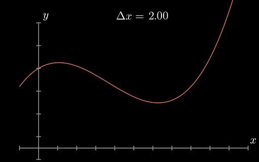

```{=html}
<style type="text/css">
h1.title {
  font-size: 20px;
  color: DarkRed;
  text-align: center;
}
h4.author { /* Header 4 - and the author and data headers use this too  */
    font-size: 18px;
  font-family: "Times New Roman", Times, serif;
  color: DarkRed;
  text-align: center;
}
h4.date { /* Header 4 - and the author and data headers use this too  */
  font-size: 18px;
  font-family: "Times New Roman", Times, serif;
  color: DarkBlue;
  text-align: center;
}
h1 { /* Header 3 - and the author and data headers use this too  */
    font-size: 22px;
    font-family: "Times New Roman", Times, serif;
    color: darkred;
    text-align: center;
}
h2 { /* Header 3 - and the author and data headers use this too  */
    font-size: 18px;
    font-family: "Times New Roman", Times, serif;
    color: navy;
    text-align: left;
}

h3 { /* Header 3 - and the author and data headers use this too  */
    font-size: 15px;
    font-family: "Times New Roman", Times, serif;
    color: navy;
    text-align: left;
}

h4 { /* Header 4 - and the author and data headers use this too  */
    font-size: 18px;
    font-family: "Times New Roman", Times, serif;
    color: darkred;
    text-align: left;
}
</style>
```
```{r setup, include=FALSE}
# code chunk specifies whether the R code, warnings, and output 
# will be included in the output files.
if (!require("knitr")) {
   install.packages("knitr")
   library(knitr)
}
if (!require("MASS")) {
   install.packages("MASS")
   library(MASS)
}
if (!require("pander")) {
   install.packages("pander")
   library(pander)
}
knitr::opts_chunk$set(echo = TRUE,      # include code chunk in the output file
                      warnings = FALSE, # sometimes, you code may produce warning messages,
                                        # you can choose to include the warning messages in
                                        # the output file. 
                      results = TRUE    # you can also decide whether to include the output
                                        # in the output file.
                      )   
```


\

# Introduction

This note introduces several methods for numerical integration. Before discussing the specific method, we introduce numerical approximation for derivatives based on the Taylor series and then use some definitions and ideas to develop numerical methods for approximating integrals.

\

# Numerical Approximation of Derivatives

\

The function $f(x)$ can be expanded over a small interval $t$ using the Taylor series from a start or reference point  

$$
y(x+t)=y(x) + y^\prime(x)t + \frac{y^{\prime\prime} (x)}{2!} t^2  + \frac{y^{\prime\prime\prime} (x)}{3!} t^3 +\frac{y^{(4)} (x)}{4!} t^4  + \cdots
$$

This forms an approximation to  $f(x)$ in $t$ which runs, say, from $x_i$ to  $x_j$, and can be used to integrate $y(t)$. For example, if we keep the first four terms on the right-hand side of the above series in integration, we get

$$
I = \int_0^h ydt = \int_0^h \left[y + y^\prime t + \frac{y^{\prime\prime}}{2!}t^2 + \frac{y^{\prime\prime\prime}}{4!}t^4 + O(t^4 y^{(4)}) \right]dt
$$

$$
 = hy + \frac{h^2}{2!}y^{\prime} + \frac{h^3}{3!}y^{\prime\prime} + \frac{h^4}{4!}y^{\prime\prime\prime} + O[h^5y^{(4)}]
$$
where $h_i = x_{i+1} - x_i = h$ is a constant.


Alternatively, we can rewrite the Taylor series as

$$
y(x+t)=y(x) + y^\prime(x)t + O(y^{\prime\prime} t^2) 
$$
Solving $y^\prime$ from the above equation

$$
y^\prime(x) = \frac{y(x+t) - y(x)}{t} - O(y^{\prime\prime}t) 
$$


by setting $t$ to $h$ in the Taylor series, we may also approximate the first derivative

$$
y^\prime (x) = \frac{y(x+h) - y(x)}{h} - O(hy^{\prime\prime}).
$$

That is,

$$
y_i^\prime= \frac{y_{i+1}-y_i}{h} - O(hy^{\prime\prime})
$$

The last expression, **a first-forward finite difference**, will be used to complete the trapezoid rule below.  Note that this is only the **first order accurate**.

The well-known **second-order accurate central difference** approximations for derivatives are obtained by writing a backward Taylor expansion $y(x-t)$ and letting $t = h$.  Then subtracting it from $y(x+t)$ yields

$$
y(x+t)=y(x) + y^\prime(x)t + \frac{y^{\prime\prime} (x)}{2!} t^2  + \frac{y^{\prime\prime\prime} (x)}{3!} t^3 + O(y^{(4)}t^4) \\
y(x-t)=y(x) + y^\prime(x)(-t) + \frac{y^{\prime\prime} (x)}{2!} (-t)^2  + \frac{y^{\prime\prime\prime} (x)}{3!} (-t)^3 + O(y^{(4)}t^4)\\
$$


$$
y(x+t) + y(x-t) = 2y(x) + y^{\prime\prime}(x)(t^2) + O(y^{(4)}t^4).
$$

Solve for $y^{\prime\prime}(x)$, we have

$$
y^{\prime\prime}(x) = \frac{y(x+t) + y(x-t) - 2y(x)}{t^2} - O(y^{(4)}t^2).
$$

\

```{r echo=FALSE, fig.align ="center", out.width='65%'}

```

\

# Trapezoid Method


The concept of the trapezoidal rule comes from approximating $y(t)$ at any point $t$ in an interval by a linear polynomial using Taylor’s series and then integrating the approximation. 

\

```{r echo=FALSE, fig.align ="center",  out.width = '45%'}
if (knitr:::is_latex_output()) {
  knitr::asis_output('\\url{https://github.com/pengdsci/MAT325/raw/main/w13/img/w12-trapezoid-sum.gif}')
} else {
  
}
```
\

## Formulation of Trapezoid Method

If the approximation is a linear function, the resulting integration is called the trapezoidal rule. For the data interval $[x_i, x_{i+1}]$  

$$
I_{x_i}^{x_{i+1}} = \int_0^h ydt = \int_0^h \left[y_i+ y^\prime t + O(y^{\prime\prime} t^2) \right]dt = \int_0^hy_idt + \int_0^hy^\prime t dt + \int_0^h O(y^{\prime\prime} h^2)dt\\
=hy_i + \frac{y^\prime h^2}{2} + O(y^{\prime\prime} h^3) = hy_i +\frac{h^2}{2}\frac{y_{i+1}-y_i}{h} +O(y^{\prime\prime} h^3) = \frac{h}{2}(y_{i+1}+y_i) + O(y^{\prime\prime} h^3).
$$

This is the trapezoidal rule for one interval.

\

## Error Analysis


The **Error bound** of the trapezoid rule for one interval $[x_i, x_{i+1}]$ is easy to see that $S(x)$ in the following figure has an equation

$$
S(x) =  \frac{f(x_{i+1})-f(x_i)}{x_{i+1} - x_i} x + \frac{x_{i+1}f(x_{i}) - x_if(x_{i+1})}{x_{i+1} - x_i}
$$

```{r echo=FALSE, fig.align ="center", out.width='45%'}
include_graphics("img/w12-TrapezoidApproximating.png")
```


The error bound we will estimate is based on the following inequality


$$
E_i = \left|\int_{x_i}^{x_{i+1}}\left[f(x) -  S(x)\right]dx \right|
$$

Define the auxiliary function

$$
G(x) = f(x) - S(x) - q(x-x_i)(x-x_{i+1}),
$$
where q is a constant. For a given $t \in (x_i, x_{i+1})$, we can choose $q$ such that $G(t) = 0$. That is,

$$
q = \frac{f(t) - S(t)}{(t-x_i)(t-x_{i+1})}.
$$
Therefore, $G(x) = 0$ has three distinct roots $x = x_i, t, x_{i+1}$. If $f(x)$ is twice differentiable, there exists $c \in (x_i, x_{i+1})$ such that $G^{\prime\prime}(c) = 0$.   

```{r echo=FALSE, fig.align ="center", out.width='45%'}
include_graphics("img/w12-TrapezoidErrorBound.png")
```


On the other hand, $G^{\prime\prime}(x) = f^{\prime\prime}(x) – 2q$ implies that $q = f^{\prime\prime}(c)/2$. We rewrite the expression q and obtain the following

$$
f(t) - S(t) = \frac{f^{\prime\prime}(c)}{2}(t-x_i)(t-x_{i+1}).
$$

A direct calculation gives

$$
\int_{x_i}^{x_{i+1}}[f(t) - S(t)] dt = \frac{f^{\prime\prime}(c)}{2}\int_{x_i}^{x_{i+1}}(t-x_i)(t-x_{i+1})dt =  \frac{f^{\prime\prime}(c)}{2}\left[-\frac{(x_{i+1}-x_i)^3}{6} \right]
$$
Therefore, if $f^{\prime\prime}(c) \le K_i$ on $(x_i, x_{i+1})$, we have 

$$
E_i = \left|\int_{x_i}^{x_{i+1}}\left[f(x) -  S(x)\right]dx \right| \le \frac{h^3K_i}{12}
$$

where $h = x_{i+1} - x_i$, $\{a = x_0, x_1, \cdots, x_{n-1}, x_n = b \}$ be equally spaced partition of $[a, b]$. 


\

## Composite Trapezoid Method and Error Analysis

Using the same idea, we estimate the overall error over interval $[a, b]$ as follows

$$
I_a^b = \sum_{i=1}^n\frac{h}{2}(y_i + y_{i-1}) + \sum_{i = 1}^nO(h^3 y^{\prime\prime}) = \frac{h}{2} \left( y_0 + 2\sum_{i=2}^{n-1} y_i + y_n\right) + \sum_{i = 1}^nO(h^3 y^{\prime\prime}).
$$

This is called the **composite trapezoidal rule**.


The overall **error bound** for the **composite trapezoidal rule** can be similarly estimated as 

$$
E=\sum_{i=1}^n E_i  \le \sum_{i=1}^n \frac{h^3 K_i}{12} = \frac{1}{12}\left( \frac{b-a}{n}\right)^3\sum_{i=1}^nK_i
$$

## Trapezoid Algorithm

The algorithm of the trapezoid method is relatively simple. We assume the partition of the given interval $[a, b]$ is equally spaced. We will not develop the pseudo-code. The following is the R function of the trapezoid method.

```{r fig.align='center', fig.width= 5, fig.height=4}
Trapezoid.int = function(fun,          # fun = user-defined function
                         xvec,         # interval [a, b] 
                         n = 1,        # number of partitions
                         graph=TRUE){  # request graphical representation
  a = min(xvec)
  b = max(xvec)
  m = length(xvec)
  if (n >= m) xvec = seq(a,b,(b-a)/n)
  yvec = fun(xvec)
  nn = length(yvec)
  h = xvec[-1]- xvec[-nn]
  y.adjacent.sum =  yvec[-1] + yvec[-nn]
  Iab = sum(h*y.adjacent.sum)/2
  if(graph == TRUE){
      x.margin = 0.1*abs(b-a)
      tt = seq(a-x.margin, b+x.margin, (b-a+2*x.margin)/10^4)
      lim.x = c(a-x.margin, b+x.margin)
      y.max = max(fun(tt))
      y.min = min(fun(tt))
      y.margin = 0.1*abs(y.max-y.min)
      lim.y = c(y.min - y.margin, y.max + y.margin)
      plot(tt, fun(tt), type="l", col="blue", xlim=lim.x, ylim=lim.y, xlab=" ",ylab="")
      title("Trapezoidal Rule")
      lines(xvec, yvec, type="l", col="red")
      points(xvec, yvec, pch=21, col="red", cex = 0.6)
    }
  Iab
}
fun=function(x) sin(x)
Trapezoid.int(fun=fun, xvec=c(0,pi), n = 50, graph=TRUE)
```

\
 
# Simpson's One-third Rule

Simpson’s One-third rule is an extension of the Trapezoidal rule where the integrand is approximated by a second-order polynomial.

Simpson's rule approximates the integral over two neighboring sub-intervals by the area between a parabola and the $x$-axis. To describe this parabola we need $3$ distinct points (which is why we approximate two sub-integrals at a time). That is, we approximate

$$
\int_{x_0}^{x_1} f(x) dx + \int_{x_1}^{x_2}f(x) dx = \int_{x_0}^{x_2}f(x)dx
$$

by the area bounded by the parabola that passes through the three points $(x_0, f(x_0)), (x_1, f(x_1))$ and $(x_2, f(x_2))$. The $x$-axis and the vertical lines $x = x_0$ and $x = x_2$

```{r echo=FALSE, fig.align ="center", out.width='45%'}

```

\

The next animated graph shows the process of the approximation over an interval with different partitions.

```{r echo=FALSE, fig.align ="center",  out.width = '65%'}
if (knitr:::is_latex_output()) {
  knitr::asis_output('\\url{https://github.com/pengdsci/MAT325/raw/main/w12/img/w12-Simpsons_One-Third_Rule.gif}')
} else {
  
}
```

\

## Derivation of Simpson's Rule

To derive Simpson's rule formula, we first find the equation of the parabola that passes through the three points $(x_0, f(x_0)), (x_1, f(x_1))$ and $(x_2, f(x_2))$. Then we find the area between the $x$-axis and the part of that parabola with $x_0 \le x \le x_2$. Assuming an equally spaced partition, we consider the three points $(-h, y_{-h}), (0, y_0)$ and $(h, y_h)$ first (without loss of generality) to develop the formula of the approximated formula that is only dependent on the y-coordinates and the width of the sub-intervals $h = x_{i+1} - x_i$, for $i = 0, 1, \cdots, n-1$.

Using the quadratic function in the following form,
$$
y = ax^2 + bx + c
$$

we write the area between it and the $x$-axis with x running from $-h$ to $h$ as

$$
\int_{-h}^h [ax^2 + bx + c]dx = \frac{h}{3}(2ah^2 + 6c)
$$

Because the quadratic function passes through  $(-h, y_{-h}), (0, y_0)$ and $(h, y_h)$, so we have

$$
\begin{array}{ccccc}
 ah^2 & - bh  &  +c & =  & y_{-h}  \\ 
   &   &   c & =  & y_0  \\ 
ah^2 & + bh  &  +c & =  & y_{h}  \\ 
\end{array}
$$

Therefore, we can express $2ah^2 + 6c = y_{-h} +4y_0 + y_h$, consequently

$$
\text{Area} = \int_{-h}^h(ax^2 + bx + c)dx = \frac{h}{3}( y_{-h} +4y_0 + y_h)
$$


**Remarks**

* $h$ is one-half of the length of the $x$-interval under consideration.

* $y_{-h}$ is the height of the parabola at the left-hand end of the interval under consideration.

* $y_0$ is the height of the parabola at the middle point of the interval under consideration.

* $y_h$ is the height of the parabola at the right-hand end of the interval under consideration.
 

## Explicit Function on $[x_{i-1}, x_{i+1}]$

Assume that $y = A_ix^2 + B_ix + C_i$ passes through $(x_{i-1}, f(x_{i-1})), (x_i, f(x_i))$ and $(x_{i+1}, f(x_{i+1}))$. This implies that

$$
\begin{array}{ccccc}
 A_ix^2_{i-1} & - B_i x_{i-1}  &  + C_i & =  & y_{i-1}  \\ 
 A_ix^2_{i} & - B_i x_{i}  &  + C_i & =  & y_{i}   \\ 
 A_ix^2_{i+1} & - B_i x_{i+1}  &  + C_i & =  & y_{i+1}  
\end{array}
$$
 The solution to the above system is given by
 
$$
\begin{array}{ccccc}
 C_i & =  & \frac{x_{i-1}^2f(x_{i+1}) + x_{i-1}x_{i+1}f(x_{i+1})-4x_{i-1}x_{i+1}f(x_{i})+x_{i-1}x_{i+1}f(x_{i-1})+x_{i+1}^2f(x_{i-1})}{(x_{i+1}-x_{i-1})^2}  \\ 
 B_i & =  & \frac{x_{i-1}f(x_{i-1})-4x_{i-1}f(x_{i})+3x_{i-1}f(x_{i+1})+3x_{i+1}f(x_{i-1})-4x_{i+1}f(x_i)+x_{i+1}f(x_{i+1})}{(x_{i+1}-x_{i-1})^2}   \\ 
 A_i & =  & \frac{2[f(x_{i-1})-2f(x_i) + f(x_{i+1})]}{(x_{i+1} - x_{i-1})^2}  
\end{array}
$$
 
 
 
## The Composite Simpsons' Rule

To approximate the integral over interval $[a, b]$, we calculate the approximate integrals $[x_0, x_2], [x_2, x_4], \cdots, [x_{n-2}, x_n]$ separately and then take the sum of all individual integral.
 
 $$
 \int_{x_0}^{x_2}f(x)dx \approx \frac{\Delta x}{3}[f(x_0)+ 4f(x_1) + f(x_2)]
 $$
and

$$
 \int_{x_2}^{x_4}f(x)dx \approx \frac{\Delta x}{3}[f(x_2)+ 4f(x_3) + f(x_4)],
$$

and so on. Summing these all together gives


$$
I_a^b = \int_a^b f(x)dx \approx \frac{\Delta x}{3}[f(x_0)+ 4f(x_1) + 2f(x_2) + 4f(x_3) + 2f(x_4) + \cdots + 2f(x_{n-2}) + 4f(x_{n-1}) + f(x_n)].
$$
$$
 =  \frac{\Delta x}{3}\left[f(x_0)+ 4\sum_{i=1, ~i=\text{odd}}^{n-1} f(x_i) + 2\sum_{i=2,~i=\text{even}}^{n-2} f(x_i) + f(x_n)\right]
$$

\

## Error Analysis

**Error bound** of Simpson’s rule: Without loss of generality, we consider interval $[-h, +h]$ (i.e., $a = -h, b = +h, (a+b)/2 = 0)$. Let $f^{(n)}$ be the n-th derivative of $f(x)$ evaluated at $x = 0$.  On one hand,

$$
I = \int_{-h}^h f(x)dx = \int_{-h}^h \left[ f(0) + f^\prime(0) x + \frac{f^{\prime\prime}(0)}{2}x^2 + \frac{f^{\prime\prime\prime}(0)}{3!}x^3 + \frac{f^{(4)}(0)}{4!}x^4 + O(x^5)\right]dx
$$
$$
 = 2hf(0) + \frac{2h^3}{6}f^{\prime\prime}(x_0) + \frac{2h^5}{5!}f^{(4)} + O(h^7)
$$

On the other hand,

$$
S = \frac{h}{3}[f(-h) + 4f(0) + f(h)] = \frac{h}{3}\left[6f(0) + \frac{2h^2}{2}f^{\prime\prime}(0) + \frac{2h^4}{4!} f^{(4)} + O(h^6) \right]
$$
$$
=2hf(0) + \frac{2h^3}{6}f^{\prime\prime}(0) + \frac{2h^5}{3\times 4!}f^{(4)} + O(h^7)
$$

Therefore,

$$
E = |I - S| = \frac{h^5}{90}f^{(5)}(0) + O(h^6) = \frac{h^5}{90}f^{(4)}(\xi)~~\text{for}~~ \xi\in(-h, h).
$$

Let's consider three points $x_{i-1}, x_i, x_{i+1}$ and $h = x_{i+1} - x_i = x_i - x_{i-1} = (b - a)/n$. Then 

$$
E_i = |I_i - S_i| = \frac{h^5}{90}f^{(4)}(\xi) = \frac{(x_{i+1}-x_{i-1})^5}{2880}f^{(4)}(\xi)
$$


In general, for  a given interval $[a, b]$, let equally spaced partition $a = x_0 < x_1 < \cdots < x_{n-1} < x_n = b$. The error

$$
E_1 = \frac{(x_2-x_0)^5}{2880}f^{(4)}(\xi_1) = \frac{h^5}{90}f^{(4)}(\xi_1), ~~~ x_0 < \xi_1 < x_2 
$$
$$
E_2 = \frac{(x_4-x_2)^5}{2880}f^{(4)}(\xi_2) = \frac{h^5}{90}f^{(4)}(\xi_2), ~~~ x_2 < \xi_2 < x_4 
$$
$$
E_3 = \frac{(x_6-x_4)^5}{2880}f^{(4)}(\xi_3) = \frac{h^5}{90}f^{(4)}(\xi_3), ~~~ x_4 < \xi_3 < x_6 
$$

Assuming is an even number, then

$$
E_{n/2} = \frac{(x_n-x_{n-2})^5}{2880}f^{(4)}(\xi_{n/2}) = \frac{h^5}{90}f^{(4)}(\xi_{n/2}), ~~~ x_{n-2} < \xi_{n/2} < x_n $$

Therefore, the total approximation error is given by

$$
E = \sum_{i=1}^{n/2} E_i = \frac{h^5}{90}\sum_{i=1}^{n/2} f^{(4)}(\xi_i) = \frac{1}{90} \left(\frac{b-a}{n} \right)^5\sum_{i=1}^{n/2} f^{(4)}(\xi_i)
$$

## Algorithm of Simpson's Rule

Simpson's one-third rule is defined based on intervals $[x_0, x_2], []x_2, x_4], \cdots, [x_{n-2}, x_n]$. The function is not necessarily to be known if both x-coordinates and y-coordinates of the $n+1$ points are given. Because the explicit formula of the approximation is explicitly given. We can simply write a function in either R or MATLAB to implement the Simpson Rule.


**R code**

```{r}
SimpsonGraph = function(fun = NULL,     # fun = user-defined function
                        xvec,           # vec = interval [a,b]
                        n               # number of partitions: MUST be an even number. 
                        ){
  a = min(xvec)
  b = max(xvec)
  m = length(xvec)
  x0= seq(a,b,(b-a)/n)
  y0 = fun(x0)
  ##
  xx = seq(a, b, length = 500)
  yy = fun(xx)
  ##
  id1 = (1:length(x0))%%2 ==1
  x = x0[id1]
  nn = length(x)
  plot(xx, yy, type = "l", col = "blue", xlab = "", ylab = "", main = "")
  points(x0, y0, pch = 19, col = "red", cex = 0.8)
  fn = fun
  A = matrix(0, ncol = 3, nrow = nn-1)
  for(i in 1:(nn-1)){
    xi = seq(x[i], x[i+1], length=100)
    #cat("\n\n i =",i,".")
    A2 = 2*(fn(x[i]) -2*fn((x[i]+x[i+1])/2)+fn(x[i+1]))/(x[i+1]-x[i])^2
    A1 = -(x[i]*fn(x[i])-4*x[i]*fn((x[i]+x[i+1])/2)+3*x[i]*fn(x[i+1])+3*x[i+1]*fn(x[i])-4*x[i+1]*fn((x[i]+x[i+1])/2)+x[i+1]*fn(x[i+1]))/(x[i+1]-x[i])^2
    A0 = (x[i]^2*fn(x[i+1])+x[i]*x[i+1]*fn(x[i+1])-4*x[i]*x[i+1]*fn((x[i+1]+x[i])/2)+x[i]*x[i+1]*fn(x[i])+x[i+1]^2*fn(x[i]))/(x[i+1]-x[i])^2
    yi = A2*xi^2 + A1*xi + A0
    lines(xi, yi, col = "red")
    A[i,] = c(A2, A1, A0)
  }
  list(coef = A)
}
fun=function(x) sin(x)
SimpsonGraph(fun = fun, xvec=c(0,pi), n = 4)
```


```{r}
fun=function(x) sin(x)
##
Simpson.int=function(fun = NULL,     # fun = user-defined function
                     xvec,           # vec = interval [a,b]
                     n          # number of partitions: MUST be an even number.
                     ){
  a = min(xvec)
  b = max(xvec)
  m = length(xvec)
  if (n > m) x = seq(a,b,(b-a)/n)
  y = fun(x)
  nn = length(y)
  h = x[-1] - x[-nn]
  ### caution: the formula starts from i = 0!
  fx0 = y[1]
  y.0 = y[-1]
  N = length(y.0)
  id02 = seq(2,N-2,2)
  id01 = seq(1,N-1,2)
  Iab = ((b-a)/(3*N))*(fx0 + 4*sum(y.0[id01])+2*sum(y.0[id02])+y.0[N])
  list(Estimated.Area = Iab)
}

Simpson.int(fun=fun, xvec=c(0,pi), n = 18)
```


