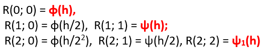
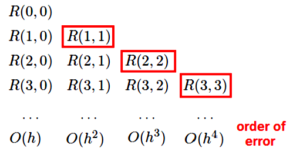
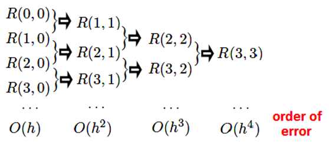
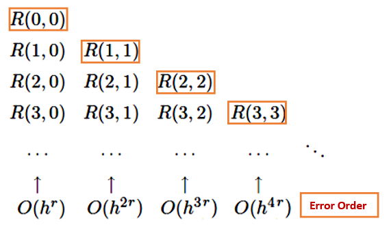
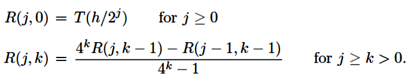
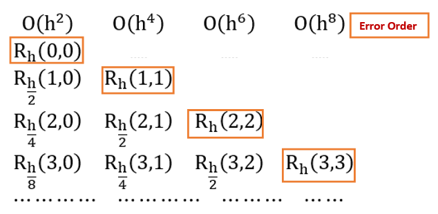
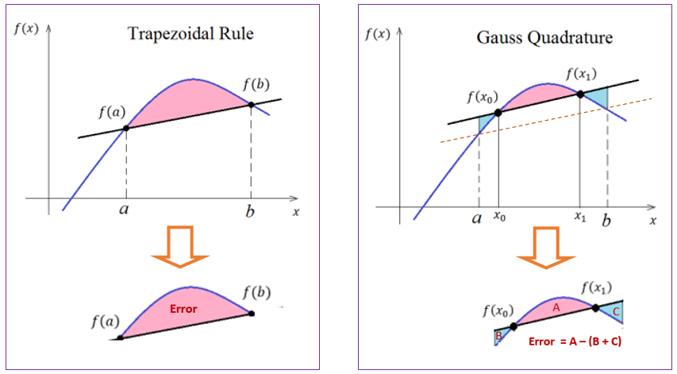

```{=html}
<style type="text/css">
h1.title {
  font-size: 20px;
  color: DarkRed;
  text-align: center;
}
h4.author { /* Header 4 - and the author and data headers use this too  */
    font-size: 18px;
  font-family: "Times New Roman", Times, serif;
  color: DarkRed;
  text-align: center;
}
h4.date { /* Header 4 - and the author and data headers use this too  */
  font-size: 18px;
  font-family: "Times New Roman", Times, serif;
  color: DarkBlue;
  text-align: center;
}
h1 { /* Header 3 - and the author and data headers use this too  */
    font-size: 22px;
    font-family: "Times New Roman", Times, serif;
    color: darkred;
    text-align: center;
}
h2 { /* Header 3 - and the author and data headers use this too  */
    font-size: 18px;
    font-family: "Times New Roman", Times, serif;
    color: navy;
    text-align: left;
}

h3 { /* Header 3 - and the author and data headers use this too  */
    font-size: 15px;
    font-family: "Times New Roman", Times, serif;
    color: navy;
    text-align: left;
}

h4 { /* Header 4 - and the author and data headers use this too  */
    font-size: 18px;
    font-family: "Times New Roman", Times, serif;
    color: darkred;
    text-align: left;
}
</style>
```
```{r setup, include=FALSE}
# code chunk specifies whether the R code, warnings, and output 
# will be included in the output files.
if (!require("knitr")) {
   install.packages("knitr")
   library(knitr)
}
if (!require("MASS")) {
   install.packages("MASS")
   library(MASS)
}
if (!require("pander")) {
   install.packages("pander")
   library(pander)
}
knitr::opts_chunk$set(echo = TRUE,      # include code chunk in the output file
                      warnings = FALSE, # sometimes, you code may produce warning messages,
                                        # you can choose to include the warning messages in
                                        # the output file. 
                      results = TRUE    # you can also decide whether to include the output
                                        # in the output file.
                      )   
```


\

# Introduction

Interpolation is to estimate a value between a given set of known values. Extrapolation is to use of known values to project a value outside of the intended range of the previous values. 

In trapezoid and Simpson's methods, the accuracy of the approximation increases as the step size $h = (b-a)/n$ decreases (i.e., n gets bigger). From the computational perspective,  reducing $h$ requires increasing the number of points $n$, and so increases the “cost” (time and other resources needed) of the calculation.


```{r echo=FALSE, fig.align ="center",  out.width = '45%'}
if (knitr:::is_latex_output()) {
  knitr::asis_output('\\url{https://github.com/pengdsci/MAT325/raw/main/w13/img/w13-trapezoid-sum.gif}')
} else {
  knitr::include_graphics("img/w13-trapezoid-sum.gif")
}
```

In this note, we will introduce methods that use the same step size $h$ but archives a more accurate approximation.

\

# Richardson Extrapolation

Richardson's extrapolation process is a well known method to improve the order of several approximation processes. It can be applied not only to improve the order of a numerical differentiation formula but also to find in fact the original formula.

In this section, we use the concept of Richardson Extrapolation to demonstrate how a higher-order integration can be achieved using only a series of values from the Trapezoidal Rule. Similarly, accurate values of derivatives could be obtained using low-order central difference derivatives. 


\

## The Logic of the Richardson Method

Assume that $\phi(h)$ is infinitely continuously differentiable as a function of $h$, thus allowing us to expand $\phi(h)$ in the Taylor series

$$
\phi(h) = \phi(0) + h\phi^\prime(0) + \frac{\phi^{\prime\prime}(0)}{2!}h^2 + \frac{\phi^{\prime\prime\prime}(0)}{3!}h^3 + \frac{\phi^{(4)}(0)}{4!}h^4 + O(h^5)
$$

Let $c_i = \frac{\phi^{(i)}(0)}{i!}$. We rewrite the above Taylor expansion to get

$$
\phi(h) = \phi(0) + c_1h + c_2h^2 + c_3h^3 + c_4h^4 + O(h^5)
$$
Apparently,

$$
\phi(h/2) = \phi(0) + \frac{c_1}{2}h + \frac{c_2}{4}h^2 + \frac{c_3}{8}h^3 + \frac{c_4}{16}h^4 + O(h^5)
$$
Define $\psi(h) = 2\phi(h/2) - \phi(h)$. We have 

$$
\psi(h) = \phi(0) - \frac{c_2}{2}h^2 - \frac{3c_3}{4}h^3 - \frac{7c_4}{8}h^4 - O(h^5)
$$

Note that $\psi(h)$ also approximates $\phi(0)$, but with an $O(h^2)$ error, rather than the $O(h)$ error. For small $h$, **this $O(h^2$) approximation will be considerably more accurate**.


If we repeat what we did on $\phi(x)$ to $\psi(x)$, that is

$$
\psi(h/2) = \phi(0) -\frac{c_2}{8}h^2 - \frac{3c_3}{32}h^3 -\frac{7c_4}{128}h^4 - O(h^5)
$$

To cancel the two terms that contain $h^2$, we define $\psi_1(h) = [4\psi(h/2) - \psi(h)]/3$ in the following

$$
\psi_1(h) = \phi(0)+\frac{4\psi(h/2) - \psi(h)}{3} = \frac{c_3}{8}h^3  + \frac{7c_4}{32}h^4 + O(h^5) 
$$

Similarly, $\psi_1(0) =  \psi(0) = \phi(0)$ but the approximation $\psi_1(0)$ has an $O(h^3)$ error. This means $\psi_1(0)$ more accurate than $\psi(0)$.


We can continue this procedure repeatedly, each time improving the accuracy by one order, at the cost of one additional computation with a smaller h.

\

## Algorithm of Richardson Method

To facilitate generalization and to avoid a further tangle of notations for developing an algorithm, we use two indices and define

$$
\begin{array}{lclcl}
 R(j, 0) & := & \phi(h/2^j) &  & j \ge 0;  \\ 
 R(j, k) & := & \frac{2^kR(j, k-1)-R(j-1, k-1)}{2^k-1}  &   & j \ge k > 0.  
\end{array}
$$

This procedure is called Richardson extrapolation after the British applied mathematician Lewis Fry Richardson, a pioneer of the numerical solution of partial differential equations, weather modeling, and mathematical models in political science.

With the above notations, we summarize the previous derivation of various approximations of $\phi(0)$ in the following table.


```{r echo=FALSE, fig.align ="center", out.width='45%'}

```


In general, the recursive algorithm can be represented in the following triangular extrapolation table.

```{r echo=FALSE, fig.align ="center", out.width='45%'}

```

**Remarks**:

1.	We expect the bottom-right element in the table to be the most accurate approximation to $\phi(0)$. 

2.	The recursive process is built on the approximations in the first column (see the following flow chart).


```{r echo=FALSE, fig.align ="center", out.width='45%'}

```

3.	Each of the cells in the triangular table is a valid approximation of $\phi(0)$.


\

## Higher Order Extrapolation


If the initial algorithm $\phi(h)$ is better than $O(h)$ accurate and in this case, the formula for $R(j; k)$ should be adjusted to take advantage. That is, if

$$
\phi(h) = \phi(0) + c_1h^r + c_2h^{2r} + c_3h^{3r} + c_4h^{4r} + O(h^{5r})
$$
for some integer $x \ge 1$. For example,

$$
\cos(h) = 1 - \frac{1}{2!}h^2 + \frac{1}{4!}h^{2\times2} - \frac{1}{3!}h^{2\times3}h^6 + O(h^{2\times 4})
$$
where $r = 2$. 

We then can define the following recursive relationship below.

$$
\begin{array}{lclcl}
 R(j, 0) & := & \phi(h/2^j) &  & j \ge 0;  \\ 
 R(j, k) & := & \frac{2^{rk}R(j, k-1)-R(j-1, k-1)}{2^{rk}-1}  &   & j \ge k > 0.  
\end{array}
$$

 The corresponding extrapolation table is given by
 
```{r echo=FALSE, fig.align ="center", out.width='45%'}

```

\

## Algorithm and Code

The recursive extrapolation procedure itself is simple arithmetic. It is easy to make a R/MATLAB function to implement the algorithm.

```{r}
Richardson.Method = function(fn,          # input function
                             h,           # step size: h
                             r = 1,       # input r-th order of error
                             digit = 7,   # number of digits to keep
                             J            # number of extrapolations
                            ){
  RR = matrix(rep(NA,J^2), ncol = J)     # Output table of Richardson
  for (i in 1:J) RR[i,1] = fn(h/2^(i-1)) # defining R(j,0)
  for (k in 2:J){
      for (j in k:J){                    #
          RR[j,k] = (2^(r*(k-1))*RR[j,k-1] - RR[j-1, k-1])/(2^(r*(k-1))-1)
       }
  }
  
  options(digits = digit)
  print(RR, na.print = "")
}
```


**Example 1**: Let $f(x) = \exp(x)$. Find $f^\prime(1)$ with $h =1$.

**Solution** Define
$$
\phi(h) = \frac{f(1+h) - f(1)}{h} 
$$
Then $f^\prime(1) = \lim_{h \to 0} \phi(h) = f^\prime(1)$. We use Richardson extrapolation to approximate $f^\prime(1)$.

```{r}
fn = function(h) (exp(1+h)-exp(1))/h
Richardson.Method(fn, h=1, r=1, digit=8, J=7)
```


**Example 2**.	Find the **first order derivative** of $f(x) = x*\exp(x)$ at $x =2$ with $h = 1/2$. The true value is $f^\prime(2) = 2+2\exp(2)$.

**Solution**: To use the Richardson method, we define
$$
\phi(h) = \frac{f(2+h) - f(2)}{h}
$$

```{r}
fn = function(h) ((2+h)*exp(2+h)-(2)*exp(2))/(h) 
Richardson.Method(fn, h=1/2, r=1, digit=8, J=5)
```

\

# Romberg Integration

The **Romberg integration** uses the Richardson extrapolation on the composite trapezoidal rule.

\

## Approximation formula and Error Analysis

Recall that, if $f(x)$ is in $C^\infty[a,b]$ (i.e., any given order of derivative of $f(x)$ exists and is continuous),  the composite trapezoid rule approximates the integral $\int_a^bf(x)dx$ by 

$$
\int_a^bf(x)dx \approx \frac{h}{2}\left[f(a) + 2\sum_{j=1}^{n-1}f(a + jh) + f(b) \right]
$$
where $h=(b-a)/n$. n is the number of sub-intervals. The error term given in the previous note can be written as

$$
E = \sum_{i=1}^nE_i =  \sum_{i=1}^n \int_{x_i}^{x_{i+1}}\left[ f(x)-S(x)\right]dx  = \sum_{i=1}^n\frac{f^{\prime\prime}(c_i)}{2}\times\left[-\frac{(x_{i+1}-x_i )^3}{6}\right] ~~~~~~ \text{(see the last note)}
$$
$$
= \sum_{i=1}^n\frac{f^{\prime\prime}(c_i)}{n}\times\left[-\frac{n(x_{i+1}-x_i )^3}{12}\right] = -\frac{nh^3}{12}\sum_{i=1}^n\frac{f^{\prime\prime}(c_i)}{n}.
$$
where $c_i$ is a number in subinterval $[x_i, x_{i+1}]$. Clearly for $i = 1, …, n$,

$$
\min_{x\in[a,b]} f^{\prime\prime}(x) \le f^{\prime\prime}(c_i) \le \max_{x\in[a,b]} f^{\prime\prime}(x).
$$

Therefore,

$$
\min_{x\in[a,b]} f^{\prime\prime}(x) \le \frac{\sum_{i=1}^nf^{\prime\prime}(c_i)}{n} \le \max_{x\in[a,b]} f^{\prime\prime}(x).
$$

By the **intermediate mean value theorem**, there exists a value in $[a, b]$, say $\xi$, such that

$$
f^{\prime\prime}(\xi) = \sum_{i=1}^n \frac{f^{\prime\prime}(c_i)}{n}
$$
Therefore,

$$
E = \sum_{i=1}^nE_i = -\frac{nh^3}{12}\sum_{i=1}^n\frac{f^{\prime\prime}(c_i)}{n} = - \frac{nh^3}{12}f^{\prime\prime}(\xi) = -\frac{(b-a)f^{\prime\prime}(\xi)}{12}h^2.
$$

The complete expression of the numerical integration using the trapezoid rule with n-subintervals is given by

$$
T(h) = \int_a^bf(x)dx = \frac{h}{2}\left[f(a) + 2\sum_{j=1}^{n-1}f(a + jh) + f(b) \right] -\frac{(b-a)f^{\prime\prime}(\xi)}{12}h^2
$$
where $a = x_0 < x_1 < \cdots < x_n = b$. $\{ x_1, \cdots, x_n\}$ are equal spaced and $h = (b-a)/n$. $c_i$ is in $[a, b]$.

\

## Romberg Algorithm

From the last formula of the previous sub-section, we see that the trapezoidal rule has an order of approximation $O(h^2)$. Therefore, following the Richardson extrapolation with $r=2$, we have

```{r echo=FALSE, fig.align ="center", out.width='45%'}

```

The corresponding Richardson extrapolation table is given by

```{r echo=FALSE, fig.align ="center", out.width='45%'}

```

\

## R Code

Since this is a direct application of the Richardson extrapolation. We will simply implement it in R.


```{r}
Romberg.Trapz = function(fn,      # The original function f(x)
                         a,       # lower limit of the given interval
                         b,       # upper limit of the given interval
                         r = 2,   # 2nd order approximation error for the trapezoid 
                         dec = 7, # number of digits in the output
                         J        # order of Richardson extrapolation
                         ){
   ## Trapezoid rule
   h = b - a       # initial h
   Trapz.fn = function(a,b,h){
                   X = seq(a,b,h)
                   TP = h*sum(fn(X)) - h*(fn(a)+fn(b))/2
                   TP
                  }
   ## Romberg Int. starts:
   RR = matrix(rep(NA,J^2), ncol=J)
   for (i in 1:J)  RR[i,1] = Trapz.fn(a,b, h/2^(i-1))   ## defining R(j,0)
   for (k in 2:J){
       for (j in k:J){
           RR[j,k]=(2^(r*(k-1))*RR[j,k-1]-RR[j-1, k-1])/(2^(r*(k-1))-1)
        }
     }
   options(digits = dec)
   print(RR, na.print = "")
 }
```

**Example 4**: Find the approximation of the integral

$$
\int_0^\pi \sin(x) dx
$$
**Solution**: We first use the Romberg method.

```{r}
fn = function(x) sin(x)
Romberg.Trapz(fn, a = 0, b = pi, r = 2, dec = 8, J = 5)
```

We can also print out the error of approximation in the following (not that the value of the integral is 2)

```{r}
print(2-Romberg.Trapz(fn, a = 0, b = pi, r = 2, dec = 8, J = 6), na.print = "")
```

In the above example, the error for **Romberg approximation** using the composite trapezoidal rule with 16 ($=2^4$) intervals is about $10^{-9}$ (level 5).   

Next, we use the trapezoid method to approximate the integral and calculate absolute error in the following (the R function is copied from the previous note).

```{r fig.align='center', fig.width= 5, fig.height=4}
Trapezoid.int = function(fun,          # fun = user-defined function
                         xvec,         # interval [a, b] 
                         n = 1,        # number of partitions
                         graph=TRUE){  # request graphical representation
  a = min(xvec)
  b = max(xvec)
  m = length(xvec)
  if (n >= m) xvec = seq(a,b,(b-a)/n)
  yvec = fun(xvec)
  nn = length(yvec)
  h = xvec[-1]- xvec[-nn]
  y.adjacent.sum =  yvec[-1] + yvec[-nn]
  Iab = sum(h*y.adjacent.sum)/2
  if(graph == TRUE){
      x.margin = 0.1*abs(b-a)
      tt = seq(a-x.margin, b+x.margin, (b-a+2*x.margin)/10^4)
      lim.x = c(a-x.margin, b+x.margin)
      y.max = max(fun(tt))
      y.min = min(fun(tt))
      y.margin = 0.1*abs(y.max-y.min)
      lim.y = c(y.min - y.margin, y.max + y.margin)
      plot(tt, fun(tt), type="l", col="blue", xlim=lim.x, ylim=lim.y, xlab=" ",ylab="")
      title("Trapezoidal Rule")
      lines(xvec, yvec, type="l", col="red")
      points(xvec, yvec, pch=21, col="red", cex = 0.6)
    }
  Iab
}
```


```{r}
fun = function(x) sin(x)
2 - Trapezoid.int(fun=fun, xvec=c(0,pi), n = 15000, graph=FALSE)
```
To obtain the same approximation error, the trapezoid method requires about 15000 intervals. That is, the step size $h = \pi/15000 \approx 0.00021$. In the Romberg approach, the step size is $h = \pi/16 \approx 0.196$. The Romberg approach certainly saves a significant amount of computational time. 


\

# Gaussian Quadrature

The accuracy of numerical integration can be improved by choosing the sampling points wisely (not necessarily to be equally spaced). For example, consider the approximation of $\int_a^bf(x)dx$ in the following figure, the left panel represents the trapezoid approximation with an approximation error being represented as the area of the pink region. We can search two points $x_0$ and $x_1$ in the neighborhood $a$ and $b$ respectively such that $A \approx C + B$ (see the right panel in the following figure), we will then get a slightly bigger trapezoid (defined on the same interval $[a, b]$ as that in the regular trapezoid approximation). The resulting approximation error is approximately equal to $A - (C + B)$ which is significantly more accurate than the trapezoid approximation. 


```{r echo=FALSE, fig.align ="center", out.width='75%'}

```

Recall that the area under the straight line, generated by the trapezoidal rule, can be expressed as

$$
I_T = \frac{b-a}{2}[f(a) + f(b)] = \frac{b-a}{2}f(a)  + \frac{b-a}{2} f(b) = \alpha_0 f(a) + \beta_0 f(b)
$$
where $\alpha_0 = \beta_0 = (b-a)/2$. The objective of the Gauss quadrature is to fit the straight line, through two points $(x_0, f(x_0))$ and $(x_1, f(x_1))$, such that the area 

$$
I_G = \alpha f(x_0) +\beta f(x_1)
$$
is exactly when the function $f(x)$ being integrated is linear or constant. Next, we derive the Gauss quadrature approximation formula. 

\

## Two-point Gauss Legendre Formula

Since there are four parameters $(\alpha, \beta, x_0, x_1)$ in $I_G$ to determine, we need to have four equations based on the assumption that $I_G$ is approximated by its true integral based on the four basis polynomials $\{1 = x^0, x_1, x^2, x^3 \}$. To be more specific,

1. $f(x) = K$ (constant function), $I_G = \alpha K + \beta K = \int_a^b Kdx = K(b-a) \Rightarrow \alpha + \beta = b - a.$ 

2. $f(x) =Kx$: $I_G = \alpha K x_0 + \beta K x_1= \int_a^b Kxdx = K(b^2-a^2)/2 \Rightarrow \alpha x_0+ \beta x_1= (b^2 - a^2)/2.$

3. $f(x) =Kx^2$: $I_G = \alpha K x^2_0 + \beta K x^2_1= \int_a^b Kx^2dx = K(b^3-a^3)/3 \Rightarrow \alpha x^2_0+ \beta x^2_1= (b^3 - a^3)/3.$

3. $f(x) =Kx^3$: $I_G = \alpha K x^3_0 + \beta K x^3_1= \int_a^b Kx^3dx = K(b^4-a^4)/4 \Rightarrow \alpha x^3_0+ \beta x^3_1= (b^4 - a^4)/4.$

After some algebra, we can find the solution to the following non-linear equation

$$
\begin{array}{lllll}
\alpha & + & \beta & = & a - b  \\ 
\alpha x_0 & + & \beta x_1 & = & (a^2-b^2)/2   \\ 
\alpha x^2_0 & + & \beta x^2_1 & = & (a^3-b^3)/3   \\ 
\alpha x^3_0 & + & \beta x^3_1 & = & (a^4-b^4)/4
\end{array}
$$

that satisfies $x_0 < x_1$ and $a < b$ has the following form

$$
\begin{array}{lllll}
x_0     & = & (a+b)/2 - \sqrt{3}(b-a)/6  \\ 
x_1     & = & (a+b)/2 + \sqrt{3}(b-a)/6   \\ 
\alpha  & = & (b-a)/2   \\ 
\beta   & = & (b-a)/2 
\end{array}
$$

Therefore, the **two-points Gauss-Legendre formula** is given by

$$
I_G = \frac{b-a}{2}\left\{ f\left[\frac{a+b}{2}-\frac{\sqrt{3}}{6}(b-a) \right] + f\left[\frac{a+b}{2}+\frac{\sqrt{3}}{6}(b-a) \right]\right\}
$$


## General Gauss Legendre Formula

Consider the general case of $n$ segments with step size $h = (b - a)/n$. For  $I^{(k)}_G$ on $[x_k, x_{k+1}]$, $h = x_{k+1} - x_k$ and $x_k+x_{k+1} = [a + (k-1)h]+[a +kh] = 2a +(2k-1)h$.  that is,


$$
 I^{(k)}_G = \frac{x_{k+1}-x_k}{2}\left\{ f\left[\frac{x_k+x_{k+1}}{2}-\frac{\sqrt{3}}{6}(x_{k+1}-x_k) \right] + f\left[\frac{x_k+x_{k+1}}{2}+\frac{\sqrt{3}}{6}(x_{k+1}-x_k) \right]\right\}
$$

$$
= \frac{h}{2}\left\{ f\left[\frac{2a +(2k-1)h}{2}-\frac{\sqrt{3}}{6}h \right] + f\left[\frac{2a +(2k-1)h}{2}+\frac{\sqrt{3}}{6}h \right]\right\}
$$

$$
= \frac{h}{2}\left\{ f\left[a +\left(k-\frac{3+\sqrt{3}}{6}\right)h \right] +  f\left[a +\left(k-\frac{3 - \sqrt{3}}{6}\right)h \right]\right\}
$$
Therefore,

$$
I_G = \sum_{k=1}^n I_G^{(k)} = \frac{h}{2}\sum_{k=1}^n \left\{ f\left[a +\left(k-\frac{3+\sqrt{3}}{6}\right)h \right] +  f\left[a +\left(k-\frac{3 - \sqrt{3}}{6}\right)h \right]\right\}.
$$
\

## R Code

We convert the above formula to an R function in the following.

```{r}
Gauss.Quadrature = function( fn,   # input function
                             a,    # lower limit of the input interval
                             b,    # upper limit of the input interval
                             n     # sub-intervals in the partition
                           ){
    h = (b - a)/n                    # step size
    k = 1:n
    X0 = a + (k -(3+sqrt(3))/6)*h
    X1 = a + (k -(3-sqrt(3))/6)*h
    Ig = 0.5*h*sum(fn(X0)+fn(X1))
    Ig
}
```

```{r}
fn = function(x) sin(sin(x))
Gauss.Quadrature(fn=fn, a = 1, b = 2, n = 10)
```


**Example**: 	Consider integral 

$$
\int_1^3 [x^6 - x^2\sin(2x)]dx \approx 317.20236
$$

The Gauss Quadrature approximation with n = 3 gives the following approximated value


```{r}
fn = function(x) x^6 - x^2*sin(2*x)
Gauss.Quadrature(fn=fn, a = 1, b = 3, n = 3)
```


# Remarks

We make several remarks to conclude this note.

1. The analysis of the error of Gauss Legendre is out of the scope of this course. We will not discuss error bound or the order of approximation.

2. There are built-in functions in both R and MATLAB that implement Gauss quadrature.


