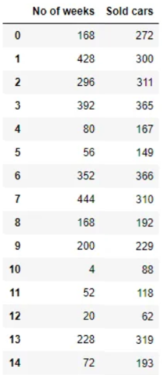

```{=html}
<style type="text/css">
h1.title {
  font-size: 20px;
  color: DarkRed;
  text-align: center;
}
h4.author { /* Header 4 - and the author and data headers use this too  */
    font-size: 18px;
  font-family: "Times New Roman", Times, serif;
  color: DarkRed;
  text-align: center;
}
h4.date { /* Header 4 - and the author and data headers use this too  */
  font-size: 18px;
  font-family: "Times New Roman", Times, serif;
  color: DarkBlue;
  text-align: center;
}
h1 { /* Header 3 - and the author and data headers use this too  */
    font-size: 22px;
    font-family: "Times New Roman", Times, serif;
    color: darkred;
    text-align: center;
}
h2 { /* Header 3 - and the author and data headers use this too  */
    font-size: 18px;
    font-family: "Times New Roman", Times, serif;
    color: navy;
    text-align: left;
}

h3 { /* Header 3 - and the author and data headers use this too  */
    font-size: 15px;
    font-family: "Times New Roman", Times, serif;
    color: navy;
    text-align: left;
}

h4 { /* Header 4 - and the author and data headers use this too  */
    font-size: 18px;
    font-family: "Times New Roman", Times, serif;
    color: darkred;
    text-align: left;
}
</style>
```
```{r setup, include=FALSE}
# code chunk specifies whether the R code, warnings, and output 
# will be included in the output files.
if (!require("knitr")) {
   install.packages("knitr")
   library(knitr)
}
if (!require("MASS")) {
   install.packages("MASS")
   library(MASS)
}
if (!require("pander")) {
   install.packages("pander")
   library(pander)
}
knitr::opts_chunk$set(echo = TRUE,      # include code chunk in the output file
                      warnings = FALSE, # sometimes, you code may produce warning messages,
                                        # you can choose to include the warning messages in
                                        # the output file. 
                      results = TRUE    # you can also decide whether to include the output
                                        # in the output file.
                      )   
```

\

\

# Introduction

We have introduced the direct methods in matrix algebra and several interpolation methods to approximate a univariate function with either an explicitly given analytic expression or with an unknown expression. In this note, we use matrix algebra to approximate an unknown linear and some nonlinear functions with multiple variables.


\

# Concepts of Least Square Approximation

To get a better idea of the least square approximation, we start with a linear approximation with only a single variable. 

* **The Linear Function to Approximate**:  $y = f(x) =\beta_0 + \beta_1 x$. $\beta_0$ and $\beta_1$ are unknown and will be estimated from the given information.

* **Given Information**: A set of data points $\{(x_1, y_1), (x_2, y_2), \cdots, (x_n, y_n)\}$.


The idea is to find $\hat{\beta}_0$ and $\hat{\beta}_1$ based on the given data points that **MINIMIZES** the mean square error (MSE) between the predicted second coordinate $\hat{y}_i = \hat{\beta}_0 + \hat{\beta}_1 x_i$ and the observed $y_i$. To be more specific,

1. Assume that the hypothetical linear function has analytic expression $y = \beta_0 + \beta_1 x$.

2. Define the predicted to be $\hat{y}_i = \beta_0 + \beta_1 x_i$.

3. Define error $d_i = \hat{y}_i - y_i$.

4. Define MSE as
$$
\text{MSE}(\beta_0, \beta_1) = \frac{\sum_{i=1}^n d_i^2}{n-2}
$$

The LSE estimates the unknowns $\beta_0$ and $\beta_1$ by minimizing the MSE!


```{r echo=FALSE, fig.align ="center",  out.width = '55%'}
if (knitr:::is_latex_output()) {
  knitr::asis_output('\\url{https://github.com/pengdsci/MAT325/raw/main/w14/img/w14-best-fit-line.gif}')
} else {
  knitr::include_graphics("img/w14-best-fit-line.gif")
}
```


\

# Approximating One-variable Linear Function

To approximate $\beta_0$ and $\beta_1$, we minimize MSE defined in the previous section in the following. Denote $Q(\beta_0, \beta_1)  = \sum_{i =1}^n d_i^2 = \sum_{i =1}^n (y_i - \beta_0 - \beta_1 x_i )^2$. The approximated $\beta_0$ and $\beta_1$, denoted by $\hat{\beta}_0$ and $\hat{\beta}_1$, is the solution to the following optimization problem

$$
\text{arg min}_{\beta_0, \beta_1} Q(\beta_0, \beta_1)
$$

To minimize $Q(\beta_0, \beta_1)$, we find the first-order derivatives and set them to zero.

$$
\frac{\partial Q(\beta_0, \beta_1)}{\partial \beta_0} = -\sum_{i=1}^n (y_i-\beta_0 - \beta_1 x_i) =0,\\
\frac{\partial Q(\beta_0, \beta_1)}{\partial \beta_1} = -\sum_{i=1}^n (y_i-\beta_0 - \beta_1 x_i)x_i=0.
$$

The above system is equivalent to 

$$
\begin{array}{rclcl}
n\beta_0 & + & (\sum_{i=1}^n x_i)\beta_1 & = & \sum_{i=1}^n y_i, \\
(\sum_{i=1}^nx_i)\beta_0 &  + &(\sum_{i=1}^nx_i^2)\beta_1& = &\sum_{i=1}^n x_iy_i.
\end{array}
$$

The matrix representation of the above system is given by

$$
\left[
\begin{array}{cc}
 n               & \sum_{i=1}^n x_i \\
 \sum_{i=1}^nx_i & \sum_{i=1}^nx_i^2
\end{array}
\right]
\left[
\begin{array}{c}
\beta_0 \\
\beta_1
\end{array}
\right]
~~=~~
\left[
\begin{array}{c}
\sum_{i=1}^n y_i \\
\sum_{i=1}^n x_iy_i
\end{array}
\right],
$$

which can be further re-expressed as

$$
\left[
\begin{array}{cccccc}
 1 & 1 &\cdots & 1 & 1 \\
 x_1 & x_2 & \cdots & x_{n-1} & x_n \\
\end{array}
\right]
\left[
\begin{array}{cc}
 1 & x_1 \\
 1 & x_2 \\
 \vdots & \vdots \\
 1 & x_{n-1}\\
 1 & x_n \\
\end{array}
\right]
\left[
\begin{array}{c}
\beta_0 \\
\beta_1
\end{array}
\right]
~~=~~
\left[
\begin{array}{cccccc}
 1 & 1 &\cdots & 1 & 1 \\
 x_1 & x_2 & \cdots & x_{n-1} & x_n \\
\end{array}
\right]
\left[
\begin{array}{c}
y_1 \\
y_2\\
\vdots\\
y_{n-1}\\
y_n
\end{array}
\right].
$$

Denote
$$
\mathbf{X} =
\left[
\begin{array}{cc}
 1 & x_1 \\
 1 & x_2 \\
 \vdots & \vdots \\
 1 & x_{n-1} \\
 1 & x_n
\end{array}
\right],
~~~
\mathbf{Y} =
\left[
\begin{array}{c}
y_1 \\
y_2\\
\vdots\\
y_{n-1}\\
y_n
\end{array}
\right],
~~\text{and}~~
\mathbf{\beta} =
\left[
\begin{array}{c}
\beta_0 \\
\beta_1
\end{array}
\right].
$$
Then

$$
\mathbf{X}^T \mathbf{X} \mathbf{\beta} = \mathbf{X}^T\mathbf{Y}.
$$

Clearly, $\mathbf{X}^T \mathbf{X}$ is a square matrix. If it is invertible, we solve for $\mathbf{\beta}$ from the above system 
$$
\mathbf{\beta} = [\mathbf{X}^T \mathbf{X}]^{-1} \mathbf{X}^T\mathbf{Y}.
$$
The right-hand side of the above equation is only dependent on the given data points. Therefore, $\mathbf{\hat{\beta}} = [\mathbf{X}^T \mathbf{X}]^{-1} \mathbf{X}^T\mathbf{Y}$ is the solution to the minimization problem.

Therefore, $\hat{y} = \hat{\beta}_0 + \hat{\beta}_1 x$ is the least square approximation of $y = \beta_0 + \beta_1 x$.

\

**Example 1**: The data are from $n = 214$ females in statistics classes at the University of California at Davis (https://raw.githubusercontent.com/pengdsci/MAT325/main/w14/LS-ApproxHeights.txt). The variables are $y = \text{student’s self-reported height}$, $x_1 = \text{student’s guess at her mother’s height}$, and $x_2 = \text{student’s guess at her father’s height}$. All heights are in inches. The scatter plots below are of each student’s height versus the mother’s height and the student’s height against the father’s height.

```{r fig.align='center', fig.height= 5, fig.width=7}
height = read.table("https://raw.githubusercontent.com/pengdsci/MAT325/main/w14/LS-ApproxHeights.txt", header = TRUE)  # read data 
studentHeight = height$Height    # extract students' heights from the data set and store them in a numeric vector
momHeight = height$momheight     # vector of mothers' heights
dadHeight = height$dadheight     # vector of fathers' heights
## making scatter plots
par(mfrow = c(1,2))              # setting up the layout of the graphical page
plot(momHeight, studentHeight, pch = 19, col = "blue", main = "")
plot(dadHeight, studentHeight, pch = 19, col = "darkred", main = "")
```
**Solution**: We want to approximate the linear relationship between students' heights and their mothers' and fathers' heights respectively.

*Part I*:  Assume that the linear function between students' heights and their mothers' heights is of the following form

$$
y= \beta_0 + \beta_1 x_1
$$
To approximate $\beta_0$ and $\beta_1$, we define $\mathbf{X}$ and $\mathbf{Y}$ and then find the solution of the LS approximation in the following R code. 

```{r}
n = length(studentHeight)
X = cbind(rep(1,n), momHeight)
Y = cbind(studentHeight)
beta = round(solve(t(X)%*%X)%*%(t(X)%*%Y),4)
pander(beta)
```
Therefore, the linear function is approximated by $y = 34.0223 + 0.4834x_1$.

\

# Approximating Multiple-variable Linear Function

## An Extension of the Height Example

In the above example, we assume that a student's height is only dependent on her mother's height. However, the height of a person is dependent on both parents. We further assume that the relationship has form $y = \beta_0 + \beta_1 x_1 + \beta_2 x_2$. Then we need to approximate unknowns $(\beta_0, \beta_1, \beta_2$ using the same logic that was used for approximating the linear function with only a single variable. To be more specific, we need only to modify the matrix of $\mathbf{X}$ by adding one additional column. The three matrices for 


$$
\mathbf{X} =
\left[
\begin{array}{ccc}
 1 & x_{11} & x_{21} \\
 1 & x_{12} & x_{22} \\
 \vdots & \vdots \\
 1 & x_{1,n-1} & x_{2, n-1} \\
 1 & x_{1n} & x_{2n}
\end{array}
\right],
~~~
\mathbf{Y} =
\left[
\begin{array}{c}
y_1 \\
y_2\\
\vdots\\
y_{n-1}\\
y_n
\end{array}
\right],
~~\text{and}~~
\mathbf{\beta} =
\left[
\begin{array}{c}
\beta_0 \\
\beta_1 \\
\beta_2
\end{array}
\right].
$$

The LS approximation of $(\beta_0, \beta_1, \beta_2)$ is given by

$$
\mathbf{\beta} = [\mathbf{X}^T \mathbf{X}]^{-1} \mathbf{X}^T\mathbf{Y}.
$$

\

**Example 2** [Continuation of *Example 1*]. We now approximate linear function $y = \beta_0 + \beta_1 x_1 + \beta x_2$ using the data given in example 1. The following R code approximates the coefficients of the linear function.

```{r}
height = read.table("https://raw.githubusercontent.com/pengdsci/MAT325/main/w14/LS-ApproxHeights.txt", header = TRUE)  # read data 
studentHeight = height$Height    # extract students' heights from the data set and store them in a numeric vector
momHeight = height$momheight     # vector of mothers' heights
dadHeight = height$dadheight     # vector of fathers' heights
n = length(studentHeight)
X = cbind(rep(1,n), momHeight, dadHeight)
Y = cbind(studentHeight)
beta = round(solve(t(X)%*%X)%*%(t(X)%*%Y),4)
pander(beta)
```

Therefore, the approximated linear function is $y = 18.55 + 0.3035x_1 + 0.3879x_2$.


\

## Approximating General Multi-variables Linear Functions

To approximate linear function $y = \beta_0 + \beta_1x_1 + \beta_2x_2 + \cdots = \beta_kx_k$ based on a set of given data points $(y_i, x_{1i}, x_{2i}, \cdots, x_{ki})$ for $i = 1, 2, \cdots, n$, we extend the $\mathbf{X}$ matrix similarly by adding more columns to it based on the given data points. To be more specific, the three matrices used in the LS approximation are explicitly given by

$$
\mathbf{X} =
\left[
\begin{array}{ccccc}
 1 & x_{11} & x_{21} & \cdots & x_{k1} \\
 1 & x_{12} & x_{22} & \cdots & x_{k2}\\
 \vdots & \vdots & \ddots & \vdots &\vdots\\
 1 & x_{1,n-1} & x_{2, n-1} & \cdots & x_{k,n-1}\\
 1 & x_{1n} & x_{2n} & \cdots & x_{kn}
\end{array}
\right],
~~~
\mathbf{Y} =
\left[
\begin{array}{c}
y_1 \\
y_2\\
\vdots\\
y_{n-1}\\
y_n
\end{array}
\right],
~~\text{and}~~
\mathbf{\beta} =
\left[
\begin{array}{c}
\beta_0 \\
\beta_1 \\
\beta_2 \\
\vdots \\
\beta_{k-1}\\
\beta_k
\end{array}
\right].
$$

The solution to the LS approximation has the same general form given below

$$
\mathbf{\beta} = [\mathbf{X}^T \mathbf{X}]^{-1} \mathbf{X}^T\mathbf{Y}.
$$

**Example 3**: For a sample of $n = 20$ individuals, we have measurements of $y = \text{body fat}$, $x_1 = \text{triceps skinfold thickness}$, $x_2 = text{thigh circumference}, and $x_3 = \text{midarm circumference}$. The Data can be found at https://raw.githubusercontent.com/pengdsci/MAT325/main/w14/LS-Approximation-Bodyfat.txt.

**Solution** We use the following code to find the approximated coefficients in the linear function $y = \beta_0 + \beta_1 x_1 + \beta_2 x_2 + \beta_3 x_3$.

```{r}
bodyFat = read.table("https://raw.githubusercontent.com/pengdsci/MAT325/main/w14/LS-Approximation-Bodyfat.txt", header = TRUE)
n = dim(bodyFat)[1]   # number of data points
X = as.matrix(cbind(intercept=rep(1,n), bodyFat[, 1:3]))
Y = as.matrix(bodyFat[,4])
beta = round(solve(t(X)%*%X)%*%(t(X)%*%Y),4)
kable(beta)
```
Therefore, the approximated linear function is $y = 117.1 + 4.334x_1 - 2.857 x_2 - 2.186 x_3$, or equivalently, $\text{body fat} = 117.1 + 4.334\text{Tricps} - 2.857 \text{Thigh} - 2.186 \text{Midarm}$.

\

# Approximating One-variable Polynomial Function

We have introduced several interpolation-based approximations to a function. In this section, we use the LS approach to approximate a single variable polynomial. $y = a_0 + a_1 x + a_2x^2 + \cdots + a_kx^k$.

\

## Approximating Quadratic Function

As an illustrative example, let's approximate the trend line of the sales of a particular brand of vehicles. $\text{sales} = f(\text{time})$, the variable **time** represents the number of weeks.

```{r echo=FALSE, fig.align ="center", out.width='35%'}

```

The scatter plot of the two variables is given below.

```{r echo = FALSE, fig.align='center', fig.width=5, fig.height=5}
sales = c(272, 300, 311, 365, 167, 149, 366, 310, 192, 229, 88, 118, 62, 319, 193)
no.weeks = c(168, 428, 296, 392, 80, 56, 352, 444, 168, 200, 4, 52, 20, 228, 72)
plot(no.weeks, sales, pch = 19, col="blue")
```

The above plot indicates a non-linear trend. A quadratic trend seems to be more appropriate to characterize the relationship. 

Assuming the quadratic relation between the time and the sales, we have the unknown quadratic function $\text{sales} = f(\text{time}) = a_0 + a_1 \text{time} + a_2\text{time}^2$. If we denote $y = \text{sales}$, $x_1 = \text{time}$, and $x_2 = \text{time}^2$, the unknown quadratic function can written as $y = a_0 + a_1x_1 +a_2x_2$. This means we can still use the multi-variable LS to approximate the unknown quadratic function. To be more specific, matrices $\mathbf{X}$ and $\mathbf{Y}$ for the LS approximation are given by

$$
\mathbf{X} = \left[
\begin{array}{ccc}
1  &  168  &  28224  \\
1  &  428  &  183184  \\
1  &  296  &  87616  \\
1  &  392  &  153664  \\
1  &  80  &  6400  \\
1  &  56  &  3136  \\
1  &  352  &  123904  \\
1  &  444  &  197136  \\
1  &  168  &  28224  \\
1  &  200  &  40000\\
1  &  4  &  16  \\
1  &  52  &  2704  \\
1  &  20  &  400  \\
1  &  228  &  51984  \\
1  &  72  &  5184
\end{array}
\right]
~~~~
\mathbf{Y} =\left[
\begin{array}{c}
272\\
300\\
311\\
365\\
167\\
149\\
366\\
310\\
192\\
229\\
88\\
118\\
62\\
319\\
193
\end{array}
\right]
$$

The coefficients of the quadratic function are estimated by

$$
\mathbf{\beta} = [\mathbf{X}^T \mathbf{X}]^{-1} \mathbf{X}^T\mathbf{Y}.
$$
The following R code calculates the approximated coefficients.

```{r}
Y = matrix(c(272, 300, 311, 365, 167, 149, 366, 310, 192, 229, 88, 118, 62, 319, 193), ncol=1)
no.weeks = c(168, 428, 296, 392, 80, 56, 352, 444, 168, 200, 4, 52, 20, 228, 72)
X = as.matrix(cbind(intercept = rep(1, length(Y)), weeks = no.weeks, weeks.sq = no.weeks^2))
beta = solve(t(X)%*%X)%*%(t(X)%*%Y)
pander(round(beta,4))
```
Therefore, the unknown quadratic function is approximated by

$$
\text{sales} = 63.8510 + 1.4095\times \text{time} -0.0019\times \text{time}^2
$$

```{r echo = FALSE, fig.align='center', fig.width=5, fig.height=5}
sales = c(272, 300, 311, 365, 167, 149, 366, 310, 192, 229, 88, 118, 62, 319, 193)
no.weeks = c(168, 428, 296, 392, 80, 56, 352, 444, 168, 200, 4, 52, 20, 228, 72)
plot(no.weeks, sales, pch = 19, col="blue")
abline(lm(sales~no.weeks),col='red', lwd = 2, lty = 2)
xx=seq(0,450, length=500)
fn = function(x)63.8510 + 1.4095*x -0.0019*x^2 
lines(xx, fn(xx), xlim = c(0,450), lwd = 2, col = "purple")
legend("bottomright", c("Linear", "Quadratic"), lwd=rep(2,2), lty=c(2, 1), col = c("red", "purple"), bty = "n")
```

\

## Approximating General Polynomial Functions


In general, for a given set of data points $\{(x_1, y_1), (x_2, y_2), \cdots, (x_n, y_n)\}$, the unknown polynomial has form $f(x) = a_0 + a_1 x + a_2x^2 + \cdots + a_kx^k$ can be approximated based on the following two matrices

$$
\mathbf{X} = \left[
\begin{array}{cccccc}
1 & x_1 & x_1^2 & \cdots & x^k_1 \\
1 & x_2 & x_2^2 & \cdots & x^k_2 \\
\vdots & \vdots & \vdots& \ddots & \vdots \\
1 & x_{n-1} & x_{n-1}^2 & \cdots & x^k_{n-1} \\
1 & x_n & x_n^2 & \cdots & x^k_n 
\end{array}
\right]
~~~~
\mathbf{Y} = \left[
\begin{array}{c}
y_1 \\
y_2 \\
\vdots \\
y_{n-1} \\
y_n \\
\end{array}
\right]
$$

The coefficients $\mathbf{\alpha} = c(a_0, a_1, \cdots, a_k)^T$ is given by

$$
\mathbf{\alpha} = (X^TX)^{-1}X^TY.
$$

# Practice Exercises Chapter 8 

*(Please include this problem as part IV of the HW of Chapter 6)*.

**Problem 8.1.12**. Make a scatter plot and choose an appropriate degree of the polynomial and use the LS method and the data points to approximate the unknown polynomial function.


