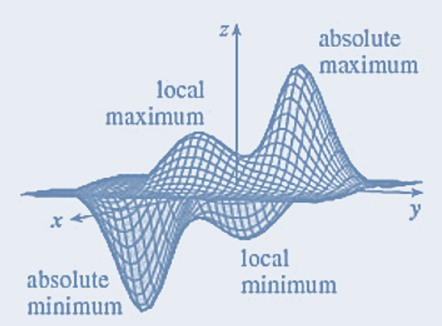
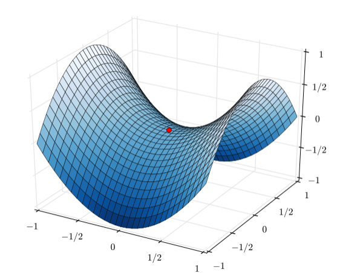

```{=html}
<style type="text/css">
h1.title {
  font-size: 20px;
  color: DarkRed;
  text-align: center;
}
h4.author { /* Header 4 - and the author and data headers use this too  */
    font-size: 18px;
  font-family: "Times New Roman", Times, serif;
  color: DarkRed;
  text-align: center;
}
h4.date { /* Header 4 - and the author and data headers use this too  */
  font-size: 18px;
  font-family: "Times New Roman", Times, serif;
  color: DarkBlue;
  text-align: center;
}
h1 { /* Header 3 - and the author and data headers use this too  */
    font-size: 22px;
    font-family: "Times New Roman", Times, serif;
    color: darkred;
    text-align: center;
}
h2 { /* Header 3 - and the author and data headers use this too  */
    font-size: 18px;
    font-family: "Times New Roman", Times, serif;
    color: navy;
    text-align: left;
}

h3 { /* Header 3 - and the author and data headers use this too  */
    font-size: 15px;
    font-family: "Times New Roman", Times, serif;
    color: navy;
    text-align: left;
}

h4 { /* Header 4 - and the author and data headers use this too  */
    font-size: 18px;
    font-family: "Times New Roman", Times, serif;
    color: darkred;
    text-align: left;
}
</style>
```
```{r setup, include=FALSE}
# code chunk specifies whether the R code, warnings, and output 
# will be included in the output files.
if (!require("knitr")) {
   install.packages("knitr")
   library(knitr)
}
if (!require("MASS")) {
   install.packages("MASS")
   library(MASS)
}
if (!require("pander")) {
   install.packages("pander")
   library(pander)
}
knitr::opts_chunk$set(echo = TRUE,      # include code chunk in the output file
                      warnings = FALSE, # sometimes, you code may produce warning messages,
                                        # you can choose to include the warning messages in
                                        # the output file. 
                      results = TRUE    # you can also decide whether to include the output
                                        # in the output file.
                      )   
```

\

\

# Introduction

We have introduced the direct methods in matrix algebra and several
interpolation methods to approximate a univariate function with either
an explicitly given analytic expression or with an unknown expression.
We use matrix algebra to solve problems of least-square approximation of
multiple-variable functions. In this note, we will introduce Newton's
methods to solve nonlinear system equations with applications in
optimization.

# Multivariate Taylor Expansion

The recursive algorithm of Newton's method for single variable nonlinear
equations is derived based on the Taylor expansion. The method can be
generalized to solve the system of nonlinear functions. We consider Taylor
expansion of two-variable function $f(x,y)$ at $(x_0, y_0)$. For
convenience

$$
f(x,y) = f(x_0, y_0) +  f_x(x_0,y_0)(x-x_0) + f_y(x_0,y_0)(y-y_0) 
$$

$$
 + \frac{f_{x^2}(x_0,y_0)}{2!}(x-x_0)^2 + \frac{f_{y^2}(x_0,y_0)}{2!}(y-y_0)^2 + \frac{f_{xy}(x_0,y_0)}{1!1!}(x-x_0)(y-y_0) 
$$ $$
 + \cdots + \sum_{k+m = n\\0\le k,~m\le n}\frac{f_{x^ky^m}(x_0,y_0)}{k!~m!}(x-x_0)^k(y-y_0)^m + E_n
$$

where

$$
f_{x^k}(x_0,y_0) = \frac{\partial^{k} f(x,y)}{\partial x^k}\big{|}_{x=x_0\\y=y_0}, ~~~ f_{y^k}(x_0,y_0) = \frac{\partial^k f(x,y)}{\partial y^k}\big{|}_{x=x_0\\y=y_0}, ~~~ f_{x^py^q}(x_0,y_0) = \frac{\partial^{p+q} f(x,y)}{\partial x^p \partial y^q}\big{|}_{x=x_0,\\y=y_0}.
$$ and $E_n$ is the remainder term.

**Example 1**: Find the third order Taylor expansion of
$f(x, y) = e^{2x}\sin(3y)$ about $(x_0, y_0) = (0, 0)$ using the above
formula. We first compute all partial derivatives up to order 3 at
$(x_0, y_0)$.

$$
\begin{array}{ll}
f(x, y) = e^{2x}\sin(3y)          &  f(x_0, y_0) = 0          \\
f_x(x, y) = 2e^{2x}\sin(3y)       &  f_x(x_0, y_0) = 0        \\
f_y(x, y) = 3e^{2x}\cos(3y)       &  f_y(x_0, y_0) = 3        \\
f_{x^2}(x, y) = 4e^{2x}\sin(3y)   &  f_{x^2}(x_0, y_0) = 0    \\
f_{xy}(x, y) = 6e^{2x}\cos(3y)    &  f_{xy}(x_0, y_0) = 6     \\
f_{y^2}(x, y) = -9e^{2x}\sin(3y)  &  f_{y^2}(x_0, y_0) = 0    \\
f_{x^3}(x, y) = 8e^{2x}\sin(3y)   &  f_{x^3}(x_0, y_0) = 0    \\
f_{x^2y}(x, y) = 12e^{2x}\cos(3y) &  f_{x^2y}(x_0, y_0) = 12  \\
f_{xy^2}(x, y) = -18e^{2x}\sin(3y)&  f_{xy^2}(x_0, y_0) = 0   \\
f_{y^3}(x,y) = -27e^{2x}\cos(3y)  &  f_{y^3}(x_0, y_0) = -27
\end{array}
$$ Using the above formula, we have $$
 e^{2x}\sin(3y) = \frac{3}{1}y + \frac{6}{1!1!}xy + \frac{12}{2!1!}x^2y -\frac{27}{3!}y^3 + E_3(x,y) \\
 ~~~~=3y + 6xy + 6x^2y-4.5y^3 + E_3(x,y).
$$

\

# Newton Method for Nonlinear Systems

To find the root of nonlinear equation $f(x) = 0$, we assume that $f(x)$
is differentiable. Using Taylor's expansion, we have

$$
f(x) \approx f(x_0) + f^\prime(x_0)(x-x_0) ~~~\Rightarrow ~~~ x = x_0-\frac{f(x_0)}{f^\prime(x_0)}
$$

## System of Two Nonlinear Equations

Consider system

$$
\left\{
\begin{array}{lcl}
f_1(x,y) & = & 0 \\
f_2(x,y) & = & 0
\end{array}
\right.
$$

As we did in single function equation, we take the first order
derivative of both $f_1(x,y)$ and $f_2(x,y)$, the do linear
approximations to both functions

$$
\left\{
\begin{array}{lcl}
f_1(x,y) & = & f_1(x_0, y_0) + \frac{\partial f_1(x_0, y_0)}{\partial x}(x-x_0) + \frac{\partial f_1(x_0,y_0)}{\partial y}(y-y_0) \\
f_2(x,y) & = & f_2(x_0, y_0) + \frac{\partial f_2(x_0, y_0)}{\partial x}(x-x_0) + \frac{\partial f_2(x_0,y_0)}{\partial y}(y-y_0)
\end{array}
\right.
$$ The above system can be written in the following matrix equation

$$
\left[
\begin{array}{cc}
\frac{\partial f_1(x_0, y_0)}{\partial x} & \frac{\partial f_1(x_0,y_0)}{\partial y}\\
\frac{\partial f_2(x_0, y_0)}{\partial x} & \frac{\partial f_2(x_0,y_0)}{\partial y}
\end{array}
\right]
\left[
\begin{array}{cc}
x-x_0 \\
y-y_0
\end{array}
\right]
~=~
-
\left[
\begin{array}{cc}
f_1(x_0,y_0)\\
f_2(x_0,y_0)
\end{array}
\right]
$$

The coefficient matrix in the above matrix equation is called **Jacobian
matrix** and is denoted by **J**. If the inverse of $$
\mathbf{J} = \left[
\begin{array}{cc}
\frac{\partial f_1(x_0, y_0)}{\partial x} & \frac{\partial f_1(x_0,y_0)}{\partial y}\\
\frac{\partial f_2(x_0, y_0)}{\partial x} & \frac{\partial f_2(x_0,y_0)}{\partial y}
\end{array}
\right]
$$ exists, then

$$
\left[
\begin{array}{cc}
x-x_0 \\
y-y_0
\end{array}
\right]
~=~ -
\left[
\begin{array}{cc}
\frac{\partial f_1(x_0, y_0)}{\partial x} & \frac{\partial f_1(x_0,y_0)}{\partial y}\\
\frac{\partial f_2(x_0, y_0)}{\partial x} & \frac{\partial f_2(x_0,y_0)}{\partial y}
\end{array}
\right]^{-1}
\left[
\begin{array}{cc}
f_1(x_0,y_0)\\
f_2(x_0,y_0)
\end{array}
\right]
$$ which can be further re-expressed as

$$
\left[
\begin{array}{cc}
x \\
y
\end{array}
\right]
~=~
\left[
\begin{array}{cc}
x_0 \\
y_0
\end{array}
\right]
-
\left[
\begin{array}{cc}
\frac{\partial f_1(x_0, y_0)}{\partial x} & \frac{\partial f_1(x_0,y_0)}{\partial y}\\
\frac{\partial f_2(x_0, y_0)}{\partial x} & \frac{\partial f_2(x_0,y_0)}{\partial y}
\end{array}
\right]^{-1}
\left[
\begin{array}{cc}
f_1(x_0,y_0)\\
f_2(x_0,y_0)
\end{array}
\right].
$$

The Newton method of the above system of two nonlinear equations is
based on the following recursive relationship

$$
\left[
\begin{array}{cc}
x_{k+1} \\
y_{k+1}
\end{array}
\right]
~=~
\left[
\begin{array}{cc}
x_k \\
y_k
\end{array}
\right]
-
\left[
\begin{array}{cc}
\frac{\partial f_1(x_k, y_k)}{\partial x} & \frac{\partial f_1(x_k,y_k)}{\partial y}\\
\frac{\partial f_2(x_k, y_k)}{\partial x} & \frac{\partial f_2(x_k,y_k)}{\partial y}
\end{array}
\right]^{-1}
\left[
\begin{array}{cc}
f_1(x_k,y_k)\\
f_2(x_k,y_k)
\end{array}
\right].
$$ Denote

$$
\mathbf{X}_{k+1} =\left[
\begin{array}{cc}
x_{k+1} \\
y_{k+1}
\end{array}
\right],
~~~~~~
\mathbf{X}_{k} =
\left[
\begin{array}{cc}
x_k \\
y_k
\end{array}
\right],
~~~~~
\mathbf{h} = -
\left[
\begin{array}{cc}
\frac{\partial f_1(x_k, y_k)}{\partial x} & \frac{\partial f_1(x_k,y_k)}{\partial y}\\
\frac{\partial f_2(x_k, y_k)}{\partial x} & \frac{\partial f_2(x_k,y_k)}{\partial y}
\end{array}
\right]^{-1}
\left[
\begin{array}{cc}
f_1(x_k,y_k)\\
f_2(x_k,y_k)
\end{array}
\right].
$$

Then the recursive relationship is given by $$
\mathbf{X}_{k+1} = \mathbf{X}_{k} + \mathbf{h}. 
$$

\

## Newton Algorithm and

With the above recursive relation, we develop the following *brief*
pseudo-code

```         
 INPUT: fn,       (vector of the system of nonlinear equations)
        J,        (Jacobian matrix based on fn)
        ini.val,   
        TOL, 
        maxit 
OUTPUT: sol, etc.        

STEP 1: initialization 
         iterator: i = 1
         err = 1  (any number that is bigger than TOL)
         sol      (initialize the matrix to store output information) 
STEP 2: WHILE err > TOL AND i < maxit DO
        h = inverse(J)xY
        new.x = ini.x + h  (updating x vector)
        ENDWHILE
STEP 3: RETURN sol
```

**Example 2**: Solve the following system of nonlinear equations $$
\left\{
\begin{array}{lcl}
x^2 + y^2 & = & 4 \\
xy & = & 1
\end{array}
\right.
$$ which corresponds to finding the intersection points of a circle and
a hyperbola in the plane.

**Solution**: In order to use the Newton method, we need to find the
Jacobian matrix. Denote $f_1(x,y) = x^2 + y^2 -4$ and
$f_2(x,y) = xy -1$. Then

$$
J(x,y) = \left[
\begin{array}{cc}
\frac{\partial f_1(x_k, y_k)}{\partial x} & \frac{\partial f_1(x_k,y_k)}{\partial y}\\
\frac{\partial f_2(x_k, y_k)}{\partial x} & \frac{\partial f_2(x_k,y_k)}{\partial y}
\end{array}
\right]
~=~
\left[
\begin{array}{cc}
2x & 2y\\
y & x
\end{array}
\right]
$$

```{r}
##
fn.vec=function(ini.val){
 x=ini.val[1]
 y=ini.val[2]
 f1 = x^2+y^2 -4
 f2 = x*y-1
 c(f1,f2)
}

Jacobian=function(ini.val){
 x=ini.val[1]
 y=ini.val[2]
 f1.x = 2*x
 f1.y = 2*y
 f2.x = y
 f2.y = x
 m=matrix(c(f1.x, f1.y, f2.x, f2.y), ncol=2, byrow=T)
 m
}

Newton=function(fn.vec, Jacobian, ini.val, tol, maxit=100){
 x=ini.val[1]
 y=ini.val[2]
 ### initialization
 err=1
 i = 1
 sol.mtx = matrix(0, nrow=maxit, ncol=length(ini.val))
 err.vec = rep(0, maxit)
 fn.mtx = matrix(0, nrow=maxit, ncol=length(ini.val))
 while(err > tol  && i < maxit){
   h = - solve(Jacobian(ini.val))%*%fn.vec(ini.val)
   new.val = ini.val + h 
   err=max(abs(h))
   ## store intermediate outputs
   err.vec[i] = err
   sol.mtx[i,] = as.vector(new.val)
   fn.mtx[i,] = fn.vec(new.val)
   ## updating the root and the iteration ID
   ini.val=new.val
   i = i + 1
 }
 id = which(err.vec==0)[1]-1   # locate the starting rows with all zero cells
 list(solution = sol.mtx[1:id,], error = err.vec[1:id], fn.values = fn.mtx[1:id,])
}
# function call

Newton(fn.vec, Jacobian, ini.val=c(1,1.5), tol=10^(-4))
```

\

## Optimization

For ease of presentation, we focus on bivariate functions. Multivariate
functions can be treated similarly.

```{r fig.align='center', out.width="40%"}

```

First, we recall some of the results in Calculus. Let $f(x,y$ be a two
variable real function. $f(x,y$ has a local maximum at $(a,b)$ if
$f(x,y) \le f(a,b)$ when $(x,y)$ is in the neighborhood of $(a,b)$.
$f(a,b)$ is the local maximum value. $f(x,y$ has a local maximum at
$(a,b)$ if $f(x,y) \ge f(a,b)$ when $(x,y)$ is in the neighborhood of
$(a,b)$. $f(a,b)$ is the local minimum value.

**Theorem 1** If $f(x,y)$ has a local maximum or minimum at $(a,b)$ and
the first order partial derivatives of $f(x,y)$ exist, the
$f_x(a,b) = 0$ and $f_y(a,b) = 0$.

**Theorem 2** Suppose the second order partial derivative of $f(x,y)$
are continuous on a disk with center $(a,b)$ (i.e., the neighborhood of
$(a,b)$), and assume that $f_x(a,b) = 0$ and $f_y(a, b) = 0$ [that is,
$(a,b)$ is a critical point of $f(x,y)$]. Let

$$
D(a, b) = f_{x^2}(a,b)f_{y^2}(a,b) - [f_{xy}(a,b)]^2.
$$ (a). If $D > 0$ and $f_{x^2}(a,b) > 0$, then $f(a, b)$ is a local
minimum.

(b). If $D > 0$ and $f_{x^2}(a,b) < 0$, then $f(a, b)$ is a local
maximum.

(c). If $D < 0$ , then $f(a, b)$ is not a local minimum or maximum.

\

Notations $f_{x^2}(a,b), ~f_{y^2}(a,b), ~~\text{and}~~f_{xy}(a,b)$ are
specified earlier.

*Some Remarks:*

-   In case (c) the point $(a,b)$ is called a **saddle point** of
    $f(x,y)$ and the graph of $f(x,y)$ crosses its tangent plane at
    $(a,b)$. The red point on the surface (hyperbolic paraboloid) in the
    following figure is a saddle point.

```{r fig.align='center', out.width="40%"}

```

-   If $D=0$, the test gives no information. $f(x,y)$ could have a local
    maximum or local minimum at $(a,b)$, or (a,b) could be a saddle
    point of $f(x,y)$.

-   To remember the formula for $D(a,b)$, it's helpful to write it as a
    determinant:

$$
D(a,b) = \left[
\begin{array}{cc}
f_{x^2}(a,b) & f_{xy}(a,b)\\
f_{xy}(a,b)  & f_{y^2}(a,b)
\end{array}
\right]
~=~ f_{x^2}(a,b)f_{y^2}(a,b)-[f_{xy}(a,b)]^2
$$

-   The matrix D in the above expression is called **Hessian Matrix** in
    the optimization problem.

\

**Example 3**: Find the critical value of
$f(x,y) = 2x^3/3 + 2xy^2 - 8x - 4y + 6$ and justify whether the critical
point is a local maximum or local minimum or a saddle point.

**Solution** We first find the critical point(s) of by solving the
following system of nonlinear equations

$$
\left\{
\begin{array}{llcl}
f_x(x,y) = 2x^2 + 2y^2 - 8 & = & 0\\
f_y(x,y) = 4xy - 4 & = & 0
\end{array}
\right.
$$

The above system is identical to the nonlinear system in **Example 2**.
We know the solution to the above system is $(a,b) = (0.5176381, 1.931852)$.
To see whether $(0.5176381, 1.931852)$ is a local extreme value or a
saddle point, we need to know the **Hessian matrix**

$$
D(x,y) = \left[
\begin{array}{cc}
4x & 4y\\
4y & 4x
\end{array}
\right]
$$

The determinant of the Hessian matrix at $(0.5176381, 1.931852)$ is

$$
D(0.5176381, 1.931852) = \det \left[
\begin{array}{cc}
4\times 0.5176381 & 4\times 1.931852\\
4\times 1.931852 & 4\times 0.5176381
\end{array}
\right]
~=~ 14(0.5176381^2- 1.931852^2) < 0.
$$

\

**Example 4**: Find and classify the critical points of the function 
$$
f(x,y) = 10x^2y - 5x^2 - 4y^2 - x^4 - 2y^4
$$ 
Also find the highest point on the graph of $f(x,y)$.

**Solution**: We first make a 3D

```{r fig.align='center', fig.height=4, fig.width=4}
FN=function(x,y) 10*y*x^2-5*x^2-4*y^2-x^4-2*y^4
x=seq(-4,4,0.1)
y=seq(-3,3,0.1)
z=outer(x,y,FN)
persp(x, y, z, theta = 180, phi = 30, expand = 0.6, col = "lightblue", ltheta = 90, 
shade = 0.15, ticktype = "detailed", xlab = "X", ylab = "Y", zlab = "Z", zlim =c(-10,8)
)
```

```{r fig.align='center', fig.width=6, fig.height=6}
contour(x,y,z, nlevels = 40)
```

The 3D surface indicates that there are three local extrema and two saddle points on the surface. We need to choose appropriate initial values to locate the critical points and saddle points. We first take partial derivatives of the given function $f(x,y)$ and set them to zero.

$$
\left\{
\begin{array}{lclcl}
f_x(x,y) & = & 20xy - 10x - 4x^3 & = & 0\\
f_y(x,y) & = & 10x^2 -8y - 8y^3 & = & 0
\end{array}
\right.
$$
The Jacobian matrix of the above nonlinear system is given by

$$
\mathbf{J} = \left[
\begin{array}{cc}
f_{x^2}(x,y) & f_{xy}(x,y) \\
f_{xy}(x,y)  & f_{y^2}(x,y)
\end{array}
\right]
~=~
\left[
\begin{array}{cc}
20y-12x^2 - 10 & 20x \\
20x  & -24y^2 - 8
\end{array}
\right]
$$

We now use the Newton method with different initial values to find all critical values (guided by the surface in the figure).

```{r}
fn.vec=function(ini.val){
 x=ini.val[1]
 y=ini.val[2]
 fx = 20*x*y-10*x-4*x^3
 fy = 10*x^2-8*y-8*y^3
 c(fx,fy)
}

Jacobian=function(ini.val){
 x=ini.val[1]
 y=ini.val[2]
 fxx = 20*y-10-12*x^2
 fxy = 20*x
 fyx = 20*x
 fyy = -8-24*y^2
 m=matrix(c(fxx, fxy, fyx, fyy), ncol=2, byrow=T)
 m
}

Newton.Raphson=function(fn.vec, Jacobian, ini.val, tol, maxit=100, trace = TRUE){
 x=ini.val[1]
 y=ini.val[2]
 ### initialization
 err = 1
 i = 1
 sol.mtx = matrix(0, nrow=maxit, ncol=length(ini.val))
 err.vec = rep(0, maxit)
 fn.mtx = matrix(0, nrow=maxit, ncol=length(ini.val))
 while(err > tol  && i < maxit){
   h = - solve(Jacobian(ini.val))%*%fn.vec(ini.val)
   new.val = ini.val + h 
   err=max(abs(h))
   ## store intermediate outputs
   err.vec[i] = err
   sol.mtx[i,] = as.vector(new.val)
   fn.mtx[i,] = fn.vec(new.val)
   ## updating the root and the iteration ID
   ini.val=new.val
   i = i + 1
  }
  id = which(err.vec==0)[1]-1   # locate the starting rows with all zero cells
  ##  Determinant of Hessian
  D = det(Jacobian(sol.mtx[id,]))
  fxx = Jacobian(sol.mtx[id,])[1,1]
  ##
  if(trace ==TRUE){
      list(solution = sol.mtx[1:id,],  error = err.vec[1:id], fn.values = fn.mtx[1:id,])
  } else {
   if(D > 0 & fxx > 0) extreme = "local minimum"
   if(D > 0 & fxx < 0) extreme = "local maximum"
   if(D < 0 ) extreme = "saddle point"
   list(iterations = id, solution = sol.mtx[id,], D = D, fxx = fxx, extreme = extreme, error = err.vec[id], fn.values = fn.mtx[id,])
  }
 }
```


```{r}
Newton.Raphson(fn.vec, Jacobian, ini.val=c(0.8,0.6), tol=10^(-4), trace = FALSE)
```
```{r}
Newton.Raphson(fn.vec, Jacobian, ini.val=c(-0.8,0.6), tol=10^(-4), trace = FALSE)
```

```{r}
Newton.Raphson(fn.vec, Jacobian, ini.val=c(0.1,0.2), tol=10^(-4), trace = FALSE)
```

```{r}
Newton.Raphson(fn.vec, Jacobian, ini.val=c(-2.8,1.6), tol=10^(-4), trace = FALSE)
```

```{r}
Newton.Raphson(fn.vec, Jacobian, ini.val=c(-2.8,1.6), tol=10^(-4), trace = FALSE)
```

\

# Case Study

Many studies indicated that body mass index (BMI) is a more powerful risk factor for diabetes than genetics. The objective of this case study is to explore the association between BMI and diabetes. Studies show that the probability of diabetes and MBI have the following relationship.
$$
\text{Prob}(\text{diabetes}) = \frac{e^{\alpha_0 + \alpha_1 BMI}}{1 + e^{\alpha_0 + \alpha_1 BMI}}
$$
Let $x$ be the measurement BMI and $y$ be the status of diabetes that is numerically encoded as

$$
y = \left\{
\begin{array}{ll}
 1 & \text{if the diabetes test result is positive},\\
 0 & \text{if the diabetes test result is negative}.
\end{array}
\right.
$$
For a given set of historical observations (i.e., nodes) $\{(x_1,y_1), (x_2, y_2), \cdots, (x_n, y_n)\}$. Using the theory of likelihood, we can approximate unknowns $\alpha_0$ and $\alpha_1$ by **maximizing** the following logarithmic likelihood function defined based on the given data points

$$
\mathbf{LL}(\alpha_0, \alpha_1) = -\sum_{i=1}^n\ln[1+e^{\alpha_0 + \alpha_1 x_i}]+ \sum_{i=1}^ny_i(\alpha_0 + \alpha_1 x_i)
$$
To find the critical values, we set up the following nonlinear system of equations

$$
\frac{\partial LL}{\partial \alpha_0} = -\sum_{i=1}^n \frac{e^{\alpha_0+\alpha_1x_i}}{1+e^{\alpha_0+\alpha_1x_i}}+\sum_{i=1}^ny_i = 0
$$
$$
\frac{\partial LL}{\partial \alpha_1} = -\sum_{i=1}^n \frac{e^{\alpha_0+\alpha_1x_i}}{1+e^{\alpha_0+\alpha_1x_i}}x_i+\sum_{i=1}^nx_iy_i = 0
$$

The Jacobian matrix of the above system is 
$$
\mathbf{J} = \left[ 
\begin{array}{cc}
\frac{\partial^2 LL}{\partial \alpha_0^2} & \frac{\partial^2 LL}{\partial \alpha_0\alpha_1} \\
\frac{\partial^2 LL}{\partial \alpha_0\alpha_1} & \frac{\partial^2 LL}{\partial \alpha_1^2}
\end{array}
\right]
$$
where
$$
\frac{\partial^2 LL}{\partial \alpha_0^2} = -\sum_{i=1}^n \frac{e^{\alpha_0+\alpha_1x_i}}{[1+e^{\alpha_0+\alpha_1x_i}]^2},
~~~
\frac{\partial^2 LL}{\partial \alpha_0\alpha_1} = -\sum_{i=1}^n \frac{x_ie^{\alpha_0+\alpha_1x_i}}{[1+e^{\alpha_0+\alpha_1x_i}]^2},
~~~
\frac{\partial^2 LL}{\partial \alpha_1^2} = -\sum_{i=1}^n \frac{x_i^2e^{\alpha_0+\alpha_1x_i}}{[1+e^{\alpha_0+\alpha_1x_i}]^2},
$$

The Newton recursive formula is given by

$$
\left[
\begin{array}{c}
\alpha_0^{(k+1)}\\
\alpha_1^{(k+1)}
\end{array}
\right]
~=~
\left[
\begin{array}{c}
\alpha_0^{(k)}\\
\alpha_1^{(k)}
\end{array}
\right]
~-~
\left[ 
\begin{array}{cc}
\frac{\partial^2 LL(\alpha_0^{(k)},\alpha_1^{(k)})}{\partial \alpha_0^2} & \frac{\partial^2 LL(\alpha_0^{(k)},\alpha_1^{(k)})}{\partial \alpha_0\alpha_1} \\
\frac{\partial^2 LL(\alpha_0^{(k)},\alpha_1^{(k)})}{\partial \alpha_0\alpha_1} & \frac{\partial^2 LL(\alpha_0^{(k)},\alpha_1^{(k)})}{\partial \alpha_1^2}
\end{array}
\right]^{-1}
~
\left[
\begin{array}{c}
\frac{\partial LL(\alpha_0^{(k)},\alpha_1^{(k)})}{\partial \alpha_1}\\
\frac{\partial LL(\alpha_0^{(k)},\alpha_1^{(k)})}{\partial \alpha_1}
\end{array}
\right]
$$
Note $\mathbf{J}$ is the Jacobian matrix of (the vector of) the two nonlinear functions in the derived systems of nonlinear equations. It is also the Hessian matrix of the log-likelihood function. 

Next, we write an R function to return the Jacobian matrix and the vector of the values of the two gradients of $\mathbf{LL}(\alpha_0, \alpha_1)$.

```{r}
JH = function(x, y, a0, a1){
  # x = x-coordinates
  # y = y-coordinates
  # a0 = alpha_0, a1 = alpha_1
  E = exp(a0+a1*x)
  L0 = -sum(E/(1+E)) + sum(y)
  L1 = -sum(x*E/(1+E)) + sum(x*y)
  L00 = -sum(E/(1+E)^2)
  L01 = -sum(x*E/(1+E)^2)
  L10 = L01
  L11 =  -sum(x^2*E/(1+E)^2)
  LV = c(L0, L1)
  J = matrix(c(L00, L01, L10, L11), ncol =2, byrow = TRUE)
  list(LV = LV, Jacob = J)
}
```

```{r}
Newton.Alg=function(x, y, ini.val, tol, maxit=100, trace = TRUE){
 ### initialization
 err = 1
 i = 1
 sol.mtx = matrix(0, nrow=maxit, ncol=length(ini.val))
 err.vec = rep(0, maxit)
 fn.mtx = matrix(0, nrow=maxit, ncol=length(ini.val))
 while(err > tol  && i < maxit){
 ### initialization
   JnFun = JH(x, y, a0 = ini.val[1],a1 = ini.val[2])
   JMatrix = JnFun$Jacob
   fn.vec = JnFun$LV
   if(det(JMatrix) == 0){
     cat("\n\n The Hessian matrix is singular!")
     break
   }
   h = - solve(JMatrix)%*%fn.vec
   new.val = ini.val + h 
   err=max(abs(h))
   ## store intermediate outputs
   err.vec[i] = err
   sol.mtx[i,] = as.vector(new.val)
   fn.mtx[i,] = JH(x, y, a0 = ini.val[1],a1 = ini.val[2])$LV
   ## updating the root and the iteration ID
   ini.val=new.val
   i = i + 1
  }
  id = which(err.vec==0)[1]-1   # locate the starting rows with all zero cells
  ##  Determinant of Hessian
  SOL = sol.mtx[id,]
  D = det(JH(x, y, a0 = SOL[1], a1 = SOL[2])$Jacob)
  #D = det(Jacobian(sol.mtx[id,]))
  fxx = (JH(x, y, a0 = SOL[1], a1 = SOL[2])$Jacob)[1,1]
  ##
  if(trace ==TRUE){
      list(solution = sol.mtx[1:id,],  error = err.vec[1:id], fn.values = fn.mtx[1:id,])
  } else {
   if(D > 0 & fxx > 0) extreme = "local minimum"
   if(D > 0 & fxx < 0) extreme = "local maximum"
   if(D < 0 ) extreme = "saddle point"
   list(iterations = id, solution = sol.mtx[id,], 
        D = D, 
        fxx = fxx, 
        extreme = extreme, 
        error = err.vec[id], 
        fn.values = fn.mtx[id,])
  }
 }
```

Next, we use diabetes data to illustrate the above predictive algorithm.  The data is originally from the National Institute of Diabetes and Digestive and Kidney Diseases. The objective of collecting the data is to diagnostically **predict whether or not a patient has diabetes**, based on certain diagnostic measurements included in the data. Several constraints were placed on the selection of these instances from a larger database. In particular, all patients here are females at least 21 years old of *Pima Indian heritage*.

A portion of the above data with missing components removed is stored in the GitHub repository of this course: <https://raw.githubusercontent.com/pengdsci/MAT325/main/w12/diabetes.csv>

\

We only use one of the potential risk factors, BMI, to make a prediction. We use 

```{r}
diabetes = read.csv("https://raw.githubusercontent.com/pengdsci/MAT325/main/w12/diabetes.csv")
diabeticStatus = diabetes$Outcome      # y-variable: 1 = diabetes, 0 = no-diabetes
BMI = diabetes$BMI                     # x-variable (risk factor)
#glm(diabeticStatus ~ BMI, family = binomial(link = logit))
Newton.Alg(x=BMI, y=diabeticStatus, ini.val=c(-6, .2), tol = 10^(-8), maxit=100, trace = FALSE)
```
The potential challenge of using Newton's method is to find the initial value so that the algorithm converges to the solution to the system of the nonlinear equations or the optimization problem. 

Recall that the practical question is to predict diabetes diagnostically with given risk factors. This case study involves only one factor - BMI. With the above result of the Newton method, we have the predictive model in the following form

$$
\text{P[Y = diabetes]} = \frac{e^{-3.6061 + 0.0863\times BMI}}{1 + e^{-3.6061 + 0.0863\times BMI}}.
$$

The above function predicts the probability of being diabetic with a given BMI measurement. For example, if someone's BMI is 30, the probability of getting diabetes is

$$
\text{P[Y = diabetes]} = \frac{e^{-3.6061 + 0.0863\times 30}}{1 + e^{-3.6061 + 0.0863\times 30}} \approx 0.2656
$$

```{r fig.align='center', fig.width=5, fig.height=5}
bmi=seq(18,45, length = 50)
E = exp(-3.6061 + 0.0863*bmi)
Prob.diabetes = E/(1 + E)
plot(bmi, Prob.diabetes, type = "l", lwd=2, col = "blue")
```

The above figure shows that the chance of getting diabetes increases as BMI increases.


